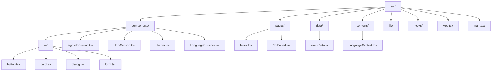
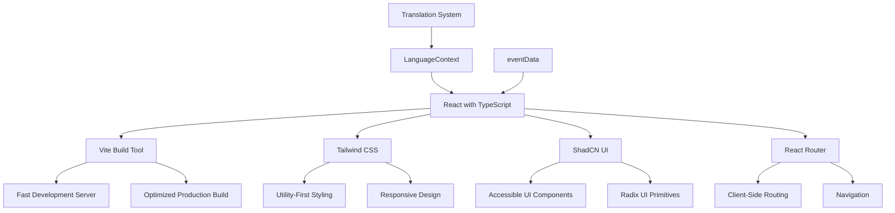
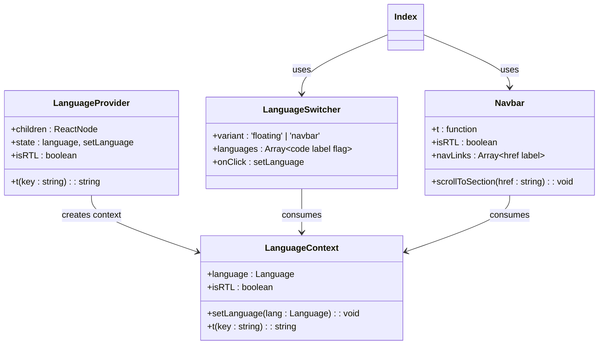
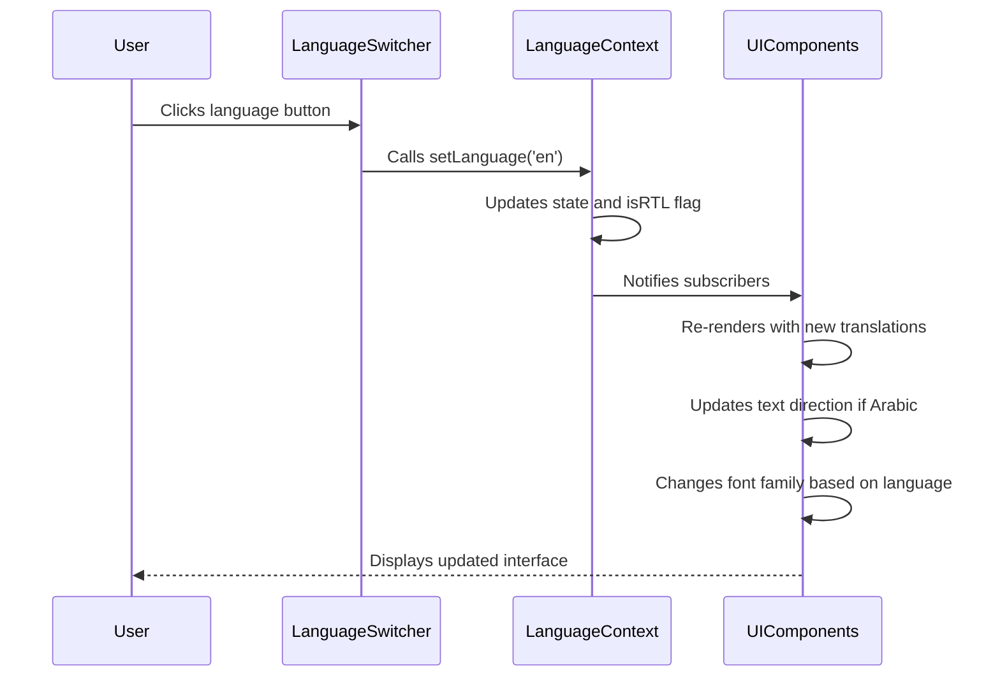
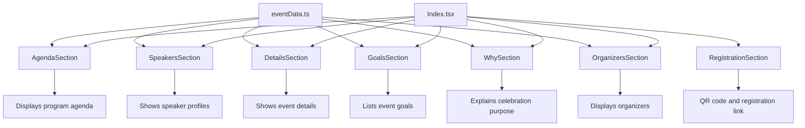

# Project Overview

> **Referenced Files in This Document**   
> - [App.tsx](src/App.tsx)
> - [main.tsx](src/main.tsx)
> - [Index.tsx](src/pages/Index.tsx)
> - [LanguageContext.tsx](src/contexts/LanguageContext.tsx)
> - [LanguageSwitcher.tsx](src/components/LanguageSwitcher.tsx)
> - [Navbar.tsx](src/components/Navbar.tsx)
> - [eventData.ts](src/data/eventData.ts)
> - [tailwind.config.ts](tailwind.config.ts)
> - [vite.config.ts](vite.config.ts)
> - [package.json](package.json)
> - [README.md](README.md)

## Table of Contents
1. [Introduction](#introduction)
2. [Project Structure](#project-structure)
3. [Core Components](#core-components)
4. [Architecture Overview](#architecture-overview)
5. [Detailed Component Analysis](#detailed-component-analysis)
6. [Dependency Analysis](#dependency-analysis)
7. [Performance Considerations](#performance-considerations)
8. [Troubleshooting Guide](#troubleshooting-guide)
9. [Conclusion](#conclusion)

## Introduction
The sc-dof event platform is a multilingual website designed for the Syrian community to commemorate Liberation Day. The platform serves as a comprehensive event information hub, showcasing details about the agenda, speakers, goals, venue, and registration process. Built with modern web technologies, the application supports three languages—Arabic, English, and Turkish—with full RTL (right-to-left) layout support for Arabic. The platform's primary purpose is to honor the memory of Syria's liberation, celebrate the resilience of the Syrian people, and foster community engagement through a well-organized event.

The website features a clean, responsive design with smooth navigation and interactive elements. It includes sections for event details, program agenda, speaker profiles, organizational information, and a prominent registration section with QR code integration. The application leverages React's component-based architecture for maintainability and scalability, with a focus on accessibility and user experience across different devices and screen sizes.

**Section sources**
- [README.md](README.md#L1-L74)
- [eventData.ts](src/data/eventData.ts#L1-L109)

## Project Structure

The project follows a standard React with TypeScript and Vite structure, organized into logical directories for components, pages, data, and utilities. The `src` directory contains the core application code, with components organized in a hierarchical structure that separates UI primitives from higher-level page components.



**Diagram sources**
- [src/components](src/components)
- [src/pages](src/pages)
- [src/data](src/data)
- [src/contexts](src/contexts)

**Section sources**
- [src/components](src/components)
- [src/pages](src/pages)
- [src/data](src/data)
- [src/contexts](src/contexts)

## Core Components

The application's core functionality is built around several key components that handle language internationalization, navigation, and content presentation. The `LanguageContext` provides a centralized state management solution for language selection and text translation, while the `LanguageSwitcher` component enables users to toggle between Arabic, English, and Turkish. The `Navbar` component implements smooth scrolling navigation to different sections of the page, with responsive design that adapts to mobile devices.

The main content is organized into specialized components such as `HeroSection`, `AgendaSection`, `SpeakersSection`, and `RegistrationSection`, each responsible for presenting specific aspects of the event information. These components consume data from `eventData.ts` and use the translation function from the language context to display content in the selected language. The `RegistrationSection` includes a QR code component that generates a scannable code for event registration, enhancing accessibility for mobile users.

**Section sources**
- [App.tsx](src/App.tsx#L1-L43)
- [Index.tsx](src/pages/Index.tsx#L1-L32)
- [LanguageContext.tsx](src/contexts/LanguageContext.tsx#L1-L292)
- [LanguageSwitcher.tsx](src/components/LanguageSwitcher.tsx#L1-L44)
- [Navbar.tsx](src/components/Navbar.tsx#L1-L123)

## Architecture Overview

The sc-dof platform follows a modern React architecture with TypeScript, leveraging Vite as the build tool for fast development and optimized production builds. The application uses a component-based architecture with clear separation of concerns, where UI components are decoupled from data and state management.



**Diagram sources**
- [App.tsx](src/App.tsx#L1-L43)
- [main.tsx](src/main.tsx#L1-L6)
- [vite.config.ts](vite.config.ts#L1-L19)
- [tailwind.config.ts](tailwind.config.ts#L1-L98)
- [package.json](package.json#L1-L85)

## Detailed Component Analysis

### Language Internationalization System

The platform's multilingual capabilities are implemented through a custom context-based internationalization system that manages language state and provides translation functions to components throughout the application.



**Diagram sources**
- [LanguageContext.tsx](src/contexts/LanguageContext.tsx#L1-L292)
- [LanguageSwitcher.tsx](src/components/LanguageSwitcher.tsx#L1-L44)
- [Navbar.tsx](src/components/Navbar.tsx#L1-L123)

**Section sources**
- [LanguageContext.tsx](src/contexts/LanguageContext.tsx#L1-L292)
- [LanguageSwitcher.tsx](src/components/LanguageSwitcher.tsx#L1-L44)

### User Workflow: Language Switching

The language switching functionality follows a clear user interaction pattern that persists the selected language across the application and updates the UI accordingly.



**Diagram sources**
- [LanguageContext.tsx](src/contexts/LanguageContext.tsx#L1-L292)
- [LanguageSwitcher.tsx](src/components/LanguageSwitcher.tsx#L1-L44)
- [App.tsx](src/App.tsx#L1-L43)

### Event Information Architecture

The platform organizes event information into distinct sections, each with its own component that consumes data from the central eventData store.



**Diagram sources**
- [eventData.ts](src/data/eventData.ts#L1-L109)
- [AgendaSection.tsx](src/components/AgendaSection.tsx#L1-L64)
- [SpeakersSection.tsx](src/components/SpeakersSection.tsx#L1-L238)
- [Index.tsx](src/pages/Index.tsx#L1-L32)

## Dependency Analysis

The application relies on a well-defined set of dependencies that provide essential functionality for the user interface, state management, and development tooling.

```mermaid
graph TD
A[sc-dof Platform] --> B[React & React DOM]
A --> C[TypeScript]
A --> D[Vite]
A --> E[Tailwind CSS]
A --> F[ShadCN UI]
A --> G[Radix UI]
A --> H[React Router]
A --> I[React Query]
B --> J[UI Rendering]
C --> K[Type Safety]
D --> L[Build Tool]
E --> M[Styling]
F --> N[UI Components]
G --> O[Accessible Primitives]
H --> P[Navigation]
I --> Q[Data Fetching]
F --> G : built on
A --> R[Lucide React]
A --> S[QRCode React]
A --> T[Next Themes]
```

**Diagram sources**
- [package.json](package.json#L1-L85)
- [vite.config.ts](vite.config.ts#L1-L19)
- [tailwind.config.ts](tailwind.config.ts#L1-L98)

**Section sources**
- [package.json](package.json#L1-L85)
- [vite.config.ts](vite.config.ts#L1-L19)

## Performance Considerations

The platform implements several performance optimizations to ensure fast loading times and smooth user interactions. Vite provides rapid development server startup and hot module replacement, while the production build is optimized for performance with code splitting and asset optimization.

The application leverages React's virtual DOM for efficient UI updates and uses memoization patterns to prevent unnecessary re-renders. Tailwind CSS's JIT (Just-In-Time) compiler generates only the CSS classes that are actually used in the application, significantly reducing the final bundle size. The component structure follows best practices for code organization, with atomic components that can be efficiently cached and reused.

Image assets are optimized and loaded only when needed, with fallbacks for missing speaker images. The QR code for registration is generated client-side, eliminating the need for external image requests. The use of CSS variables and Tailwind's utility classes enables efficient styling without the overhead of traditional CSS frameworks.

**Section sources**
- [vite.config.ts](vite.config.ts#L1-L19)
- [tailwind.config.ts](tailwind.config.ts#L1-L98)
- [package.json](package.json#L1-L85)

## Troubleshooting Guide

Common issues in the sc-dof platform typically relate to language persistence, responsive layout challenges, and component rendering. For language switching issues, ensure that the LanguageProvider wraps the entire application in App.tsx and that components properly consume the context using useLanguage hook.

For responsive layout problems, verify that Tailwind's responsive prefixes (sm:, md:, lg:, xl:) are correctly applied to components and that the viewport meta tag is properly configured in index.html. If images are not loading, check the import paths in components and ensure that asset files exist in the correct directories.

When components fail to render, confirm that all required props are being passed and that there are no TypeScript type errors. For routing issues, ensure that React Router's BrowserRouter is properly configured and that route paths match the navigation links. If the development server fails to start, verify that all dependencies are installed with npm install and that there are no conflicts in package.json.

**Section sources**
- [App.tsx](src/App.tsx#L1-L43)
- [LanguageContext.tsx](src/contexts/LanguageContext.tsx#L1-L292)
- [Navbar.tsx](src/components/Navbar.tsx#L1-L123)
- [vite.config.ts](vite.config.ts#L1-L19)

## Conclusion

The sc-dof event platform successfully delivers a multilingual web experience for the Syrian community, combining modern web technologies with thoughtful design and internationalization. The application's architecture, built on React with TypeScript and Vite, provides a solid foundation for maintainability and scalability. The integration of Tailwind CSS and ShadCN UI components enables rapid development of a consistent, accessible user interface.

The platform's internationalization system effectively supports Arabic, English, and Turkish languages with proper RTL layout handling for Arabic, demonstrating a commitment to serving the diverse needs of the Syrian diaspora. The event information is presented in a clear, organized manner with intuitive navigation and engaging visual elements.

Future enhancements could include server-side rendering for improved SEO, additional language support, and enhanced accessibility features. The current implementation provides a robust foundation that can be extended to support additional events and community initiatives.