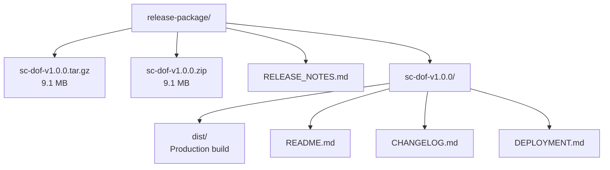
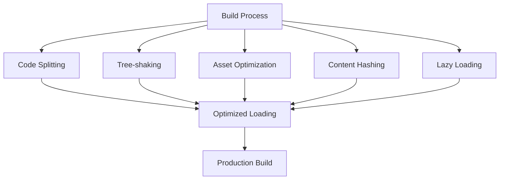
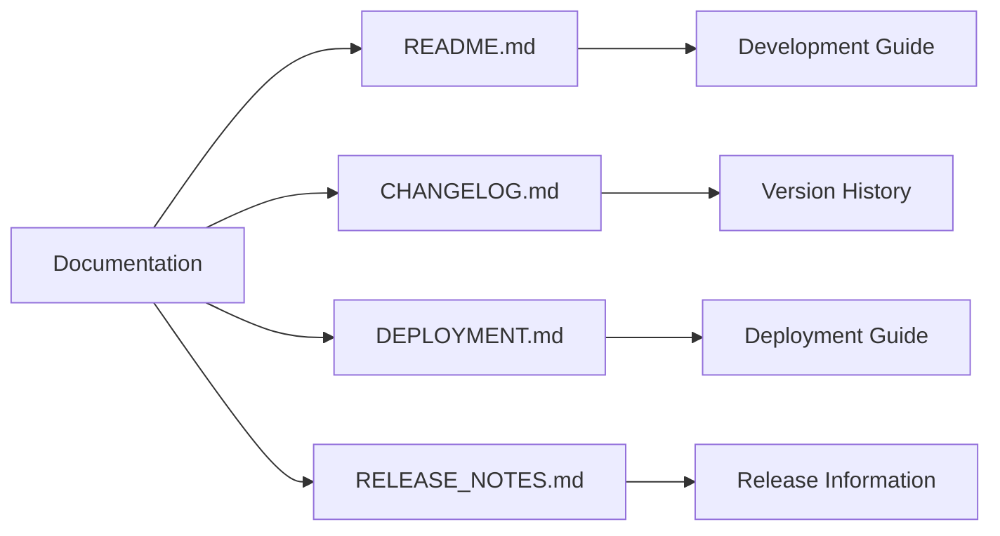

# Release Instructions

<cite>
**Referenced Files in This Document**   
- [RELEASE_INSTRUCTIONS.md](file://RELEASE_INSTRUCTIONS.md)
- [DEPLOYMENT.md](file://DEPLOYMENT.md)
- [RELEASE_NOTES.md](file://RELEASE_NOTES.md)
- [package.json](file://package.json)
- [vite.config.ts](file://vite.config.ts)
- [tailwind.config.ts](file://tailwind.config.ts)
- [CHANGELOG.md](file://CHANGELOG.md)
- [README.md](file://README.md)
- [App.tsx](file://src/App.tsx)
- [main.tsx](file://src/main.tsx)
- [eventData.ts](file://src/data/eventData.ts)
- [LanguageContext.tsx](file://src/contexts/LanguageContext.tsx)
</cite>

## Table of Contents
1. [Introduction](#introduction)
2. [Release Package Overview](#release-package-overview)
3. [GitHub Release Creation](#github-release-creation)
4. [Build and Verification](#build-and-verification)
5. [Post-Release Actions](#post-release-actions)
6. [Documentation Overview](#documentation-overview)
7. [Quick Reference](#quick-reference)

## Introduction
This document provides comprehensive instructions for releasing version 1.0.0 of the Syrian Liberation Day Event Platform. The release process includes preparing the repository, creating a GitHub release, uploading assets, and performing post-release actions. The platform is a multilingual event website commemorating Syrian Liberation Day (December 20, 2025) for the Syrian community in Turkey.

**Section sources**
- [RELEASE_INSTRUCTIONS.md](file://RELEASE_INSTRUCTIONS.md#L1-L200)
- [README.md](file://README.md#L1-L296)

## Release Package Overview

The release package is located at `release-package/` and contains all necessary files for distribution. This includes compressed archives of the complete release, documentation files, and the production build directory.



**Diagram sources**
- [RELEASE_INSTRUCTIONS.md](file://RELEASE_INSTRUCTIONS.md#L9-L23)

**Section sources**
- [RELEASE_INSTRUCTIONS.md](file://RELEASE_INSTRUCTIONS.md#L9-L23)

## GitHub Release Creation

### Repository Preparation
Before creating the GitHub release, ensure all changes are committed and pushed to the main branch:

```bash
cd 
git add .
git commit -m "Release v1.0.0 - Production ready build"
git push origin main
```

Verify that the commit includes:
- Updated version in package.json (1.0.0)
- New CHANGELOG.md with complete release history
- New DEPLOYMENT.md with hosting instructions
- New RELEASE_NOTES.md for GitHub release description
- Updated .gitignore to exclude release-package directory
- Fixed linting errors across UI components

### Release Configuration
To create the GitHub release:

1. Navigate to the repository on GitHub
2. Click on "Releases" in the right sidebar or Code tab
3. Click "Draft a new release"

Configure the release with the following settings:

**Release Tag:**
- Tag: `v1.0.0`
- Target: `main` (default branch)
- Check "This is a new tag"

**Release Title:**
```
Syrian Liberation Day Event Platform v1.0.0
```

**Release Description:**
Copy the entire content from `RELEASE_NOTES.md` and paste it into the release description box.

**Release Type:**
- Do NOT check "Set as a pre-release"
- Check "Set as the latest release"

### Asset Upload
Attach the following binary files to the release:
1. `release-package/sc-dof-v1.0.0.zip`
2. `release-package/sc-dof-v1.0.0.tar.gz`

### Publishing
Before publishing:
1. Review all information carefully
2. Click "Publish release"
3. Confirm the release is live

**Section sources**
- [RELEASE_INSTRUCTIONS.md](file://RELEASE_INSTRUCTIONS.md#L28-L87)

## Build and Verification

### Release Verification Checklist
Before publishing, verify all items in the checklist:

- [x] Version updated to 1.0.0 in package.json
- [x] Production build completed successfully
- [x] All linting errors fixed (only warnings remain)
- [x] CHANGELOG.md created with complete release notes
- [x] DEPLOYMENT.md created with deployment instructions
- [x] RELEASE_NOTES.md created for GitHub
- [x] Release packages created (ZIP and TAR.GZ)
- [x] Package size verified (~9.1 MB each)
- [x] Documentation files included in package
- [x] .gitignore updated to exclude release-package

### Build Statistics
The production build has the following characteristics:

**Bundle Sizes:**
- JavaScript Bundle: 371.17 kB (120.04 kB gzipped)
- CSS Bundle: 76.18 kB (12.76 kB gzipped)
- HTML Entry: 6.21 kB (2.05 kB gzipped)
- Total Dist Size: ~11 MB
- Package Size: 9.1 MB (compressed)

**Quality Metrics:**
- Build Status: SUCCESS
- Linting Status: PASSED (0 errors, 9 warnings)
- TypeScript: COMPILED
- Build Time: 3.53s



**Diagram sources**
- [RELEASE_INSTRUCTIONS.md](file://RELEASE_INSTRUCTIONS.md#L108-L121)

**Section sources**
- [RELEASE_INSTRUCTIONS.md](file://RELEASE_INSTRUCTIONS.md#L91-L121)
- [package.json](file://package.json#L1-L85)
- [vite.config.ts](file://vite.config.ts#L1-L19)

## Post-Release Actions

### Immediate Actions
After publishing the release:
1. Publish GitHub release (following the steps above)
2. Announce release to stakeholders
3. Update main README.md with release badge (optional)
4. Share release link with community

### Optional Enhancements
Consider implementing these enhancements:

**Add Release Badge to README.md:**
```markdown

```

**Deployment and Monitoring:**
1. Test deployment on a staging environment
2. Deploy to production hosting platform
3. Monitor for issues in the first 24-48 hours

**Section sources**
- [RELEASE_INSTRUCTIONS.md](file://RELEASE_INSTRUCTIONS.md#L125-L142)

## Documentation Overview

The release includes comprehensive documentation to support users and developers:

### Included Documentation Files
1. **README.md** - Project overview and development guide
   - Technology stack details
   - Getting started instructions
   - Project structure explanation
   - Development guidelines

2. **CHANGELOG.md** - Version history and changes
   - Features added in each version
   - Technical specifications
   - Browser compatibility information
   - Security and performance details

3. **DEPLOYMENT.md** - Deployment instructions
   - Platform-specific guides (Netlify, Vercel, GitHub Pages, etc.)
   - Server configuration (Apache, Nginx)
   - Security considerations
   - Troubleshooting guide

4. **RELEASE_NOTES.md** - GitHub release notes
   - Release overview and key features
   - What's included in the release
   - Getting started guide for deployers



**Diagram sources**
- [RELEASE_INSTRUCTIONS.md](file://RELEASE_INSTRUCTIONS.md#L145-L172)

**Section sources**
- [RELEASE_INSTRUCTIONS.md](file://RELEASE_INSTRUCTIONS.md#L145-L172)
- [DEPLOYMENT.md](file://DEPLOYMENT.md#L1-L335)
- [RELEASE_NOTES.md](file://RELEASE_NOTES.md#L1-L250)

## Quick Reference

### Project Files
- Version file: `package.json`
- Build output: `dist/`
- Release packages: `release-package/`

### Documentation
- Project docs: `README.md`
- Changes: `CHANGELOG.md`
- Deployment: `DEPLOYMENT.md`
- Release notes: `RELEASE_NOTES.md`

### Key Features
The Syrian Liberation Day Event Platform v1.0.0 includes:
- **Multilingual Support**: Arabic (RTL), English, and Turkish
- **Responsive Design**: Mobile-first approach for all devices
- **Event Information Hub**: Comprehensive details about the commemoration
- **Interactive Features**: Countdown timer, Google Maps integration, QR codes
- **Modern Technology Stack**: React, TypeScript, Vite, Tailwind CSS

The platform is now ready for release, celebrating the Syrian community's resilience and freedom.

**Section sources**
- [RELEASE_INSTRUCTIONS.md](file://RELEASE_INSTRUCTIONS.md#L175-L187)
- [RELEASE_NOTES.md](file://RELEASE_NOTES.md#L1-L250)
- [CHANGELOG.md](file://CHANGELOG.md#L1-L96)