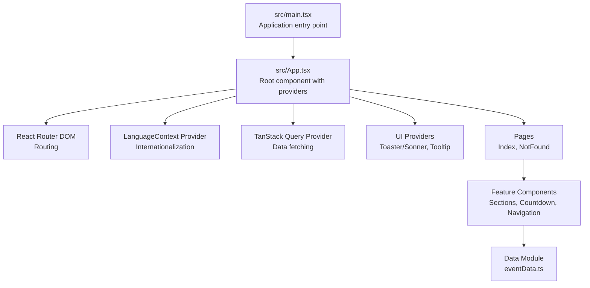
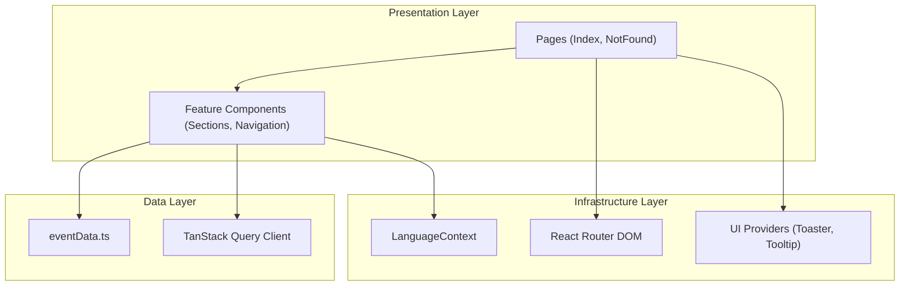
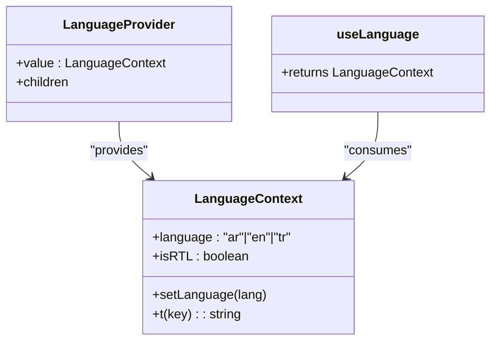
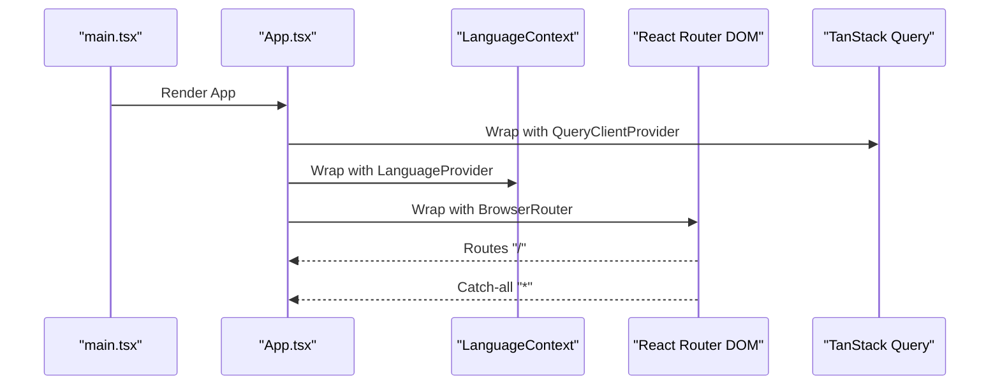
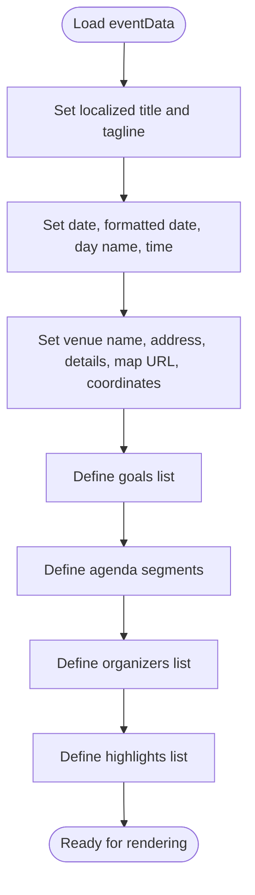
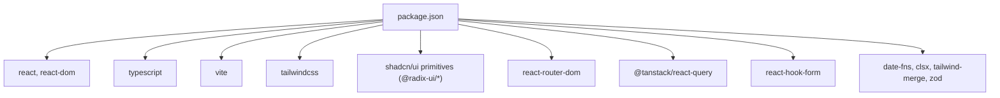

# Release Notes

<cite>
**Referenced Files in This Document**
- [RELEASE_NOTES.md](file://RELEASE_NOTES.md)
- [RELEASE_INSTRUCTIONS.md](file://RELEASE_INSTRUCTIONS.md)
- [README.md](file://README.md)
- [DEPLOYMENT.md](file://DEPLOYMENT.md)
- [package.json](file://package.json)
- [src/App.tsx](file://src/App.tsx)
- [src/main.tsx](file://src/main.tsx)
- [src/data/eventData.ts](file://src/data/eventData.ts)
- [src/contexts/LanguageContext.tsx](file://src/contexts/LanguageContext.tsx)
</cite>

## Table of Contents
1. [Introduction](#introduction)
2. [Project Structure](#project-structure)
3. [Core Components](#core-components)
4. [Architecture Overview](#architecture-overview)
5. [Detailed Component Analysis](#detailed-component-analysis)
6. [Dependency Analysis](#dependency-analysis)
7. [Performance Considerations](#performance-considerations)
8. [Troubleshooting Guide](#troubleshooting-guide)
9. [Conclusion](#conclusion)
10. [Appendices](#appendices)

## Introduction
This document presents the official release notes for the Syrian Liberation Day Event Platform, version 1.0.0. It summarizes the platform’s purpose, key features, technology stack, deployment options, browser compatibility, and quality assurance outcomes. It also outlines the release packaging and publishing workflow for GitHub Releases.

## Project Structure
The project is a modern React application with TypeScript, Vite, Tailwind CSS, and ShadCN UI components. The application is structured around feature-based components, a dedicated data module for event information, and a language context for internationalization. The entry point initializes the React root and wraps the app with providers for routing, language, tooltips, TanStack Query, and notifications.

**Diagram sources**
- [src/main.tsx](file://src/main.tsx#L1-L6)
- [src/App.tsx](file://src/App.tsx#L1-L43)
- [src/data/eventData.ts](file://src/data/eventData.ts#L1-L109)
- [src/contexts/LanguageContext.tsx](file://src/contexts/LanguageContext.tsx#L1-L292)

**Section sources**
- [README.md](file://README.md#L132-L191)
- [src/main.tsx](file://src/main.tsx#L1-L6)
- [src/App.tsx](file://src/App.tsx#L1-L43)

## Core Components
- Application entry and providers: Initializes the React root and composes providers for routing, language, tooltips, TanStack Query, and notifications.
- Language context: Manages language selection, translation keys, and RTL detection for Arabic.
- Event data module: Centralizes event metadata, venue, agenda, organizers, and highlights.
- Pages and routes: Defines the root route and a catch-all route for 404 handling.

**Section sources**
- [src/main.tsx](file://src/main.tsx#L1-L6)
- [src/App.tsx](file://src/App.tsx#L1-L43)
- [src/contexts/LanguageContext.tsx](file://src/contexts/LanguageContext.tsx#L1-L292)
- [src/data/eventData.ts](file://src/data/eventData.ts#L1-L109)

## Architecture Overview
The application follows a layered architecture:
- Presentation layer: Feature components and pages.
- Data layer: Event data module and TanStack Query for data fetching.
- Infrastructure layer: Language context, routing, and UI providers.

**Diagram sources**
- [src/App.tsx](file://src/App.tsx#L1-L43)
- [src/data/eventData.ts](file://src/data/eventData.ts#L1-L109)
- [src/contexts/LanguageContext.tsx](file://src/contexts/LanguageContext.tsx#L1-L292)

## Detailed Component Analysis

### Language Context and Internationalization
The language context provides:
- Language state with support for Arabic, English, and Turkish.
- A translation function keyed by dot notation (e.g., section.element).
- RTL detection for Arabic to enable right-to-left layouts.
- A provider wrapper to make language state available throughout the app.

**Diagram sources**
- [src/contexts/LanguageContext.tsx](file://src/contexts/LanguageContext.tsx#L1-L292)

**Section sources**
- [src/contexts/LanguageContext.tsx](file://src/contexts/LanguageContext.tsx#L1-L292)
- [README.md](file://README.md#L194-L236)

### Application Root and Providers
The root component composes providers for:
- TanStack Query (data fetching and caching).
- Tooltip provider (UI tooltips).
- Language provider (internationalization).
It also sets the directionality and font family based on the selected language and mounts the router with routes for the index page and a catch-all 404 page.

**Diagram sources**
- [src/main.tsx](file://src/main.tsx#L1-L6)
- [src/App.tsx](file://src/App.tsx#L1-L43)

**Section sources**
- [src/main.tsx](file://src/main.tsx#L1-L6)
- [src/App.tsx](file://src/App.tsx#L1-L43)

### Event Data Model
The event data module centralizes:
- Event title, subtitle, tagline, and localized variants.
- Date, formatted date, day name, and time.
- Venue details, Google Maps URL, and coordinates.
- Goals, agenda segments, organizers, and highlights.

**Diagram sources**
- [src/data/eventData.ts](file://src/data/eventData.ts#L1-L109)

**Section sources**
- [src/data/eventData.ts](file://src/data/eventData.ts#L1-L109)

## Dependency Analysis
The application depends on a modern React ecosystem with strong tooling and UI libraries. The package file lists core dependencies and dev dependencies, including React, TypeScript, Vite, Tailwind CSS, ShadCN UI primitives, React Router, TanStack Query, and related utilities.

**Diagram sources**
- [package.json](file://package.json#L1-L85)

**Section sources**
- [package.json](file://package.json#L1-L85)

## Performance Considerations
- The release package includes optimized production builds with code splitting, tree-shaking, asset minification, content hashing, and lazy loading.
- Build statistics indicate bundle sizes and total package size for quick sizing expectations.
- Recommendations include enabling CDN integration, compression, and appropriate caching headers for production deployments.

**Section sources**
- [RELEASE_NOTES.md](file://RELEASE_NOTES.md#L61-L87)
- [RELEASE_INSTRUCTIONS.md](file://RELEASE_INSTRUCTIONS.md#L108-L122)

## Troubleshooting Guide
Common deployment issues and resolutions:
- Blank page after deployment: Check browser console for errors; verify base path configuration, CORS, and SPA redirect settings.
- 404 errors on page refresh: Ensure server redirects all routes to index.html for SPA routing.
- Fonts or images not loading: Confirm MIME types and CORS headers; verify all dist assets are uploaded.
- Arabic text display issues: Ensure UTF-8 encoding and correct font loading; confirm RTL CSS is not blocked.

**Section sources**
- [DEPLOYMENT.md](file://DEPLOYMENT.md#L292-L331)

## Conclusion
Version 1.0.0 delivers a production-ready, multilingual, responsive event platform tailored for the Syrian Liberation Day commemoration. It includes comprehensive documentation, deployment guides, and quality assurance outcomes. The release package is prepared for immediate deployment across multiple platforms and includes release notes suitable for GitHub Releases.

## Appendices

### Release Packaging and Publishing Workflow
- The release package includes compressed archives and documentation files.
- The publishing workflow covers tagging, release description, assets upload, and verification checklist.
- Post-release actions include announcements, optional README badges, staging tests, production deployment, and monitoring.

**Section sources**
- [RELEASE_NOTES.md](file://RELEASE_NOTES.md#L70-L107)
- [RELEASE_INSTRUCTIONS.md](file://RELEASE_INSTRUCTIONS.md#L1-L88)
- [RELEASE_INSTRUCTIONS.md](file://RELEASE_INSTRUCTIONS.md#L89-L143)

### Browser Compatibility
- The platform targets modern browsers with recommended minimum versions and full support levels.

**Section sources**
- [RELEASE_NOTES.md](file://RELEASE_NOTES.md#L109-L119)

### Technology Stack Overview
- Core: React, TypeScript, Vite.
- UI: Tailwind CSS, ShadCN UI, Lucide React.
- State and routing: React Router DOM, TanStack Query, React Hook Form.
- Utilities: date-fns, clsx, tailwind-merge, zod.
- Build and development: ESLint, PostCSS/Autoprefixer.

**Section sources**
- [README.md](file://README.md#L35-L61)
- [package.json](file://package.json#L1-L85)