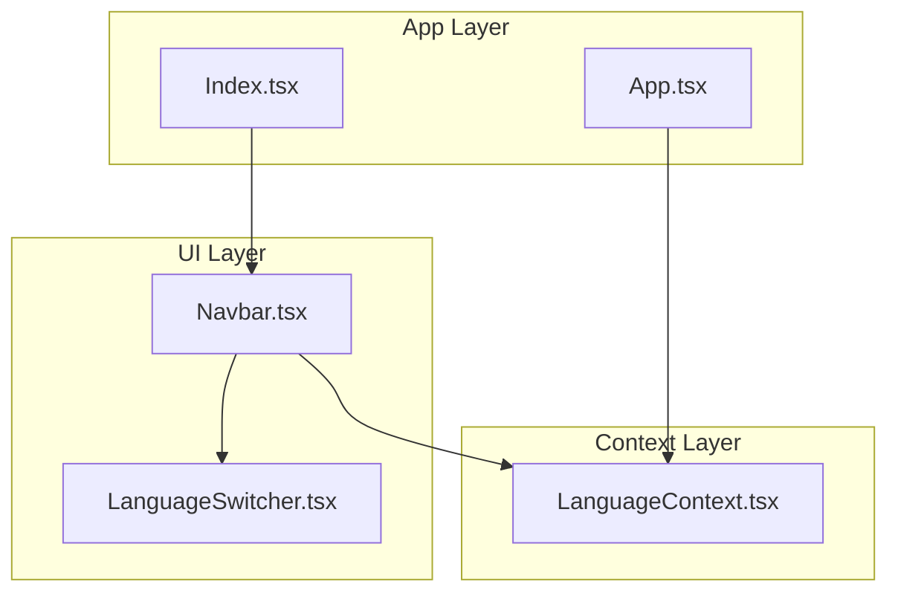
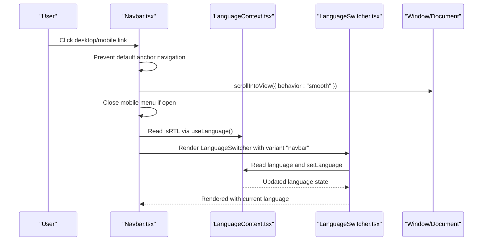
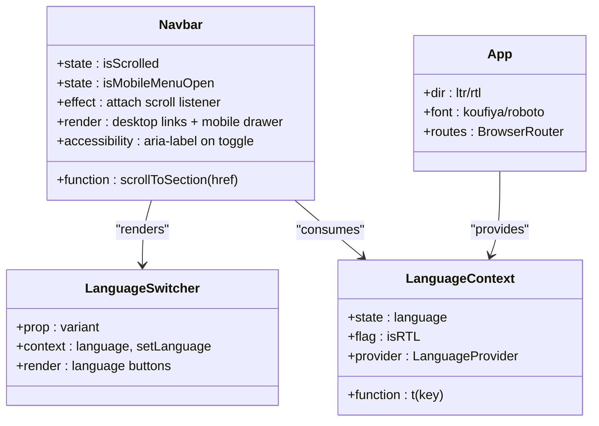
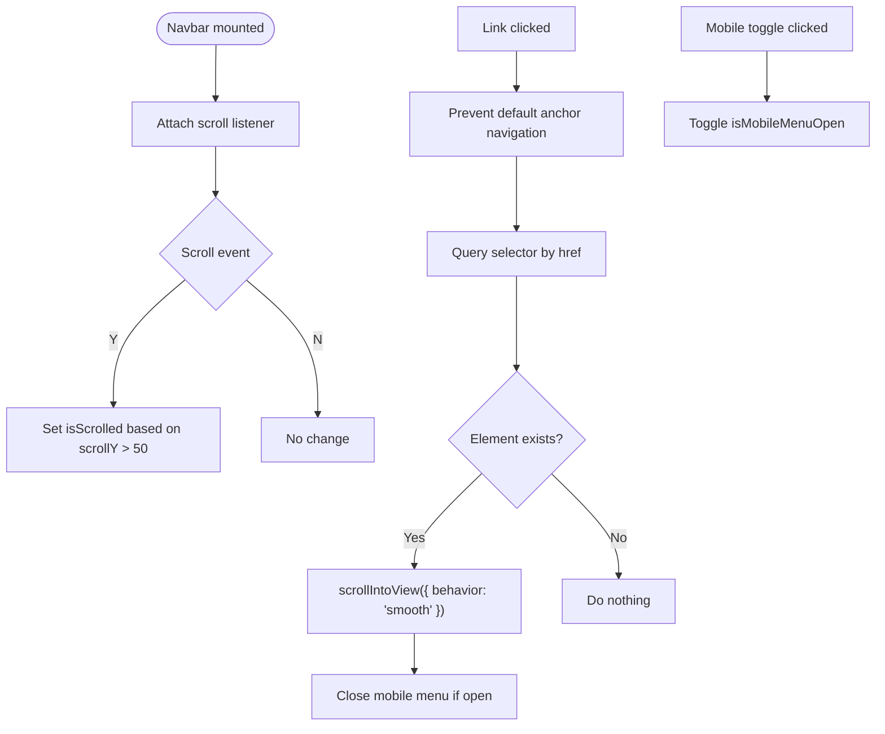
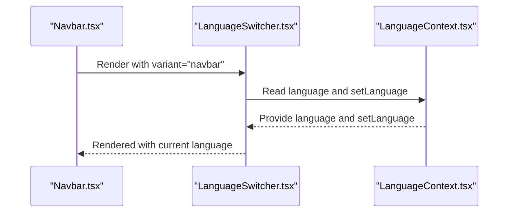
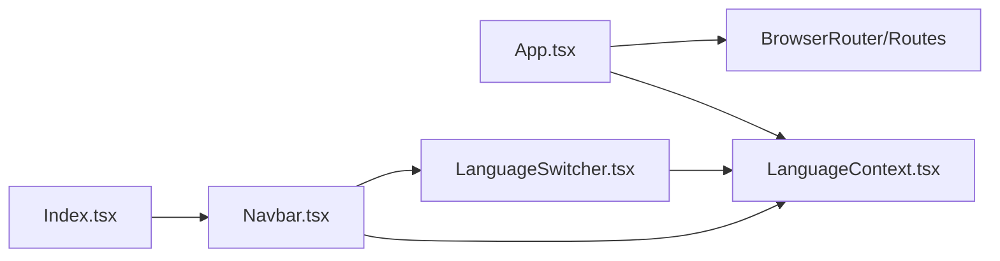

# Navbar Component

<cite>
**Referenced Files in This Document**
- [Navbar.tsx](file://src/components/Navbar.tsx)
- [LanguageSwitcher.tsx](file://src/components/LanguageSwitcher.tsx)
- [LanguageContext.tsx](file://src/contexts/LanguageContext.tsx)
- [App.tsx](file://src/App.tsx)
- [Index.tsx](file://src/pages/Index.tsx)
- [use-mobile.tsx](file://src/hooks/use-mobile.tsx)
</cite>

## Table of Contents
1. [Introduction](#introduction)
2. [Project Structure](#project-structure)
3. [Core Components](#core-components)
4. [Architecture Overview](#architecture-overview)
5. [Detailed Component Analysis](#detailed-component-analysis)
6. [Dependency Analysis](#dependency-analysis)
7. [Performance Considerations](#performance-considerations)
8. [Troubleshooting Guide](#troubleshooting-guide)
9. [Conclusion](#conclusion)

## Introduction
This document provides a comprehensive guide to the Navbar component, focusing on its responsive design, scroll-based visual effects, hash-based navigation, and integration with the internationalization system. It explains how the component uses React hooks to manage mobile menu state and scroll behavior, how it implements smooth in-page navigation using scrollIntoView, and how it coordinates with LanguageSwitcher and LanguageContext to inherit directionality (RTL/LTR). Accessibility features such as aria-labels and Lucide icons are covered, along with Tailwind-based responsive layouts and styling logic.

## Project Structure
The Navbar is part of the components layer and is integrated into the main page layout. It relies on the LanguageContext for translations and directionality, and it renders the LanguageSwitcher in both desktop and mobile views. The Index page composes the Navbar alongside other sections.

**Diagram sources**
- [Navbar.tsx](file://src/components/Navbar.tsx#L1-L123)
- [LanguageSwitcher.tsx](file://src/components/LanguageSwitcher.tsx#L1-L44)
- [LanguageContext.tsx](file://src/contexts/LanguageContext.tsx#L1-L292)
- [App.tsx](file://src/App.tsx#L1-L43)
- [Index.tsx](file://src/pages/Index.tsx#L1-L32)

**Section sources**
- [Navbar.tsx](file://src/components/Navbar.tsx#L1-L123)
- [Index.tsx](file://src/pages/Index.tsx#L1-L32)
- [App.tsx](file://src/App.tsx#L1-L43)

## Core Components
- Navbar: Implements responsive navigation with scroll detection, mobile menu toggle, hash-based smooth scrolling, and RTL/LTR directionality via LanguageContext.
- LanguageSwitcher: Provides language selection with two variants (navbar/floating) and inherits directionality from LanguageContext.
- LanguageContext: Supplies language state, translation function, and isRTL flag to consuming components.
- App/Index: Compose Navbar and other sections; App sets global direction and font family based on language.

Key responsibilities:
- Navbar manages mobile menu state and scroll effects using useState and useEffect.
- Navbar constructs navigation links from translations and navigates smoothly to sections via hash anchors.
- LanguageSwitcher is placed in both desktop and mobile views and reacts to language changes.
- LanguageContext drives directionality and text direction across the app.

**Section sources**
- [Navbar.tsx](file://src/components/Navbar.tsx#L1-L123)
- [LanguageSwitcher.tsx](file://src/components/LanguageSwitcher.tsx#L1-L44)
- [LanguageContext.tsx](file://src/contexts/LanguageContext.tsx#L1-L292)
- [App.tsx](file://src/App.tsx#L1-L43)
- [Index.tsx](file://src/pages/Index.tsx#L1-L32)

## Architecture Overview
The Navbar sits at the intersection of UI state, internationalization, and navigation. It listens to scroll events to adjust its visual appearance, toggles a mobile menu via local state, and performs smooth in-page navigation using hash anchors. LanguageSwitcher is integrated into both desktop and mobile layouts and reflects the current language and directionality.

**Diagram sources**
- [Navbar.tsx](file://src/components/Navbar.tsx#L1-L123)
- [LanguageSwitcher.tsx](file://src/components/LanguageSwitcher.tsx#L1-L44)
- [LanguageContext.tsx](file://src/contexts/LanguageContext.tsx#L1-L292)

## Detailed Component Analysis

### Responsive Design and Mobile Menu State
- Uses useState to track whether the mobile menu is open.
- Uses useEffect to attach a scroll listener that updates a scrolled state after the initial render.
- Applies Tailwind classes to adjust background, blur, shadow, and spacing based on scroll position.
- Conditional rendering separates desktop and mobile layouts using md:flex and md:hidden.

Accessibility:
- Mobile toggle button includes aria-label for screen readers.
- Lucide icons Menu and X are used to reflect the current state.

Event handling and state transitions:
- Toggle button switches isMobileMenuOpen on click.
- Each navigation link calls preventDefault and invokes scrollToSection, which closes the mobile menu after navigation.

Styling logic:
- Fixed positioning with z-index ensures the navbar overlays content.
- Transition classes animate background and shadow changes.
- Direction attribute is set on the nav element based on isRTL.

**Section sources**
- [Navbar.tsx](file://src/components/Navbar.tsx#L1-L123)

### Scroll-Based Visual Effects
- A scroll event listener updates a boolean state when scrollY exceeds a threshold.
- The navbar’s background and shadow classes change based on this state.
- Cleanup removes the listener on unmount to avoid memory leaks.

Performance note:
- The current implementation attaches a raw scroll listener. Consider debouncing for smoother performance on lower-end devices.

**Section sources**
- [Navbar.tsx](file://src/components/Navbar.tsx#L1-L123)

### Hash-Based Navigation with Smooth Behavior
- Navigation links use href attributes with hash anchors (#hero, #why, etc.).
- Click handlers call preventDefault to intercept anchor navigation.
- scrollToSection resolves the element and calls scrollIntoView with smooth behavior.
- Mobile menu is closed after navigation.

Edge cases:
- If an element does not exist, the function does nothing. Consider logging or fallback behavior if needed.

**Section sources**
- [Navbar.tsx](file://src/components/Navbar.tsx#L1-L123)

### Conditional Rendering: Desktop vs. Mobile Layouts
- Desktop navigation is hidden on small screens using md:flex.
- Mobile navigation is shown using md:hidden and rendered only when isMobileMenuOpen is true.
- Both desktop and mobile views include LanguageSwitcher with variant "navbar".

Responsive breakpoint:
- The component relies on Tailwind’s md breakpoint for layout switching.

**Section sources**
- [Navbar.tsx](file://src/components/Navbar.tsx#L1-L123)

### Internationalization Integration
- Navbar consumes useLanguage to access t (translation function) and isRTL (direction flag).
- The nav element receives dir={isRTL ? "rtl" : "ltr"} to align text and layout accordingly.
- Navigation labels are translated via t('nav.X') keys.

LanguageSwitcher integration:
- Desktop view: LanguageSwitcher is rendered inside a hidden md:block container.
- Mobile view: LanguageSwitcher is rendered within the mobile drawer below the links.
- LanguageSwitcher variant is set to "navbar" in both placements.

Directionality inheritance:
- LanguageSwitcher itself reads language and setLanguage from LanguageContext and applies visual feedback based on the current language.

Font and direction in App:
- App sets the global dir attribute and font class based on the current language, complementing Navbar’s inline direction setting.

**Section sources**
- [Navbar.tsx](file://src/components/Navbar.tsx#L1-L123)
- [LanguageSwitcher.tsx](file://src/components/LanguageSwitcher.tsx#L1-L44)
- [LanguageContext.tsx](file://src/contexts/LanguageContext.tsx#L1-L292)
- [App.tsx](file://src/App.tsx#L1-L43)

### Accessibility Features
- Mobile menu toggle button includes aria-label for assistive technologies.
- Links use anchor elements with href attributes and preventDefault to maintain SPA semantics while enabling smooth scrolling.
- Direction attribute dir is applied to the nav element to support RTL languages.

**Section sources**
- [Navbar.tsx](file://src/components/Navbar.tsx#L1-L123)

### Lucide Icons and Mobile Toggle
- Lucide Menu and X icons are used for the mobile toggle button.
- The icon displayed depends on isMobileMenuOpen state.
- Accessibility is ensured via aria-label on the toggle button.

**Section sources**
- [Navbar.tsx](file://src/components/Navbar.tsx#L1-L123)

### Alternative Mobile Detection Hook
- A separate useIsMobile hook exists for detecting mobile breakpoints elsewhere in the codebase.
- While Navbar currently uses Tailwind’s responsive classes for layout, the hook could be used for programmatic mobile behavior if needed.

**Section sources**
- [use-mobile.tsx](file://src/hooks/use-mobile.tsx#L1-L20)

## Architecture Overview

**Diagram sources**
- [Navbar.tsx](file://src/components/Navbar.tsx#L1-L123)
- [LanguageSwitcher.tsx](file://src/components/LanguageSwitcher.tsx#L1-L44)
- [LanguageContext.tsx](file://src/contexts/LanguageContext.tsx#L1-L292)
- [App.tsx](file://src/App.tsx#L1-L43)

## Detailed Component Analysis

### Navbar Component Analysis
- State management:
  - isScrolled: derived from scroll position.
  - isMobileMenuOpen: toggled by the mobile menu button.
- Event handling:
  - Scroll listener updates isScrolled.
  - Click handlers on links call preventDefault and scrollToSection.
  - Toggle button switches isMobileMenuOpen.
- Navigation:
  - Hash anchors (#hero, #why, etc.) mapped via navLinks.
  - scrollToSection uses scrollIntoView with smooth behavior.
- Rendering:
  - Desktop: md:flex container with link list.
  - Mobile: md:hidden drawer with link list and LanguageSwitcher.
- Internationalization:
  - Uses t('nav.X') for labels.
  - Sets dir on nav based on isRTL.

**Diagram sources**
- [Navbar.tsx](file://src/components/Navbar.tsx#L1-L123)

**Section sources**
- [Navbar.tsx](file://src/components/Navbar.tsx#L1-L123)

### LanguageSwitcher Integration
- Placement:
  - Desktop: Inside a hidden md:block container.
  - Mobile: Below the links in the mobile drawer.
- Variant:
  - Navbar passes variant="navbar" to match the intended styling.
- Directionality:
  - LanguageSwitcher reads language and setLanguage from LanguageContext; Navbar sets dir on the nav element.

**Diagram sources**
- [Navbar.tsx](file://src/components/Navbar.tsx#L1-L123)
- [LanguageSwitcher.tsx](file://src/components/LanguageSwitcher.tsx#L1-L44)
- [LanguageContext.tsx](file://src/contexts/LanguageContext.tsx#L1-L292)

**Section sources**
- [LanguageSwitcher.tsx](file://src/components/LanguageSwitcher.tsx#L1-L44)
- [Navbar.tsx](file://src/components/Navbar.tsx#L1-L123)
- [LanguageContext.tsx](file://src/contexts/LanguageContext.tsx#L1-L292)

### App-Level Direction and Font
- App sets dir based on isRTL and chooses font classes depending on language.
- This complements Navbar’s inline direction setting for consistent RTL/LTR behavior.

**Section sources**
- [App.tsx](file://src/App.tsx#L1-L43)
- [LanguageContext.tsx](file://src/contexts/LanguageContext.tsx#L1-L292)

## Dependency Analysis
- Navbar depends on:
  - LanguageContext for translations and directionality.
  - Lucide icons for mobile toggle.
  - Tailwind classes for responsive layouts.
- LanguageSwitcher depends on:
  - LanguageContext for language state and setter.
- App composes providers and routes, ensuring Navbar and LanguageSwitcher are available.

**Diagram sources**
- [App.tsx](file://src/App.tsx#L1-L43)
- [Index.tsx](file://src/pages/Index.tsx#L1-L32)
- [Navbar.tsx](file://src/components/Navbar.tsx#L1-L123)
- [LanguageSwitcher.tsx](file://src/components/LanguageSwitcher.tsx#L1-L44)
- [LanguageContext.tsx](file://src/contexts/LanguageContext.tsx#L1-L292)

**Section sources**
- [App.tsx](file://src/App.tsx#L1-L43)
- [Index.tsx](file://src/pages/Index.tsx#L1-L32)
- [Navbar.tsx](file://src/components/Navbar.tsx#L1-L123)
- [LanguageSwitcher.tsx](file://src/components/LanguageSwitcher.tsx#L1-L44)
- [LanguageContext.tsx](file://src/contexts/LanguageContext.tsx#L1-L292)

## Performance Considerations
- Scroll listener performance:
  - Current implementation attaches a raw scroll listener. On low-end devices, consider debouncing the handler to reduce reflows and repaints.
  - Alternatively, throttle the scroll handler to limit frequency of updates.
- Cleanup:
  - Navbar already cleans up the scroll listener on unmount, which is essential to prevent memory leaks.
- Re-renders:
  - The component’s state updates are minimal and scoped to scroll and mobile menu toggling, keeping re-renders inexpensive.
- Mobile detection:
  - Navbar uses Tailwind’s md breakpoint for layout. If programmatic detection is needed elsewhere, the useIsMobile hook can be considered.

[No sources needed since this section provides general guidance]

## Troubleshooting Guide
- Scroll position conflicts:
  - If smooth scrolling overshoots or leaves the target element off-screen, verify that the hash anchors match the section IDs and that there are no fixed-height elements overlapping the viewport.
- Mobile touch behavior:
  - On some devices, the mobile menu may close unexpectedly if the click target is misaligned. Ensure the toggle button covers the intended touch area and that preventDefault is consistently applied to all link clicks.
- Scroll event listener performance:
  - If the page feels sluggish on scroll, debounce the scroll handler or replace it with a throttled version.
- Accessibility:
  - Confirm that the mobile toggle button has a clear aria-label and that focus order remains logical when the mobile menu opens/closes.
- Directionality issues:
  - Verify that dir is applied to the nav element and that the global dir in App is consistent. LanguageSwitcher should reflect the current language without conflicting with Navbar’s direction setting.

**Section sources**
- [Navbar.tsx](file://src/components/Navbar.tsx#L1-L123)
- [App.tsx](file://src/App.tsx#L1-L43)

## Conclusion
The Navbar component provides a clean, accessible, and responsive navigation experience. It integrates seamlessly with the internationalization system, supports smooth in-page navigation, and adapts its appearance based on scroll position. By leveraging Tailwind’s responsive utilities and Lucide icons, it offers a consistent user experience across devices. With minor performance enhancements like debounced scroll listeners and careful attention to accessibility and directionality, the Navbar remains a robust foundation for the application’s navigation.