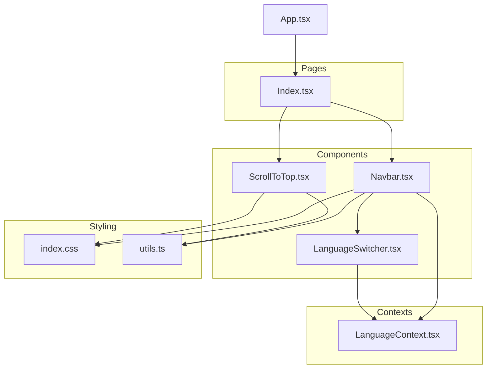
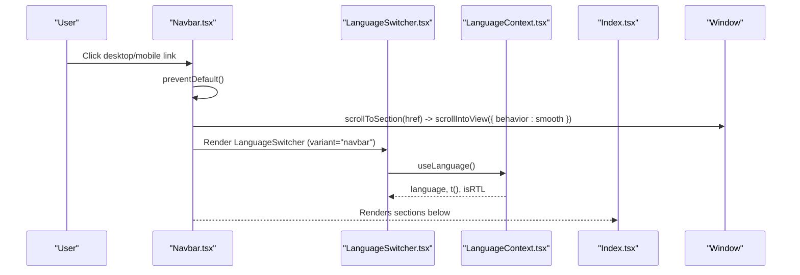
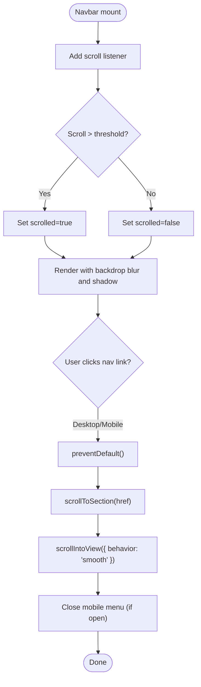
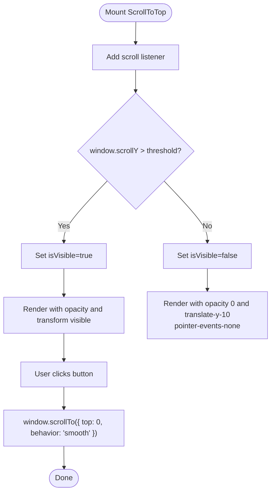
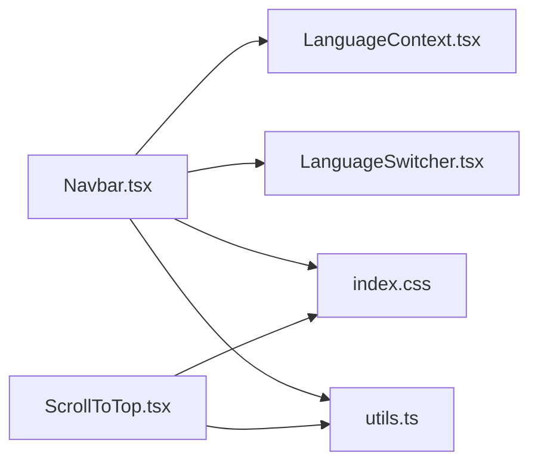

# Navigation Components

> **Referenced Files in This Document**
> - [Navbar.tsx](src/components/Navbar.tsx)
> - [ScrollToTop.tsx](src/components/ScrollToTop.tsx)
> - [LanguageSwitcher.tsx](src/components/LanguageSwitcher.tsx)
> - [LanguageContext.tsx](src/contexts/LanguageContext.tsx)
> - [Index.tsx](src/pages/Index.tsx)
> - [App.tsx](src/App.tsx)
> - [index.css](src/index.css)
> - [utils.ts](src/lib/utils.ts)

## Table of Contents
1. [Introduction](#introduction)
2. [Project Structure](#project-structure)
3. [Core Components](#core-components)
4. [Architecture Overview](#architecture-overview)
5. [Detailed Component Analysis](#detailed-component-analysis)
6. [Dependency Analysis](#dependency-analysis)
7. [Performance Considerations](#performance-considerations)
8. [Troubleshooting Guide](#troubleshooting-guide)
9. [Conclusion](#conclusion)

## Introduction
This document explains the navigation components that power in-page navigation and user experience on the event landing page. It focuses on:
- Navbar: responsive design with desktop and mobile menu states, integration with LanguageSwitcher, and hash-based navigation using scrollIntoView for smooth scrolling.
- ScrollToTop: visibility logic based on scroll position, smooth scrolling behavior, and animated appearance/disappearance using Tailwind classes and transform transitions.

It also covers state management with useState and useEffect, event handling, accessibility practices (aria-labels), and performance considerations such as scroll listener optimization.

## Project Structure
The navigation components are integrated into the main page layout and rely on shared internationalization and styling utilities.

**Diagram sources**
- [Index.tsx](src/pages/Index.tsx#L1-L32)
- [Navbar.tsx](src/components/Navbar.tsx#L1-L123)
- [ScrollToTop.tsx](src/components/ScrollToTop.tsx#L1-L41)
- [LanguageSwitcher.tsx](src/components/LanguageSwitcher.tsx#L1-L44)
- [LanguageContext.tsx](src/contexts/LanguageContext.tsx#L1-L292)
- [App.tsx](src/App.tsx#L1-L43)
- [index.css](src/index.css#L130-L142)
- [utils.ts](src/lib/utils.ts#L1-L7)

**Section sources**
- [Index.tsx](src/pages/Index.tsx#L1-L32)
- [App.tsx](src/App.tsx#L1-L43)

## Core Components
- Navbar: Fixed header with logo, desktop navigation links, mobile menu toggle, and LanguageSwitcher integration. Uses hash-based navigation via scrollIntoView and preventDefault to smoothly scroll to sections.
- ScrollToTop: Floating button that appears when the user scrolls beyond a threshold, enabling smooth scroll-to-top with animated transitions.

**Section sources**
- [Navbar.tsx](src/components/Navbar.tsx#L1-L123)
- [ScrollToTop.tsx](src/components/ScrollToTop.tsx#L1-L41)

## Architecture Overview
The Navbar and ScrollToTop components are composed within the main Index page. Navbar listens to scroll events to update its visual state and manages mobile menu visibility. Both components rely on the LanguageContext for i18n and directionality, and on Tailwind utilities for styling and transitions.

**Diagram sources**
- [Navbar.tsx](src/components/Navbar.tsx#L30-L76)
- [LanguageSwitcher.tsx](src/components/LanguageSwitcher.tsx#L1-L44)
- [LanguageContext.tsx](src/contexts/LanguageContext.tsx#L267-L292)
- [Index.tsx](src/pages/Index.tsx#L1-L32)

## Detailed Component Analysis

### Navbar Component
Responsibilities:
- Manage scroll-based visual effect (background blur and shadow) when scrolling down.
- Provide desktop and mobile navigation with hash-based routing to page sections.
- Integrate LanguageSwitcher and reflect RTL/LTR directionality.
- Toggle mobile menu with state and render Lucide icons (Menu/X) for visual feedback.

Key behaviors:
- Scroll detection: useEffect adds a scroll listener to update a state flag when scroll position exceeds a threshold. Cleanup removes the listener on unmount.
- Hash-based navigation: Each link’s click handler prevents default anchor behavior and calls a utility function to scroll to the target section using scrollIntoView with smooth behavior.
- Mobile menu: State toggles visibility of the mobile navigation panel; clicking a mobile link also triggers the same scroll utility and closes the menu.
- Accessibility: The mobile menu toggle button includes an aria-label for screen readers.

**Diagram sources**
- [Navbar.tsx](src/components/Navbar.tsx#L11-L17)
- [Navbar.tsx](src/components/Navbar.tsx#L30-L76)
- [Navbar.tsx](src/components/Navbar.tsx#L95-L116)

Implementation highlights:
- State and effects: useState for scrolled and mobile menu state; useEffect for scroll listener and cleanup.
- Event handling: preventDefault on anchor clicks; click handlers for mobile menu toggle and navigation links.
- Styling: Tailwind classes adjust background, backdrop blur, shadow, and transitions based on scroll state.
- Internationalization: uses LanguageContext for labels and directionality; passes isRTL to the nav container.
- Icons: Lucide Menu/X rendered conditionally based on mobile menu state.

Accessibility:
- aria-label on the mobile menu toggle button.
- Semantic anchor elements for navigation.

Integration points:
- LanguageSwitcher is rendered in both desktop and mobile contexts.
- Uses t() from LanguageContext for localized labels.

**Section sources**
- [Navbar.tsx](src/components/Navbar.tsx#L1-L123)
- [LanguageSwitcher.tsx](src/components/LanguageSwitcher.tsx#L1-L44)
- [LanguageContext.tsx](src/contexts/LanguageContext.tsx#L1-L292)
- [index.css](src/index.css#L130-L142)
- [utils.ts](src/lib/utils.ts#L1-L7)

### ScrollToTop Component
Responsibilities:
- Show a floating button when the user scrolls beyond a threshold.
- Smoothly scroll to the top of the page when clicked.
- Animate visibility using Tailwind classes with opacity and transform transitions.

Key behaviors:
- Visibility logic: useEffect adds a scroll listener that updates a state flag when scroll position exceeds the threshold. Cleanup removes the listener on unmount.
- Smooth scrolling: onClick triggers window.scrollTo with smooth behavior.
- Animated appearance/disappearance: Conditional Tailwind classes control opacity and translate-y; pointer-events-none hides interactions when not visible.
- Accessibility: aria-label on the button.

**Diagram sources**
- [ScrollToTop.tsx](src/components/ScrollToTop.tsx#L1-L41)

**Section sources**
- [ScrollToTop.tsx](src/components/ScrollToTop.tsx#L1-L41)
- [index.css](src/index.css#L130-L142)

### LanguageSwitcher Integration
- Navbar renders LanguageSwitcher in both desktop and mobile contexts.
- LanguageSwitcher reads current language and directionality from LanguageContext and exposes buttons to switch languages.
- The Navbar passes variant="navbar" to align styling with the navigation bar.

**Section sources**
- [Navbar.tsx](src/components/Navbar.tsx#L78-L116)
- [LanguageSwitcher.tsx](src/components/LanguageSwitcher.tsx#L1-L44)
- [LanguageContext.tsx](src/contexts/LanguageContext.tsx#L267-L292)

## Dependency Analysis
- Navbar depends on:
  - LanguageContext for labels and directionality.
  - Lucide icons for mobile menu toggle.
  - Tailwind classes for responsive layout and visual effects.
  - ScrollToTop is independent but both share the scroll listener pattern.
- ScrollToTop depends on:
  - Window scroll events.
  - Tailwind classes for animation and visibility.
- LanguageSwitcher depends on:
  - LanguageContext for language state and translation keys.
  - Optional flags/emojis for language indicators.

**Diagram sources**
- [Navbar.tsx](src/components/Navbar.tsx#L1-L123)
- [ScrollToTop.tsx](src/components/ScrollToTop.tsx#L1-L41)
- [LanguageSwitcher.tsx](src/components/LanguageSwitcher.tsx#L1-L44)
- [LanguageContext.tsx](src/contexts/LanguageContext.tsx#L1-L292)
- [index.css](src/index.css#L130-L142)
- [utils.ts](src/lib/utils.ts#L1-L7)

**Section sources**
- [Navbar.tsx](src/components/Navbar.tsx#L1-L123)
- [ScrollToTop.tsx](src/components/ScrollToTop.tsx#L1-L41)
- [LanguageSwitcher.tsx](src/components/LanguageSwitcher.tsx#L1-L44)
- [LanguageContext.tsx](src/contexts/LanguageContext.tsx#L1-L292)
- [index.css](src/index.css#L130-L142)
- [utils.ts](src/lib/utils.ts#L1-L7)

## Performance Considerations
- Scroll listeners: Both Navbar and ScrollToTop attach scroll listeners in useEffect. Ensure cleanup removes listeners to prevent memory leaks.
- Debouncing/throttling: For frequent scroll events, consider debouncing the visibility toggle in ScrollToTop to reduce re-renders and improve performance on lower-end devices.
- Smooth scrolling: Using scrollIntoView with smooth behavior is convenient but can be heavy on complex pages. Consider virtualization or limiting DOM updates in sections if performance becomes an issue.
- CSS transitions: Excessive transforms and opacity changes can cause layout thrashing. Keep transitions minimal and prefer transform/opacity combinations.
- Accessibility: aria-labels and keyboard-friendly navigation are essential. Ensure focus management when opening/closing the mobile menu.

[No sources needed since this section provides general guidance]

## Troubleshooting Guide
Common issues and resolutions:
- Scroll position conflicts:
  - Symptom: Navbar does not show backdrop blur or ScrollToTop does not appear.
  - Resolution: Verify scroll thresholds and ensure no parent containers are intercepting scroll events unexpectedly.
- Mobile touch interactions:
  - Symptom: Click handlers not firing on mobile.
  - Resolution: Ensure preventDefault is used on anchor clicks and that the mobile menu overlay does not block pointer events unintentionally.
- Performance of scroll event listeners:
  - Symptom: Jank or dropped frames while scrolling.
  - Resolution: Debounce or throttle the scroll handler in ScrollToTop; avoid heavy computations inside the handler.
- Accessibility:
  - Symptom: Screen reader confusion with mobile menu.
  - Resolution: Confirm aria-label presence on the toggle button and ensure focus moves appropriately when the menu opens.

**Section sources**
- [Navbar.tsx](src/components/Navbar.tsx#L30-L76)
- [ScrollToTop.tsx](src/components/ScrollToTop.tsx#L1-L41)

## Conclusion
The Navbar and ScrollToTop components provide a cohesive navigation experience with responsive design, internationalization, and smooth scrolling. Their modular structure allows easy maintenance and extension. Following the outlined state/event patterns, accessibility practices, and performance tips ensures a robust and user-friendly interface.

[No sources needed since this section summarizes without analyzing specific files]