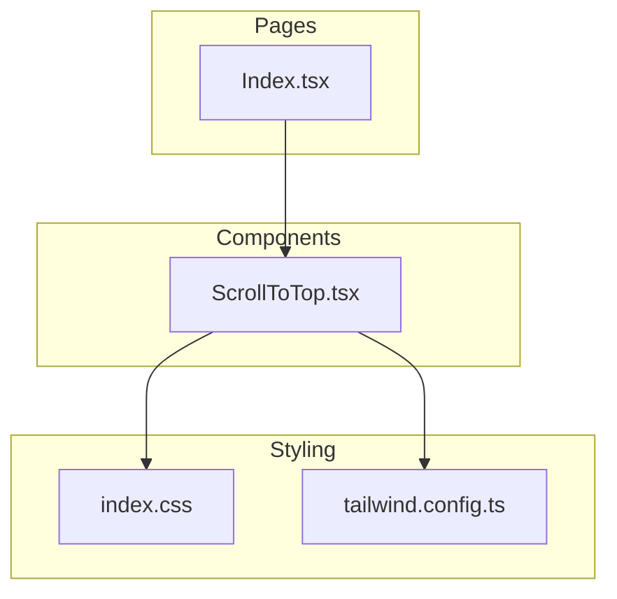
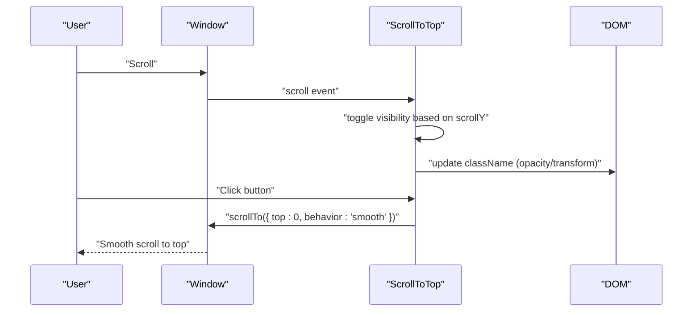
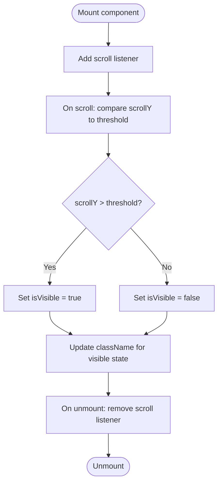
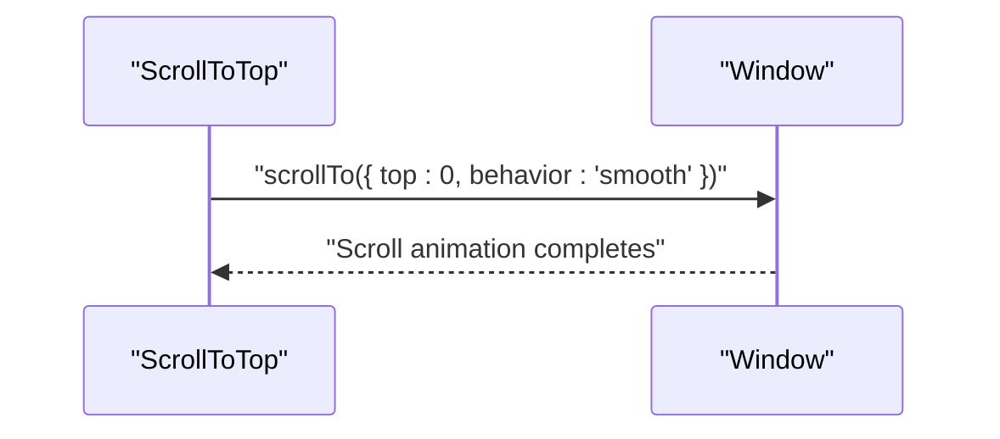
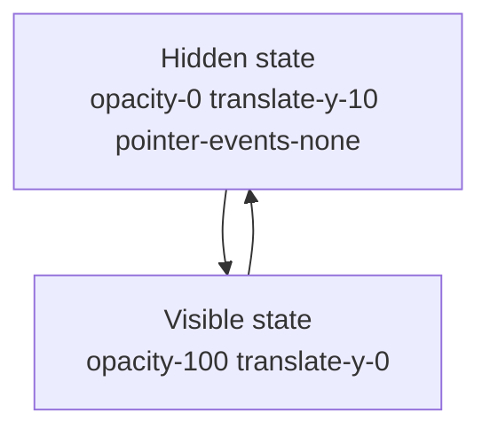
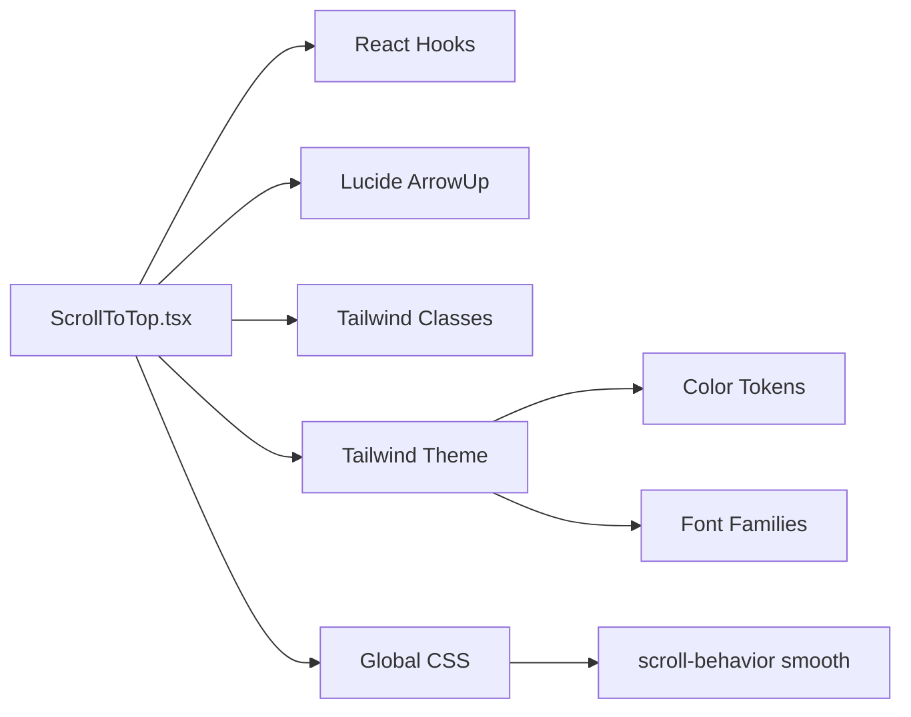

# ScrollToTop Component

<cite>
**Referenced Files in This Document**
- [ScrollToTop.tsx](file://src/components/ScrollToTop.tsx)
- [Index.tsx](file://src/pages/Index.tsx)
- [index.css](file://src/index.css)
- [tailwind.config.ts](file://src/tailwind.config.ts)
- [Navbar.tsx](file://src/components/Navbar.tsx)
</cite>

## Table of Contents
1. [Introduction](#introduction)
2. [Project Structure](#project-structure)
3. [Core Components](#core-components)
4. [Architecture Overview](#architecture-overview)
5. [Detailed Component Analysis](#detailed-component-analysis)
6. [Dependency Analysis](#dependency-analysis)
7. [Performance Considerations](#performance-considerations)
8. [Troubleshooting Guide](#troubleshooting-guide)
9. [Conclusion](#conclusion)

## Introduction
The ScrollToTop component enhances user experience by providing a quick way to navigate back to the top of the page. It appears when the user scrolls down beyond a threshold and smoothly scrolls the viewport back to the top when clicked. The component uses React hooks for visibility state and scroll event handling, Tailwind classes for animations and layout, and the ArrowUp Lucide icon for visual indication. Accessibility is supported via aria-label, and the component cleans up event listeners to prevent memory leaks.

## Project Structure
The ScrollToTop component is integrated into the main page layout and styled using the project’s Tailwind configuration and global CSS.

**Diagram sources**
- [Index.tsx](file://src/pages/Index.tsx#L1-L32)
- [ScrollToTop.tsx](file://src/components/ScrollToTop.tsx#L1-L41)
- [index.css](file://src/index.css#L1-L249)
- [tailwind.config.ts](file://src/tailwind.config.ts#L1-L98)

**Section sources**
- [Index.tsx](file://src/pages/Index.tsx#L1-L32)
- [ScrollToTop.tsx](file://src/components/ScrollToTop.tsx#L1-L41)
- [index.css](file://src/index.css#L1-L249)
- [tailwind.config.ts](file://src/tailwind.config.ts#L1-L98)

## Core Components
- ScrollToTop: A floating button that toggles visibility based on scroll position and triggers smooth scroll to the top on click.
- Integration: Included in the main page layout so it is present across routes.

Key implementation highlights:
- Visibility logic: Uses useState to track whether the button should be visible and useEffect to attach and detach a scroll event listener.
- Smooth scrolling: Calls window.scrollTo with smooth behavior to return to the top.
- Animation and layout: Conditional Tailwind classes animate opacity and vertical translation; pointer-events-none hides the button from interaction when not visible.
- Accessibility: Provides aria-label for screen readers.
- Cleanup: Removes the scroll event listener in the effect cleanup to avoid memory leaks.

**Section sources**
- [ScrollToTop.tsx](file://src/components/ScrollToTop.tsx#L1-L41)
- [Index.tsx](file://src/pages/Index.tsx#L10-L26)

## Architecture Overview
The component participates in the page lifecycle and interacts with the browser’s scroll system and DOM.

**Diagram sources**
- [ScrollToTop.tsx](file://src/components/ScrollToTop.tsx#L1-L41)

## Detailed Component Analysis

### Visibility Logic with useState and useEffect
- State: A boolean flag determines whether the button is visible.
- Effect: Attaches a scroll handler that updates the visibility state based on window.scrollY exceeding a threshold.
- Cleanup: Removes the scroll listener when the component unmounts.

**Diagram sources**
- [ScrollToTop.tsx](file://src/components/ScrollToTop.tsx#L1-L41)

**Section sources**
- [ScrollToTop.tsx](file://src/components/ScrollToTop.tsx#L1-L41)

### Smooth Scrolling Behavior
- The component triggers window.scrollTo with smooth behavior to return to the top of the page.
- Global CSS sets scroll-behavior to smooth, which affects native anchor scrolling; the component’s explicit smooth option ensures consistent behavior for programmatic navigation.

**Diagram sources**
- [ScrollToTop.tsx](file://src/components/ScrollToTop.tsx#L20-L25)
- [index.css](file://src/index.css#L130-L142)

**Section sources**
- [ScrollToTop.tsx](file://src/components/ScrollToTop.tsx#L20-L25)
- [index.css](file://src/index.css#L130-L142)

### Animated Appearance and Disappearance
- Conditional Tailwind classes control opacity and vertical translation to animate the button’s entrance and exit.
- pointer-events-none prevents interaction when the button is hidden.

**Diagram sources**
- [ScrollToTop.tsx](file://src/components/ScrollToTop.tsx#L27-L37)

**Section sources**
- [ScrollToTop.tsx](file://src/components/ScrollToTop.tsx#L27-L37)

### Accessibility Considerations
- aria-label provides a screen-reader-friendly label for the button.
- Keyboard navigation: The button is a standard HTML button and receives focus via tab order; ensure focus styles align with the project’s design system.

**Section sources**
- [ScrollToTop.tsx](file://src/components/ScrollToTop.tsx#L28-L36)

### Integration with the Page Layout
- The component is included in the main page layout so it remains visible across routes.

**Section sources**
- [Index.tsx](file://src/pages/Index.tsx#L10-L26)

## Dependency Analysis
- Internal dependencies:
  - React hooks: useState and useEffect for state and side effects.
  - Lucide icon: ArrowUp for visual indication.
- External dependencies:
  - Tailwind CSS classes for styling and animations.
  - Global CSS defines color tokens and scroll behavior.
  - Tailwind configuration extends colors and fonts used by the component.

**Diagram sources**
- [ScrollToTop.tsx](file://src/components/ScrollToTop.tsx#L1-L41)
- [index.css](file://src/index.css#L1-L249)
- [tailwind.config.ts](file://src/tailwind.config.ts#L1-L98)

**Section sources**
- [ScrollToTop.tsx](file://src/components/ScrollToTop.tsx#L1-L41)
- [index.css](file://src/index.css#L1-L249)
- [tailwind.config.ts](file://src/tailwind.config.ts#L1-L98)

## Performance Considerations
- Scroll event frequency: Scroll events fire frequently and can cause layout thrashing if not optimized. The current implementation performs a simple comparison and state update, which is lightweight.
- Recommended optimizations:
  - Debounce or throttle the scroll handler to limit re-renders.
  - Use passive event listeners where appropriate.
  - Consider IntersectionObserver for detecting visibility thresholds instead of scroll events for heavy pages.
- Memory leak prevention: The effect already removes the scroll listener on unmount, which is essential.

Practical example references:
- Event listener setup and cleanup in useEffect: [ScrollToTop.tsx](file://src/components/ScrollToTop.tsx#L7-L18)
- Similar pattern in Navbar: [Navbar.tsx](file://src/components/Navbar.tsx#L14-L16)

**Section sources**
- [ScrollToTop.tsx](file://src/components/ScrollToTop.tsx#L7-L18)
- [Navbar.tsx](file://src/components/Navbar.tsx#L14-L16)

## Troubleshooting Guide
- Button does not appear:
  - Verify the scroll threshold and initial state. The component sets visibility based on scrollY exceeding the threshold.
  - Confirm the component is rendered in the page layout.
- Button does not disappear:
  - Ensure the scroll listener is attached and the effect runs. Check for early returns or conditional rendering preventing mount.
- Click does nothing:
  - Confirm window.scrollTo is supported and not blocked by browser policies.
  - Verify the button is not hidden by pointer-events-none when not visible.
- Accessibility issues:
  - Ensure the aria-label is present and meaningful.
  - Test keyboard focus and ensure focus visibility is adequate.

Integration references:
- Component inclusion in the page: [Index.tsx](file://src/pages/Index.tsx#L10-L26)
- Scroll listener pattern: [ScrollToTop.tsx](file://src/components/ScrollToTop.tsx#L7-L18)

**Section sources**
- [Index.tsx](file://src/pages/Index.tsx#L10-L26)
- [ScrollToTop.tsx](file://src/components/ScrollToTop.tsx#L7-L18)

## Conclusion
The ScrollToTop component provides a simple yet effective way to improve navigation on long pages. It uses React hooks for state and side effects, Tailwind for smooth animations and layout, and Lucide for a clear visual indicator. With proper cleanup and potential performance enhancements like debouncing, it integrates cleanly into the application’s UI and supports accessibility standards.