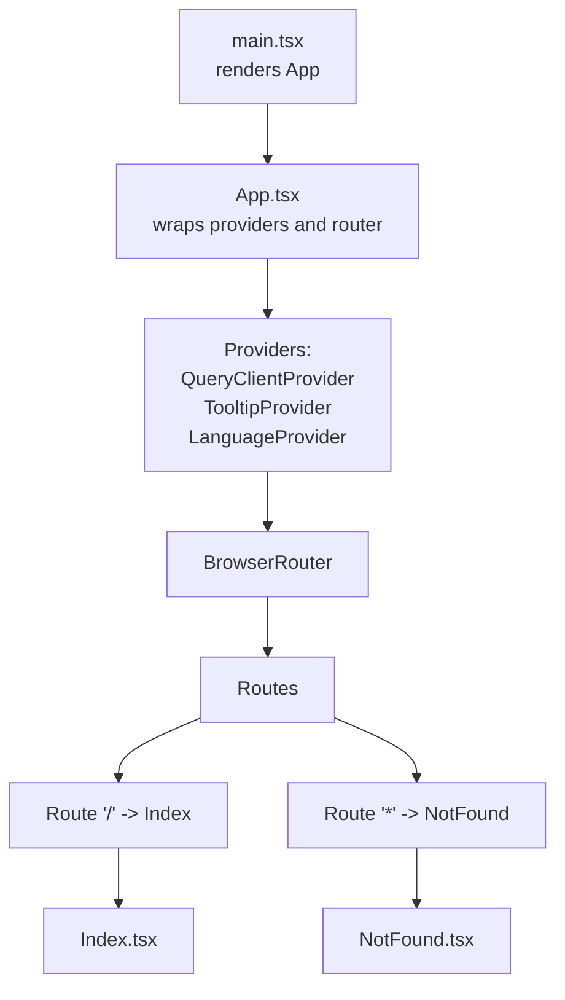
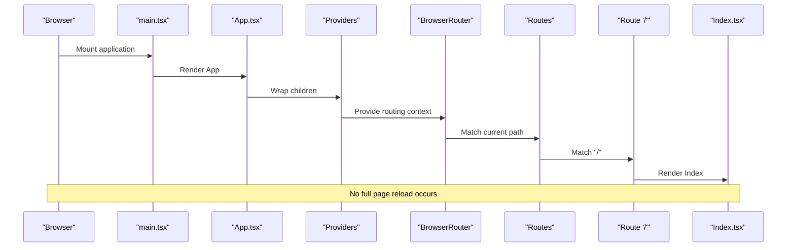
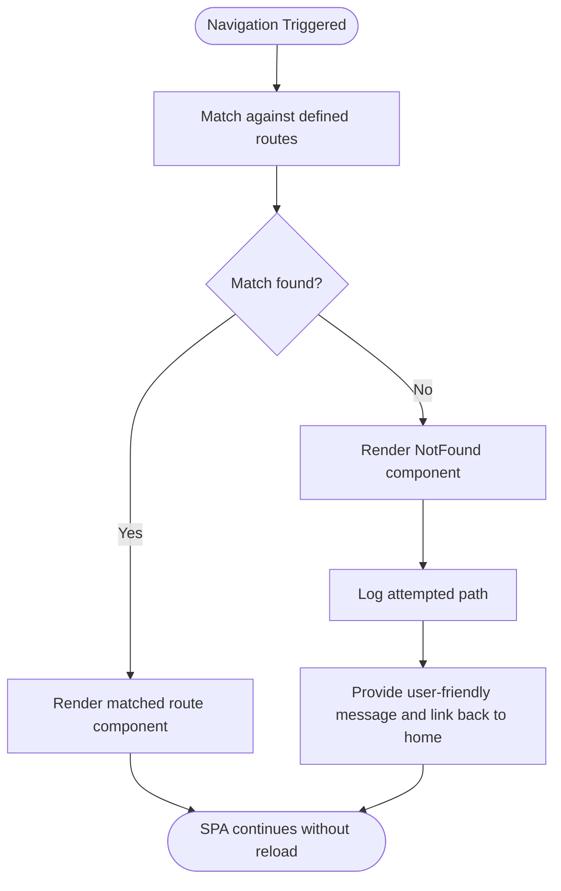
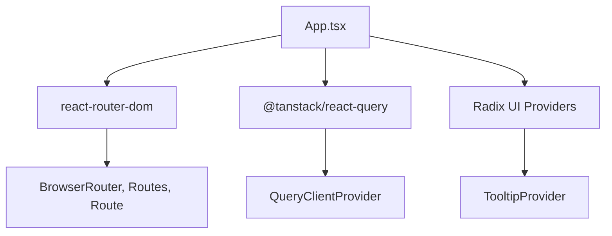

# React Router Implementation

<cite>
**Referenced Files in This Document**
- [App.tsx](file://src/App.tsx)
- [main.tsx](file://src/main.tsx)
- [Index.tsx](file://src/pages/Index.tsx)
- [NotFound.tsx](file://src/pages/NotFound.tsx)
- [LanguageContext.tsx](file://src/contexts/LanguageContext.tsx)
- [Navbar.tsx](file://src/components/Navbar.tsx)
- [ScrollToTop.tsx](file://src/components/ScrollToTop.tsx)
- [NavLink.tsx](file://src/components/NavLink.tsx)
- [package.json](file://package.json)
- [manifest.json](file://public/manifest.json)
</cite>

## Table of Contents
1. [Introduction](#introduction)
2. [Project Structure](#project-structure)
3. [Core Components](#core-components)
4. [Architecture Overview](#architecture-overview)
5. [Detailed Component Analysis](#detailed-component-analysis)
6. [Dependency Analysis](#dependency-analysis)
7. [Performance Considerations](#performance-considerations)
8. [Troubleshooting Guide](#troubleshooting-guide)
9. [Conclusion](#conclusion)
10. [Appendices](#appendices)

## Introduction
This document explains the React Router DOM implementation in the application. It focuses on how BrowserRouter wraps the application to enable client-side routing, how routes are defined in App.tsx, and how the SPA architecture prevents full page reloads. It also covers integration with providers such as LanguageProvider and QueryClientProvider, practical examples from the codebase, and guidance for extending the routing system with new routes and handling route parameters.

## Project Structure
The routing system centers around the application entry point and the App shell. The main entry renders the App component, which composes providers and the router. Routes are declared declaratively with BrowserRouter, Routes, and Route.

**Diagram sources**
- [main.tsx](file://src/main.tsx#L1-L6)
- [App.tsx](file://src/App.tsx#L1-L43)
- [Index.tsx](file://src/pages/Index.tsx#L1-L32)
- [NotFound.tsx](file://src/pages/NotFound.tsx#L1-L25)

**Section sources**
- [main.tsx](file://src/main.tsx#L1-L6)
- [App.tsx](file://src/App.tsx#L1-L43)

## Core Components
- BrowserRouter: Enables client-side routing by using the browser’s History API to keep the UI in sync with the URL without reloading the page.
- Routes and Route: Declarative route definitions. The root “/” route renders the Index page, and the catch-all “*” route renders NotFound.
- Provider stack: QueryClientProvider (TanStack React Query), TooltipProvider (Radix UI), and LanguageProvider (custom) wrap the router to share state and services across the app.

Practical examples from the codebase:
- Router wrapping and route definitions: [App.tsx](file://src/App.tsx#L12-L31)
- SPA behavior: [App.tsx](file://src/App.tsx#L22-L28)
- Provider composition: [App.tsx](file://src/App.tsx#L33-L41)

**Section sources**
- [App.tsx](file://src/App.tsx#L1-L43)
- [package.json](file://package.json#L55-L58)

## Architecture Overview
The SPA architecture is built on React Router DOM. The application mounts at the root element and delegates navigation to the router. Providers are layered to supply global services and state. The Index page composes multiple sections, and NotFound handles unknown paths.

**Diagram sources**
- [main.tsx](file://src/main.tsx#L1-L6)
- [App.tsx](file://src/App.tsx#L1-L43)
- [Index.tsx](file://src/pages/Index.tsx#L1-L32)

## Detailed Component Analysis

### App Shell and Routing Setup
- BrowserRouter is placed inside AppContent to scope routing to the application subtree.
- Routes contains two routes: the root “/” mapped to Index and a catch-all “*” mapped to NotFound.
- The provider order ensures QueryClientProvider is outermost, followed by TooltipProvider, then LanguageProvider, and finally AppContent.

Key implementation references:
- Router and route declarations: [App.tsx](file://src/App.tsx#L22-L28)
- Provider composition: [App.tsx](file://src/App.tsx#L33-L41)
- Language integration: [App.tsx](file://src/App.tsx#L12-L21)

Accessibility and internationalization:
- The language direction (rtl/ltr) and font selection are derived from the LanguageProvider and applied at the root div.

**Section sources**
- [App.tsx](file://src/App.tsx#L1-L43)
- [LanguageContext.tsx](file://src/contexts/LanguageContext.tsx#L267-L292)

### Route Definitions and Fallback Handling
- Root route “/” renders the Index page, which contains the hero, sections, speakers, organizers, and footer.
- Catch-all “*” renders NotFound, which logs the attempted path and provides a link back to home.

Practical examples:
- Root route definition: [App.tsx](file://src/App.tsx#L24-L24)
- Fallback route definition: [App.tsx](file://src/App.tsx#L26-L26)
- NotFound behavior: [NotFound.tsx](file://src/pages/NotFound.tsx#L1-L25)

Fallback handling flow:

**Diagram sources**
- [App.tsx](file://src/App.tsx#L22-L28)
- [NotFound.tsx](file://src/pages/NotFound.tsx#L1-L25)

**Section sources**
- [App.tsx](file://src/App.tsx#L22-L28)
- [NotFound.tsx](file://src/pages/NotFound.tsx#L1-L25)

### Provider Integration
- QueryClientProvider: TanStack React Query client is initialized at the top level to enable caching and server-state synchronization.
- TooltipProvider: Radix UI tooltips are globally enabled.
- LanguageProvider: Supplies language state, translation keys, and RTL detection used by the App shell.

Integration references:
- Provider initialization and composition: [App.tsx](file://src/App.tsx#L10-L11), [App.tsx](file://src/App.tsx#L33-L41)
- Language context contract and usage: [LanguageContext.tsx](file://src/contexts/LanguageContext.tsx#L1-L292)

**Section sources**
- [App.tsx](file://src/App.tsx#L10-L11)
- [App.tsx](file://src/App.tsx#L33-L41)
- [LanguageContext.tsx](file://src/contexts/LanguageContext.tsx#L1-L292)

### Navigation and Accessibility Considerations
- The Navbar component uses anchor links with smooth scrolling to sections within the Index page. These are internal anchors and do not trigger route changes; they rely on client-side scrolling.
- ScrollToTop provides a floating button to return to the top of the page when content is long.
- The NavLink component wraps react-router-dom’s NavLink to support className composition and active/pending states.

References:
- Navbar anchor navigation: [Navbar.tsx](file://src/components/Navbar.tsx#L19-L28), [Navbar.tsx](file://src/components/Navbar.tsx#L30-L36)
- Scroll-to-top behavior: [ScrollToTop.tsx](file://src/components/ScrollToTop.tsx#L1-L41)
- Enhanced NavLink wrapper: [NavLink.tsx](file://src/components/NavLink.tsx#L1-L28)

Note: The current routing setup does not use react-router-dom’s Link/NavLink for cross-route navigation because the application is a single-page layout with internal anchors. If future enhancements require client-side navigation between distinct pages, replace anchor links with Link/NavLink and adjust route definitions accordingly.

**Section sources**
- [Navbar.tsx](file://src/components/Navbar.tsx#L1-L123)
- [ScrollToTop.tsx](file://src/components/ScrollToTop.tsx#L1-L41)
- [NavLink.tsx](file://src/components/NavLink.tsx#L1-L28)

### Extending the Routing System
To add new routes:
- Add a new Route under Routes with a unique path and a corresponding page component.
- Place the new route before the catch-all “*” to avoid masking it.
- If the new route requires data fetching, ensure the page component uses TanStack React Query hooks via the QueryClientProvider.

Example reference:
- Route placement convention: [App.tsx](file://src/App.tsx#L25-L25)

Handling route parameters:
- If future pages require path parameters, define them in the Route path and access them using react-router-dom’s hook for parameter extraction.
- Ensure parameterized routes are ordered before catch-all routes.

[No sources needed since this section provides general guidance]

### Nested Routing Considerations
- The current setup uses a flat route structure. If nested layouts or child routes are needed, introduce nested Routes and Route components within a parent page component.
- Maintain the provider stack so that nested components retain access to QueryClientProvider, TooltipProvider, and LanguageProvider.

[No sources needed since this section provides general guidance]

## Dependency Analysis
External dependencies relevant to routing:
- react-router-dom: Provides BrowserRouter, Routes, Route, and related utilities.
- @tanstack/react-query: Provides QueryClientProvider for data fetching and caching.
- Radix UI: Provides TooltipProvider for UI interactions.

References:
- Dependencies: [package.json](file://package.json#L55-L58)

**Diagram sources**
- [package.json](file://package.json#L55-L58)
- [App.tsx](file://src/App.tsx#L1-L43)

**Section sources**
- [package.json](file://package.json#L55-L58)
- [App.tsx](file://src/App.tsx#L1-L43)

## Performance Considerations
- Client-side routing avoids full page reloads, reducing network overhead and preserving application state.
- Keep route components lightweight and lazy-load heavy assets to improve initial load performance.
- Use TanStack React Query’s caching to minimize repeated data requests across route transitions.

[No sources needed since this section provides general guidance]

## Troubleshooting Guide
Common issues and resolutions:
- Route ordering: Ensure custom routes are defined before the catch-all “*” to prevent unintended masking. Reference: [App.tsx](file://src/App.tsx#L25-L25)
- Provider boundaries: Verify that providers are correctly nested so that components can access required contexts. Reference: [App.tsx](file://src/App.tsx#L33-L41)
- Anchor vs. route navigation: Internal anchors within a single-page layout do not trigger route changes; use Link/NavLink for cross-route navigation if needed. References: [Navbar.tsx](file://src/components/Navbar.tsx#L19-L28), [NavLink.tsx](file://src/components/NavLink.tsx#L1-L28)
- Accessibility: Ensure buttons and links have appropriate aria-labels and keyboard navigation support. References: [ScrollToTop.tsx](file://src/components/ScrollToTop.tsx#L27-L38), [Navbar.tsx](file://src/components/Navbar.tsx#L84-L90)

**Section sources**
- [App.tsx](file://src/App.tsx#L25-L25)
- [App.tsx](file://src/App.tsx#L33-L41)
- [Navbar.tsx](file://src/components/Navbar.tsx#L19-L28)
- [NavLink.tsx](file://src/components/NavLink.tsx#L1-L28)
- [ScrollToTop.tsx](file://src/components/ScrollToTop.tsx#L27-L38)

## Conclusion
The application uses React Router DOM to implement a single-page architecture. BrowserRouter, Routes, and Route provide declarative routing with a root “/” page and a robust fallback. Providers are layered to deliver global services and state. The current design emphasizes internal navigation via anchors within a single page, while maintaining the flexibility to adopt Link/NavLink for cross-route navigation in future enhancements.

[No sources needed since this section summarizes without analyzing specific files]

## Appendices

### Practical Examples from the Codebase
- Router and route definitions: [App.tsx](file://src/App.tsx#L22-L28)
- Provider composition: [App.tsx](file://src/App.tsx#L33-L41)
- NotFound fallback: [NotFound.tsx](file://src/pages/NotFound.tsx#L1-L25)
- Internal anchor navigation: [Navbar.tsx](file://src/components/Navbar.tsx#L19-L28)
- Scroll-to-top behavior: [ScrollToTop.tsx](file://src/components/ScrollToTop.tsx#L1-L41)
- Enhanced NavLink wrapper: [NavLink.tsx](file://src/components/NavLink.tsx#L1-L28)

**Section sources**
- [App.tsx](file://src/App.tsx#L22-L28)
- [App.tsx](file://src/App.tsx#L33-L41)
- [NotFound.tsx](file://src/pages/NotFound.tsx#L1-L25)
- [Navbar.tsx](file://src/components/Navbar.tsx#L19-L28)
- [ScrollToTop.tsx](file://src/components/ScrollToTop.tsx#L1-L41)
- [NavLink.tsx](file://src/components/NavLink.tsx#L1-L28)