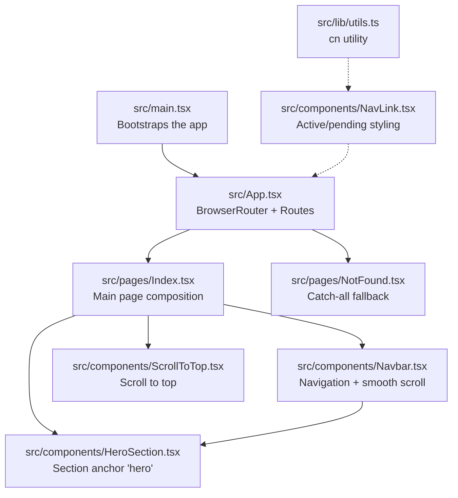
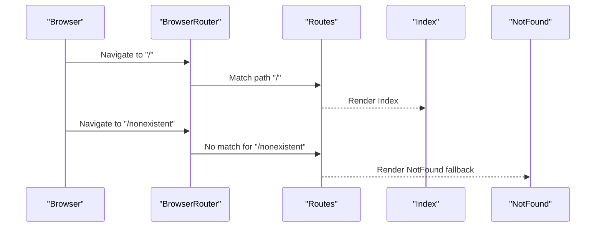
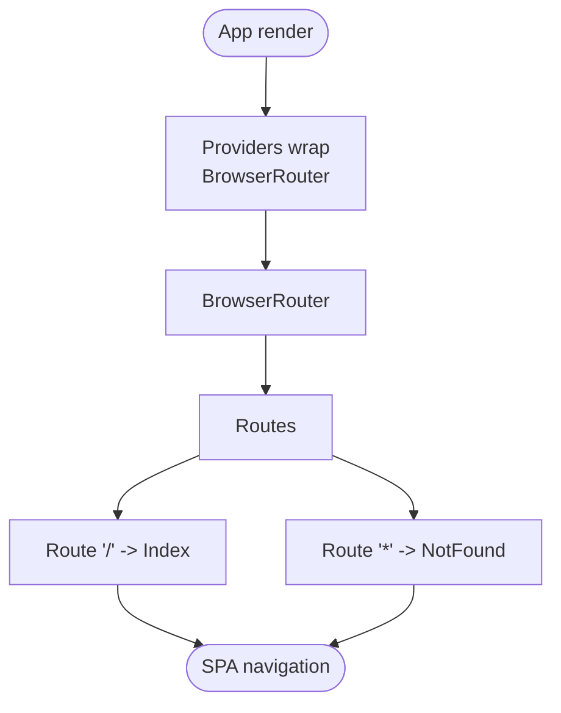
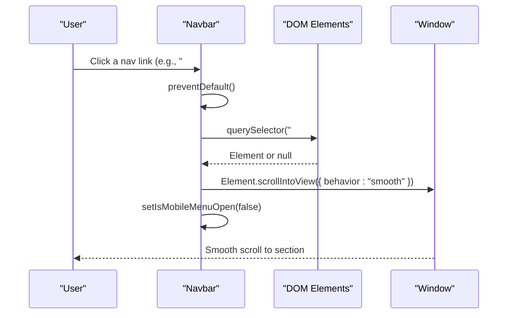
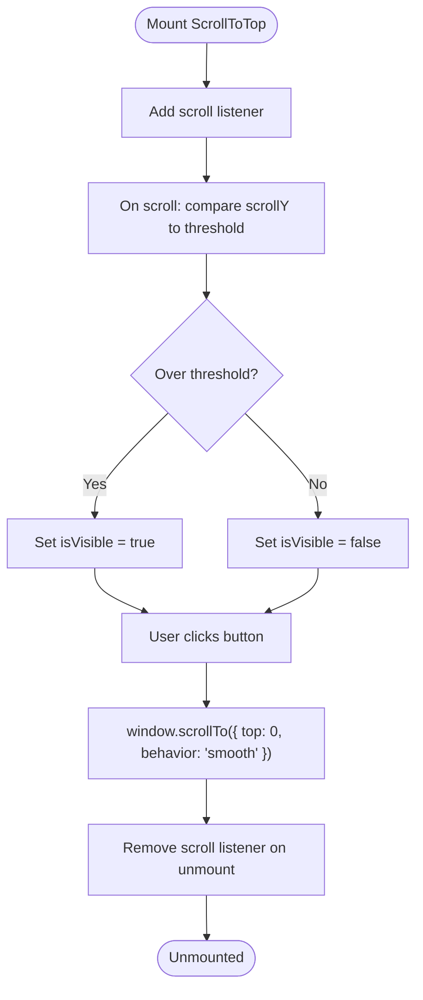
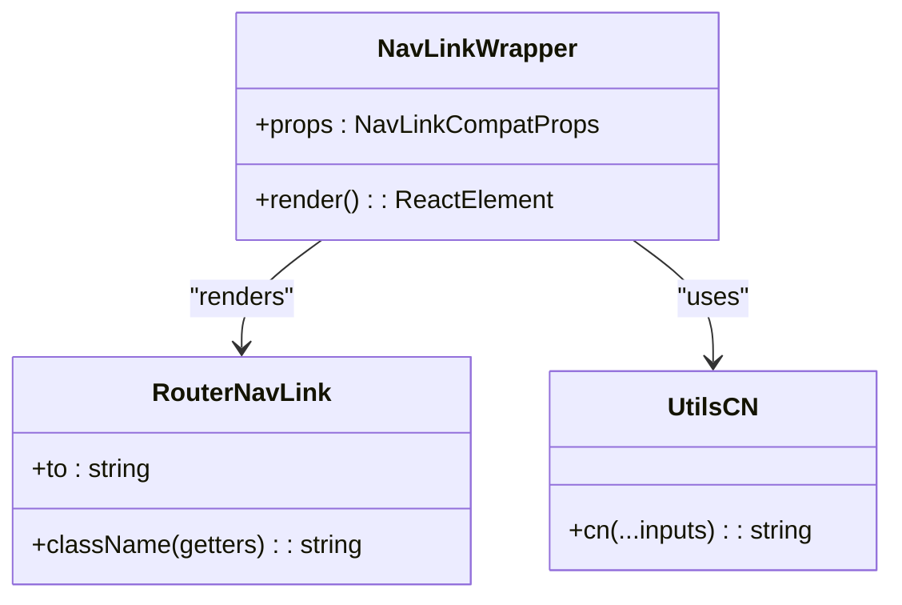
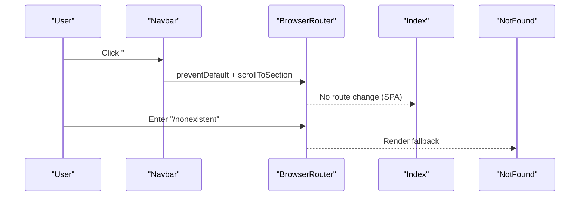
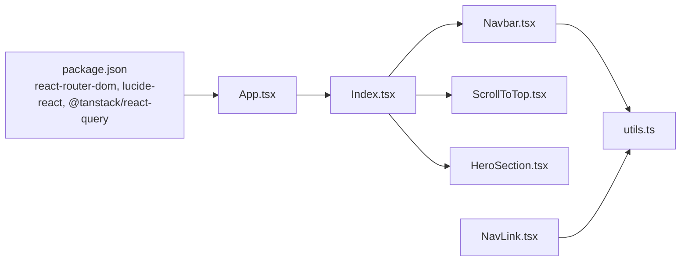

# Routing & Navigation

<cite>
**Referenced Files in This Document**
- [App.tsx](file://src/App.tsx)
- [Index.tsx](file://src/pages/Index.tsx)
- [NotFound.tsx](file://src/pages/NotFound.tsx)
- [Navbar.tsx](file://src/components/Navbar.tsx)
- [ScrollToTop.tsx](file://src/components/ScrollToTop.tsx)
- [NavLink.tsx](file://src/components/NavLink.tsx)
- [HeroSection.tsx](file://src/components/HeroSection.tsx)
- [main.tsx](file://src/main.tsx)
- [utils.ts](file://src/lib/utils.ts)
- [package.json](file://package.json)
</cite>

## Table of Contents
1. [Introduction](#introduction)
2. [Project Structure](#project-structure)
3. [Core Components](#core-components)
4. [Architecture Overview](#architecture-overview)
5. [Detailed Component Analysis](#detailed-component-analysis)
6. [Dependency Analysis](#dependency-analysis)
7. [Performance Considerations](#performance-considerations)
8. [Troubleshooting Guide](#troubleshooting-guide)
9. [Conclusion](#conclusion)

## Introduction
This document explains how users move through the application using the routing and navigation system. It focuses on:
- React Router DOM setup in App.tsx with the main Index page and a NotFound fallback
- Navbar navigation links and smooth scrolling to page sections
- ScrollToTop behavior for returning users to the top of the page
- Single-page application (SPA) patterns and how navigation works without full page reloads
- Solutions for common navigation issues such as hash routing conflicts and accessibility compliance

## Project Structure
The routing and navigation system spans several files:
- App.tsx sets up the SPA with BrowserRouter, Routes, and two routes: root "/" and catch-all "*"
- Index.tsx composes the main page with Navbar, sections, and ScrollToTop
- Navbar.tsx provides desktop/mobile navigation and smooth scrolling to sections
- ScrollToTop.tsx adds a floating button to scroll back to the top
- NavLink.tsx wraps react-router-dom’s NavLink to support active/pending styling
- HeroSection.tsx defines the anchor target for the hero section
- utils.ts provides the cn utility used by NavLink
- main.tsx bootstraps the app

**Diagram sources**
- [main.tsx](file://src/main.tsx#L1-L6)
- [App.tsx](file://src/App.tsx#L1-L43)
- [Index.tsx](file://src/pages/Index.tsx#L1-L32)
- [Navbar.tsx](file://src/components/Navbar.tsx#L1-L123)
- [ScrollToTop.tsx](file://src/components/ScrollToTop.tsx#L1-L41)
- [HeroSection.tsx](file://src/components/HeroSection.tsx#L1-L99)
- [NotFound.tsx](file://src/pages/NotFound.tsx#L1-L25)
- [NavLink.tsx](file://src/components/NavLink.tsx#L1-L29)
- [utils.ts](file://src/lib/utils.ts#L1-L7)

**Section sources**
- [main.tsx](file://src/main.tsx#L1-L6)
- [App.tsx](file://src/App.tsx#L1-L43)

## Core Components
- App.tsx: Wraps the app with providers and defines the SPA routes. The root route renders Index, and the catch-all "*" renders NotFound.
- Index.tsx: Composes the main page and includes Navbar, sections, and ScrollToTop.
- Navbar.tsx: Provides navigation links and smooth scrolling to sections via hash anchors.
- ScrollToTop.tsx: Shows a floating button when scrolled down and smoothly scrolls to the top.
- NavLink.tsx: A wrapper around react-router-dom’s NavLink that supports active/pending styling using the cn utility.
- HeroSection.tsx: Defines the anchor target for the hero section so Navbar links can scroll to it.

**Section sources**
- [App.tsx](file://src/App.tsx#L1-L43)
- [Index.tsx](file://src/pages/Index.tsx#L1-L32)
- [Navbar.tsx](file://src/components/Navbar.tsx#L1-L123)
- [ScrollToTop.tsx](file://src/components/ScrollToTop.tsx#L1-L41)
- [NavLink.tsx](file://src/components/NavLink.tsx#L1-L29)
- [HeroSection.tsx](file://src/components/HeroSection.tsx#L1-L99)

## Architecture Overview
The application is a single-page application powered by React Router DOM. BrowserRouter enables client-side routing without full page reloads. The Index page composes all visible sections and integrates navigation helpers.

**Diagram sources**
- [App.tsx](file://src/App.tsx#L1-L43)
- [Index.tsx](file://src/pages/Index.tsx#L1-L32)
- [NotFound.tsx](file://src/pages/NotFound.tsx#L1-L25)

## Detailed Component Analysis

### React Router DOM Implementation
- BrowserRouter is mounted at the root to enable client-side routing.
- Routes contains two routes:
  - Root path "/" renders Index
  - Catch-all "*" renders NotFound
- Providers (QueryClientProvider, TooltipProvider, LanguageProvider) wrap the routing tree, ensuring global state and i18n are available to all routed components.

**Diagram sources**
- [App.tsx](file://src/App.tsx#L1-L43)

**Section sources**
- [App.tsx](file://src/App.tsx#L1-L43)

### Navbar Component Navigation
- Responsive design:
  - Desktop: Horizontal navigation bar with LanguageSwitcher
  - Mobile: Collapsible menu with LanguageSwitcher inside
- Navigation links:
  - Each link targets a section via hash anchors (e.g., "#hero", "#why", "#goals", etc.)
  - Click handlers prevent default navigation and call scrollToSection to smoothly scroll to the target element
- Smooth scrolling:
  - Uses Element.scrollIntoView with smooth behavior
  - Ensures the mobile menu closes after navigation
- Accessibility:
  - Uses aria-label on the mobile menu toggle button
  - Inherits directionality (LTR/RTL) from the LanguageContext

**Diagram sources**
- [Navbar.tsx](file://src/components/Navbar.tsx#L1-L123)

**Section sources**
- [Navbar.tsx](file://src/components/Navbar.tsx#L1-L123)
- [HeroSection.tsx](file://src/components/HeroSection.tsx#L1-L99)

### ScrollToTop Component
- Visibility logic:
  - Listens to scroll events and toggles visibility when scroll position exceeds a threshold
  - Unsubscribes from scroll events on cleanup to prevent memory leaks
- Smooth scroll to top:
  - Uses window.scrollTo with smooth behavior
- Accessibility:
  - Provides an aria-label for screen readers

**Diagram sources**
- [ScrollToTop.tsx](file://src/components/ScrollToTop.tsx#L1-L41)

**Section sources**
- [ScrollToTop.tsx](file://src/components/ScrollToTop.tsx#L1-L41)

### NavLink Component for Active States
- Wraps react-router-dom’s NavLink to support dynamic className composition
- Uses the cn utility to merge Tailwind classes and resolve conflicts
- Exposes activeClassName and pendingClassName for styling active/pending states
- Maintains ref forwarding for accessibility and integration

**Diagram sources**
- [NavLink.tsx](file://src/components/NavLink.tsx#L1-L29)
- [utils.ts](file://src/lib/utils.ts#L1-L7)

**Section sources**
- [NavLink.tsx](file://src/components/NavLink.tsx#L1-L29)
- [utils.ts](file://src/lib/utils.ts#L1-L7)

### Navigation Patterns in the SPA
- Hash-based navigation:
  - Navbar links use hash anchors to navigate within the same page
  - HeroSection defines the anchor target for the hero section
- SPA behavior:
  - BrowserRouter prevents full page reloads; navigation updates the URL and re-renders components
- Fallback handling:
  - NotFound is rendered for unmatched routes, logging the attempted path for diagnostics

**Diagram sources**
- [Navbar.tsx](file://src/components/Navbar.tsx#L1-L123)
- [App.tsx](file://src/App.tsx#L1-L43)
- [Index.tsx](file://src/pages/Index.tsx#L1-L32)
- [NotFound.tsx](file://src/pages/NotFound.tsx#L1-L25)

**Section sources**
- [Navbar.tsx](file://src/components/Navbar.tsx#L1-L123)
- [HeroSection.tsx](file://src/components/HeroSection.tsx#L1-L99)
- [App.tsx](file://src/App.tsx#L1-L43)
- [NotFound.tsx](file://src/pages/NotFound.tsx#L1-L25)

## Dependency Analysis
- External dependencies:
  - react-router-dom provides BrowserRouter, Routes, Route, and NavLink
  - lucide-react provides icons used in Navbar and ScrollToTop
  - @tanstack/react-query provides QueryClientProvider
- Internal dependencies:
  - App.tsx depends on Index and NotFound
  - Index.tsx composes Navbar, sections, and ScrollToTop
  - Navbar.tsx depends on LanguageContext and uses hash anchors
  - ScrollToTop.tsx depends on window scroll events
  - NavLink.tsx depends on utils.cn

**Diagram sources**
- [package.json](file://package.json#L1-L85)
- [App.tsx](file://src/App.tsx#L1-L43)
- [Index.tsx](file://src/pages/Index.tsx#L1-L32)
- [Navbar.tsx](file://src/components/Navbar.tsx#L1-L123)
- [ScrollToTop.tsx](file://src/components/ScrollToTop.tsx#L1-L41)
- [HeroSection.tsx](file://src/components/HeroSection.tsx#L1-L99)
- [utils.ts](file://src/lib/utils.ts#L1-L7)
- [NavLink.tsx](file://src/components/NavLink.tsx#L1-L29)

**Section sources**
- [package.json](file://package.json#L1-L85)
- [App.tsx](file://src/App.tsx#L1-L43)

## Performance Considerations
- Scroll event listeners:
  - Both Navbar and ScrollToTop attach scroll listeners. Ensure cleanup on unmount to avoid memory leaks (already handled).
- Smooth scrolling:
  - Using Element.scrollIntoView with smooth behavior is efficient for short distances; for very long pages, consider virtualization or throttling if performance becomes an issue.
- Router overhead:
  - SPA routing avoids full page reloads, reducing network and rendering costs.
- Bundle size:
  - react-router-dom and lucide-react are lightweight; keep imports scoped to reduce bundle bloat.

[No sources needed since this section provides general guidance]

## Troubleshooting Guide

### Hash Routing Conflicts
Symptoms:
- Unexpected fragment navigation or jumping to sections unexpectedly
- Conflicts when sharing URLs with external fragments

Solutions:
- Ensure hash anchors in Navbar match section ids in the page (e.g., "#hero" matches the hero section id)
- Avoid using hash anchors for actual routes; rely on BrowserRouter for route changes and hash anchors only for in-page navigation
- If deep linking to sections is required, consider updating the URL fragment after navigation to reflect the current section

Evidence from code:
- Navbar links use hash anchors to target sections
- HeroSection defines the anchor target for the hero section

**Section sources**
- [Navbar.tsx](file://src/components/Navbar.tsx#L1-L123)
- [HeroSection.tsx](file://src/components/HeroSection.tsx#L1-L99)

### Accessibility Compliance
Common issues:
- Missing labels for interactive elements
- Poor focus management on mobile menus
- Low contrast or small text in navigation

Solutions:
- Navbar:
  - aria-label is present on the mobile menu toggle button
  - Ensure links have meaningful text and consider adding aria-current for active states (NavLink supports active styling)
- ScrollToTop:
  - aria-label is present for screen readers
- General:
  - Ensure sufficient color contrast and focus indicators
  - Test keyboard navigation (Tab/Shift+Tab) through the Navbar and mobile menu
  - Verify that smooth scrolling does not cause motion sensitivity issues; users can disable animations if needed

Evidence from code:
- Navbar mobile menu toggle has aria-label
- ScrollToTop button has aria-label
- NavLink supports active/pending styling for better focus semantics

**Section sources**
- [Navbar.tsx](file://src/components/Navbar.tsx#L1-L123)
- [ScrollToTop.tsx](file://src/components/ScrollToTop.tsx#L1-L41)
- [NavLink.tsx](file://src/components/NavLink.tsx#L1-L29)

### Route Ordering and Fallback Behavior
- Place specific routes before the catch-all "*" route to avoid unintended fallbacks
- NotFound logs the attempted pathname for debugging

Evidence from code:
- App.tsx comments indicate route ordering and fallback handling

**Section sources**
- [App.tsx](file://src/App.tsx#L1-L43)
- [NotFound.tsx](file://src/pages/NotFound.tsx#L1-L25)

## Conclusion
The routing and navigation system combines React Router DOM for SPA behavior with in-page hash-based navigation for smooth scrolling. Navbar and ScrollToTop provide intuitive user experiences, while NavLink enhances visual feedback for active states. By following the patterns outlined here—matching hash anchors to section ids, cleaning up event listeners, and maintaining accessibility—you can extend the navigation system reliably and inclusively.