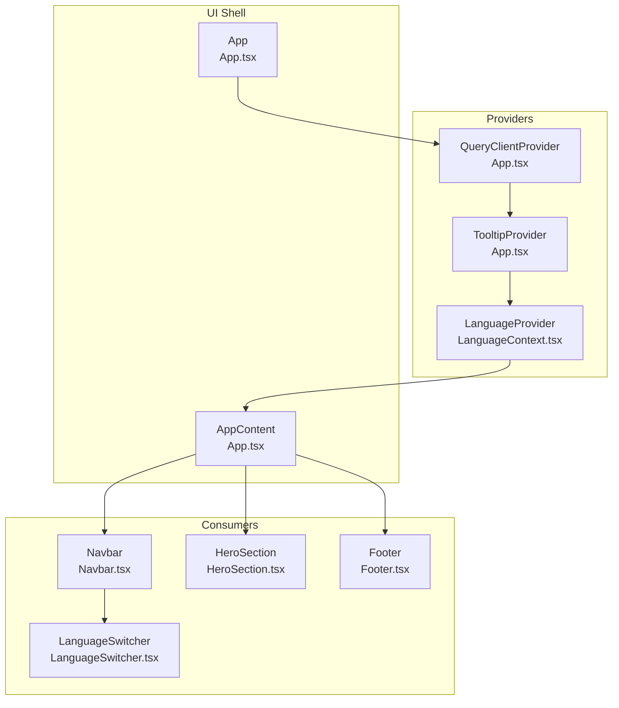
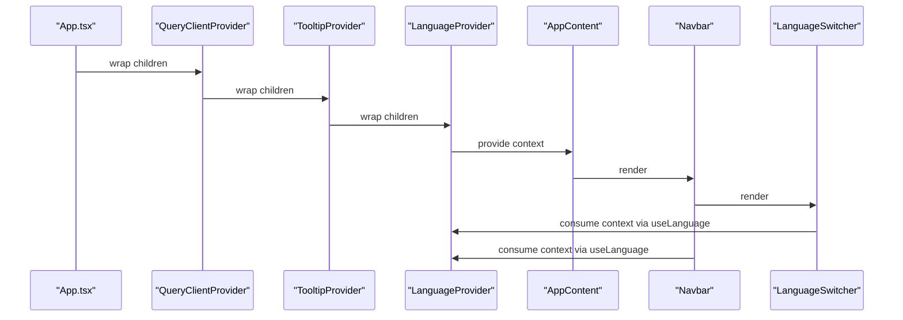
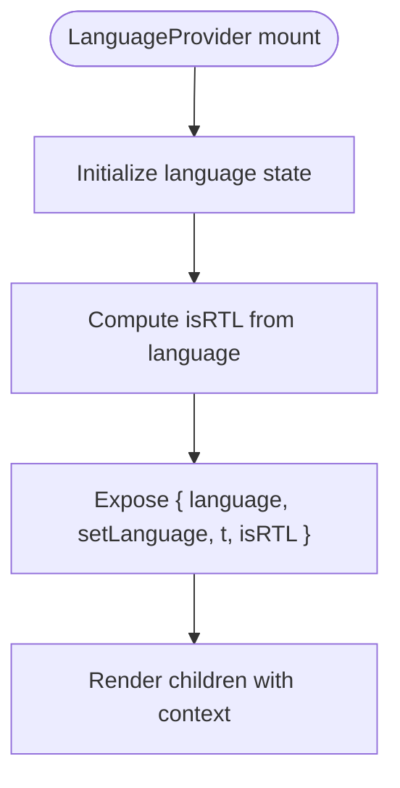
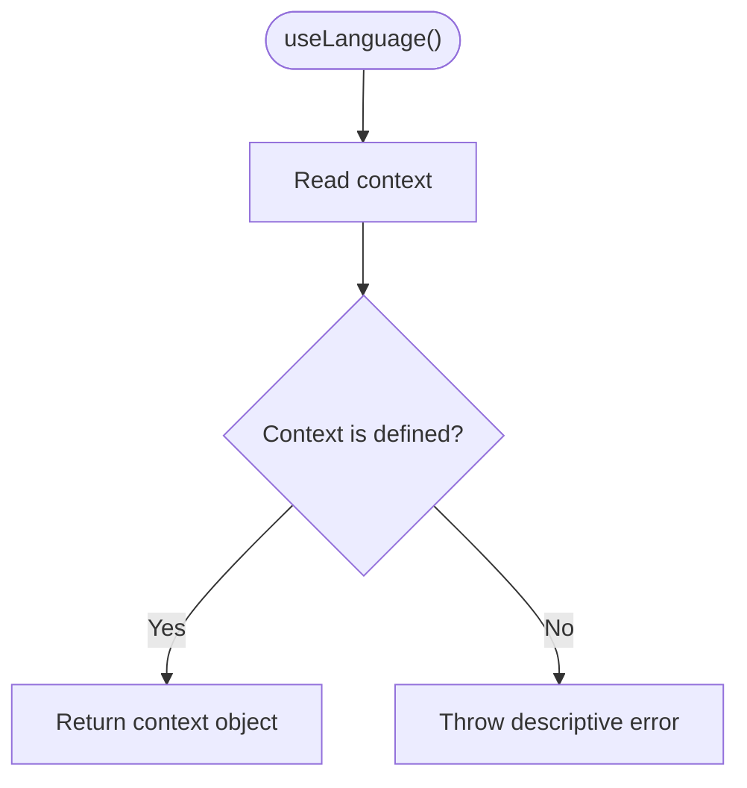
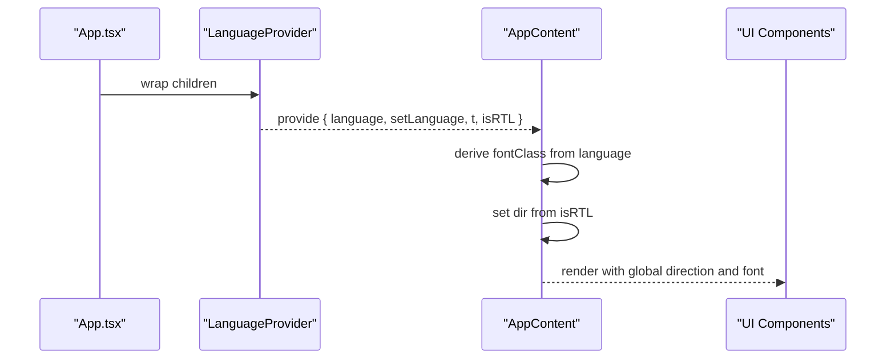
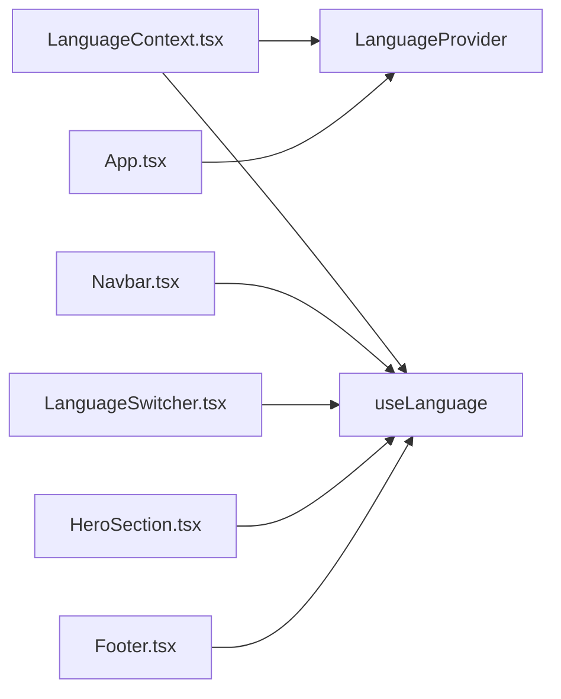

# Context API Implementation

> **Referenced Files in This Document**
> - [LanguageContext.tsx](src/contexts/LanguageContext.tsx)
> - [App.tsx](src/App.tsx)
> - [LanguageSwitcher.tsx](src/components/LanguageSwitcher.tsx)
> - [Navbar.tsx](src/components/Navbar.tsx)
> - [HeroSection.tsx](src/components/HeroSection.tsx)
> - [Footer.tsx](src/components/Footer.tsx)

## Table of Contents
1. [Introduction](#introduction)
2. [Project Structure](#project-structure)
3. [Core Components](#core-components)
4. [Architecture Overview](#architecture-overview)
5. [Detailed Component Analysis](#detailed-component-analysis)
6. [Dependency Analysis](#dependency-analysis)
7. [Performance Considerations](#performance-considerations)
8. [Troubleshooting Guide](#troubleshooting-guide)
9. [Conclusion](#conclusion)

## Introduction
This document explains the Context API implementation for language and internationalization in the application. It focuses on the LanguageProvider and the useLanguage hook, detailing how LanguageContext is created and typed, how state is managed inside LanguageProvider, how the translation function t() works, and how RTL detection is handled. It also shows how the provider is integrated into the application shell and how components consume the context to render localized content and adjust global UI behavior such as text direction and font selection.

## Project Structure
The internationalization system centers around a single context file that defines the LanguageContext, a provider component, and a custom hook. The App shell composes the provider alongside other providers (React Query and Tooltip) and demonstrates how to apply global UI effects (text direction and fonts) based on the current language.

**Diagram sources**
- [LanguageContext.tsx](src/contexts/LanguageContext.tsx#L267-L292)
- [App.tsx](src/App.tsx#L1-L43)
- [Navbar.tsx](src/components/Navbar.tsx#L1-L123)
- [LanguageSwitcher.tsx](src/components/LanguageSwitcher.tsx#L1-L44)
- [HeroSection.tsx](src/components/HeroSection.tsx#L1-L99)
- [Footer.tsx](src/components/Footer.tsx#L1-L117)

**Section sources**
- [LanguageContext.tsx](src/contexts/LanguageContext.tsx#L1-L292)
- [App.tsx](src/App.tsx#L1-L43)

## Core Components
- LanguageContext and LanguageContextType: Defines the shape of the context including language, setLanguage, t, and isRTL.
- LanguageProvider: Creates and supplies the context value, initializes language state, computes isRTL, and exposes t for translations.
- useLanguage: A custom hook that reads the context and throws a descriptive error if used outside a provider.

Key responsibilities:
- LanguageProvider holds the language state and exposes a translation function t(key) that resolves to the current language’s string or falls back to the key itself.
- useLanguage ensures consumers are wrapped by LanguageProvider and returns the context object for use in components.

**Section sources**
- [LanguageContext.tsx](src/contexts/LanguageContext.tsx#L5-L11)
- [LanguageContext.tsx](src/contexts/LanguageContext.tsx#L267-L292)

## Architecture Overview
The application composes providers in a specific order to ensure global state is available to all components. The LanguageProvider is placed near the top of the tree so that t(), language, and isRTL are accessible anywhere. Global UI behavior such as text direction and font selection are derived from the current language and applied at the root wrapper.

**Diagram sources**
- [App.tsx](src/App.tsx#L33-L41)
- [LanguageContext.tsx](src/contexts/LanguageContext.tsx#L267-L292)
- [Navbar.tsx](src/components/Navbar.tsx#L1-L123)
- [LanguageSwitcher.tsx](src/components/LanguageSwitcher.tsx#L1-L44)

## Detailed Component Analysis

### LanguageContext and LanguageProvider
- Creation and typing:
  - LanguageContext is created with React.createContext and initialized with undefined to enforce provider usage.
  - LanguageContextType defines the contract: language, setLanguage, t, and isRTL.
- State management:
  - LanguageProvider initializes language to a default value and exposes setLanguage to update it.
  - t(key) resolves a translation string from the translations object keyed by the current language; if a key is missing, it falls back to returning the key itself.
  - isRTL is computed from the current language to support right-to-left layouts.
- Provider value:
  - LanguageProvider supplies the context value containing language, setLanguage, t, and isRTL to all descendants.

**Diagram sources**
- [LanguageContext.tsx](src/contexts/LanguageContext.tsx#L267-L292)

**Section sources**
- [LanguageContext.tsx](src/contexts/LanguageContext.tsx#L1-L292)

### useLanguage Hook
- Purpose:
  - Reads the LanguageContext and returns the context object for consumers.
  - Throws a descriptive error if used outside a LanguageProvider, preventing runtime crashes and guiding developers to wrap components correctly.
- Usage pattern:
  - Components call useLanguage() to access language, setLanguage, t, and isRTL.

**Diagram sources**
- [LanguageContext.tsx](src/contexts/LanguageContext.tsx#L285-L292)

**Section sources**
- [LanguageContext.tsx](src/contexts/LanguageContext.tsx#L285-L292)

### App Shell Integration and Global UI Effects
- Provider composition:
  - App.tsx composes QueryClientProvider, TooltipProvider, and LanguageProvider around the application content.
- Global UI behavior:
  - AppContent reads isRTL and language from useLanguage to set the root div’s dir attribute for text direction.
  - Font selection is applied conditionally based on language to use a suitable font for Arabic versus others.

**Diagram sources**
- [App.tsx](src/App.tsx#L12-L31)
- [LanguageContext.tsx](src/contexts/LanguageContext.tsx#L267-L292)

**Section sources**
- [App.tsx](src/App.tsx#L12-L31)

### Consumers Using the Context

#### Navbar
- Consumes useLanguage to:
  - Translate navigation labels via t().
  - Apply RTL direction to the navigation container.
- Demonstrates how translation keys map to the translations object and how isRTL influences layout.

**Section sources**
- [Navbar.tsx](src/components/Navbar.tsx#L1-L123)
- [LanguageContext.tsx](src/contexts/LanguageContext.tsx#L272-L274)

#### LanguageSwitcher
- Consumes useLanguage to:
  - Read current language and setLanguage to change language.
  - Renders language options with appropriate flags and labels.
- Triggers re-renders across all components using t() and isRTL.

**Section sources**
- [LanguageSwitcher.tsx](src/components/LanguageSwitcher.tsx#L1-L44)
- [LanguageContext.tsx](src/contexts/LanguageContext.tsx#L267-L292)

#### HeroSection
- Consumes useLanguage to:
  - Translate hero title, subtitle, tagline, date, day, and discover-more CTA.
- Illustrates how t() is used across multiple UI elements.

**Section sources**
- [HeroSection.tsx](src/components/HeroSection.tsx#L1-L99)
- [LanguageContext.tsx](src/contexts/LanguageContext.tsx#L272-L274)

#### Footer
- Consumes useLanguage to:
  - Translate footer rights and dynamic subtitle and follow-us text.
  - Uses language to conditionally build localized strings inline.

**Section sources**
- [Footer.tsx](src/components/Footer.tsx#L1-L117)
- [LanguageContext.tsx](src/contexts/LanguageContext.tsx#L272-L274)

## Dependency Analysis
- LanguageContext.tsx exports:
  - Language type union.
  - LanguageContextType interface.
  - LanguageContext created with undefined.
  - LanguageProvider component.
  - useLanguage hook.
- App.tsx depends on:
  - LanguageProvider and useLanguage.
  - Composes providers in a specific order.
- Consumers depend on:
  - useLanguage to access language, setLanguage, t, and isRTL.
  - Translation keys align with the translations object.

**Diagram sources**
- [LanguageContext.tsx](src/contexts/LanguageContext.tsx#L1-L292)
- [App.tsx](src/App.tsx#L1-L43)
- [Navbar.tsx](src/components/Navbar.tsx#L1-L123)
- [LanguageSwitcher.tsx](src/components/LanguageSwitcher.tsx#L1-L44)
- [HeroSection.tsx](src/components/HeroSection.tsx#L1-L99)
- [Footer.tsx](src/components/Footer.tsx#L1-L117)

**Section sources**
- [LanguageContext.tsx](src/contexts/LanguageContext.tsx#L1-L292)
- [App.tsx](src/App.tsx#L1-L43)

## Performance Considerations
- Context re-renders:
  - Because LanguageProvider supplies a single object { language, setLanguage, t, isRTL }, changing language updates this object reference. Components that depend on useLanguage will re-render whenever the context value changes.
  - To minimize unnecessary re-renders, keep the provider close to the root and avoid wrapping heavy subtrees unnecessarily.
- Memoization:
  - If a component only needs a subset of context values, consider splitting the context into smaller contexts or memoizing derived values at the component level to prevent re-computation.
- Translation function:
  - The t function is stable across renders because it is defined inside the provider component. This avoids recreating the function on each render and reduces re-renders in consumers.

[No sources needed since this section provides general guidance]

## Troubleshooting Guide
- Error: “useLanguage must be used within a LanguageProvider”
  - Cause: A component called useLanguage outside the LanguageProvider boundary.
  - Fix: Ensure the component is rendered within the LanguageProvider in the application shell.
- Missing translation keys
  - Behavior: t(key) falls back to returning the key itself when a translation is not found.
  - Action: Add missing keys to the translations object for all supported languages.
- Unexpected layout shifts when switching languages
  - Cause: Text direction changes or font metrics differences.
  - Action: Ensure global direction is applied at the root (as in App.tsx) and consider preloading fonts or using CSS to stabilize layout during transitions.
- Image loading issues in LanguageSwitcher
  - Cause: Asset path issues or network failures.
  - Action: Verify asset paths and consider lazy-loading flags or providing fallbacks.

**Section sources**
- [LanguageContext.tsx](src/contexts/LanguageContext.tsx#L285-L292)
- [App.tsx](src/App.tsx#L12-L31)
- [LanguageSwitcher.tsx](src/components/LanguageSwitcher.tsx#L1-L44)

## Conclusion
The Context API implementation provides a clean, centralized way to manage language and internationalization across the application. LanguageProvider encapsulates state and exposes a simple translation function and RTL detection. The useLanguage hook ensures safe consumption of the context and throws helpful errors when misused. The App shell integrates the provider with other providers and applies global UI effects based on language. Components consume the context to render localized content and adapt layout and typography accordingly.