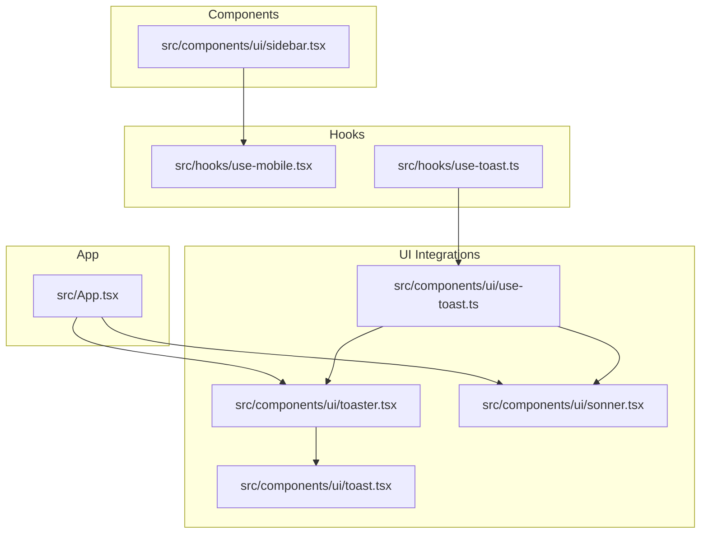
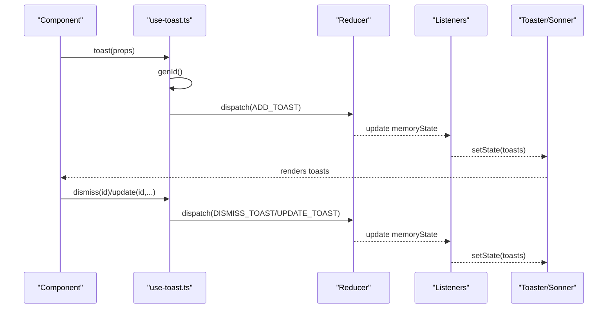
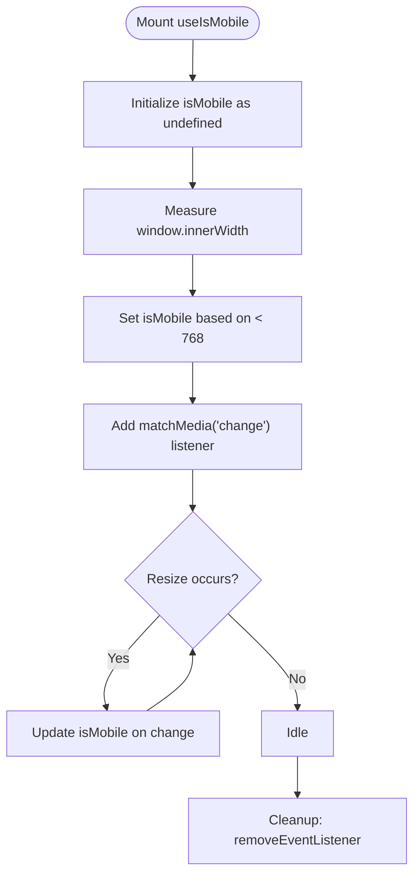
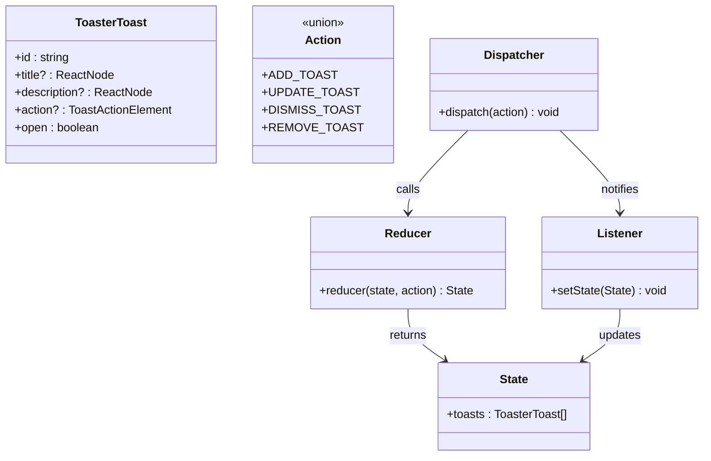
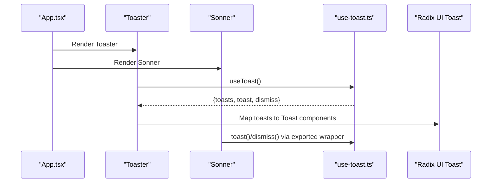
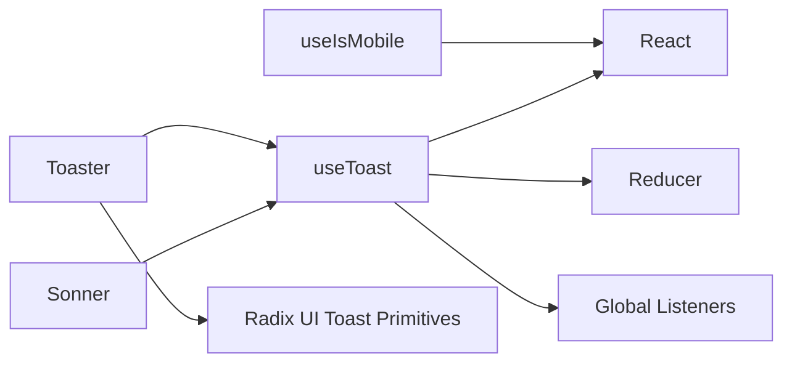

# Custom Hooks for State Management

> **Referenced Files in This Document**
> - [use-mobile.tsx](src/hooks/use-mobile.tsx)
> - [use-toast.ts](src/hooks/use-toast.ts)
> - [toaster.tsx](src/components/ui/toaster.tsx)
> - [sonner.tsx](src/components/ui/sonner.tsx)
> - [toast.tsx](src/components/ui/toast.tsx)
> - [use-toast.ts (UI wrapper)](src/components/ui/use-toast.ts)
> - [App.tsx](src/App.tsx)
> - [sidebar.tsx](src/components/ui/sidebar.tsx)

## Table of Contents
1. [Introduction](#introduction)
2. [Project Structure](#project-structure)
3. [Core Components](#core-components)
4. [Architecture Overview](#architecture-overview)
5. [Detailed Component Analysis](#detailed-component-analysis)
6. [Dependency Analysis](#dependency-analysis)
7. [Performance Considerations](#performance-considerations)
8. [Troubleshooting Guide](#troubleshooting-guide)
9. [Conclusion](#conclusion)

## Introduction
This document explains two custom hooks used for state management:
- useIsMobile: a responsive hook that detects whether the viewport width is below a mobile breakpoint and updates on resize.
- useToast: a reducer-based, singleton-style toast manager that coordinates toast lifecycle, queue limits, and imperative controls.

It also covers how these hooks integrate with UI components (Toaster and Sonner) and how to use them effectively in components like Sidebar.

## Project Structure
The hooks live under src/hooks, while their UI integrations live under src/components/ui. App mounts both Toaster and Sonner at the root level.

**Diagram sources**
- [use-mobile.tsx](src/hooks/use-mobile.tsx#L1-L19)
- [use-toast.ts](src/hooks/use-toast.ts#L1-L186)
- [toaster.tsx](src/components/ui/toaster.tsx#L1-L24)
- [sonner.tsx](src/components/ui/sonner.tsx#L1-L28)
- [toast.tsx](src/components/ui/toast.tsx#L1-L112)
- [use-toast.ts (UI wrapper)](src/components/ui/use-toast.ts#L1-L4)
- [App.tsx](src/App.tsx#L1-L43)
- [sidebar.tsx](src/components/ui/sidebar.tsx#L1-L638)

**Section sources**
- [use-mobile.tsx](src/hooks/use-mobile.tsx#L1-L19)
- [use-toast.ts](src/hooks/use-toast.ts#L1-L186)
- [toaster.tsx](src/components/ui/toaster.tsx#L1-L24)
- [sonner.tsx](src/components/ui/sonner.tsx#L1-L28)
- [toast.tsx](src/components/ui/toast.tsx#L1-L112)
- [use-toast.ts (UI wrapper)](src/components/ui/use-toast.ts#L1-L4)
- [App.tsx](src/App.tsx#L1-L43)
- [sidebar.tsx](src/components/ui/sidebar.tsx#L1-L638)

## Core Components
- useIsMobile: Returns a boolean indicating mobile viewport and updates on resize via matchMedia.
- useToast: Provides a reducer-based state machine for toasts, a singleton dispatcher, and imperative helpers (toast, dismiss, update).

**Section sources**
- [use-mobile.tsx](src/hooks/use-mobile.tsx#L1-L19)
- [use-toast.ts](src/hooks/use-toast.ts#L1-L186)

## Architecture Overview
The toast system uses a singleton pattern with a global reducer and listeners. Components subscribe via useToast and receive the latest state. UI components (Toaster and Sonner) render the current toasts.

**Diagram sources**
- [use-toast.ts](src/hooks/use-toast.ts#L1-L186)
- [toaster.tsx](src/components/ui/toaster.tsx#L1-L24)
- [sonner.tsx](src/components/ui/sonner.tsx#L1-L28)

## Detailed Component Analysis

### useIsMobile Hook
- Breakpoint: Uses a 768px breakpoint to decide mobile vs. desktop.
- Initialization: Starts with an undefined state to reflect unknown until first measurement.
- Detection: On mount, measures window width and sets the initial boolean. Subscribes to matchMedia change events to update on resize.
- Cleanup: Removes the event listener in useEffect return to prevent memory leaks.

Example usage in components:
- Sidebar uses useIsMobile to switch between a Sheet overlay (mobile) and a static sidebar (desktop). It toggles openMobile on mobile and open on desktop.

**Diagram sources**
- [use-mobile.tsx](src/hooks/use-mobile.tsx#L1-L19)
- [sidebar.tsx](src/components/ui/sidebar.tsx#L1-L638)

**Section sources**
- [use-mobile.tsx](src/hooks/use-mobile.tsx#L1-L19)
- [sidebar.tsx](src/components/ui/sidebar.tsx#L1-L638)

### useToast Hook and Reducer-Based State Management
- State shape: An array of ToasterToast entries with id, title, description, action, and open flag.
- Actions:
  - ADD_TOAST: Push a new toast to the front and slice to TOAST_LIMIT.
  - UPDATE_TOAST: Merge partial props into an existing toast by id.
  - DISMISS_TOAST: Mark toasts as closed and enqueue removal after a delay.
  - REMOVE_TOAST: Remove toasts by id or clear all when id is undefined.
- Singleton pattern:
  - memoryState holds the current state.
  - listeners array notifies subscribers when state changes.
  - dispatch updates memoryState and invokes all listeners.
- Toast lifecycle:
  - toast(props) generates a unique id, dispatches ADD_TOAST, and returns dismiss/update methods.
  - onOpenChange triggers dismiss when the toast closes.
  - addToRemoveQueue schedules removal after TOAST_REMOVE_DELAY and stores timeout references in a Map keyed by id.
- Queue limit: TOAST_LIMIT prevents queue overflow by slicing to the newest N toasts.

Integration with UI:
- Toaster reads toasts from useToast and renders each toast with title/description/action and a close button.
- Sonner integrates with next-themes to apply theme-aware styles and passes toast options.

**Diagram sources**
- [use-toast.ts](src/hooks/use-toast.ts#L1-L186)
- [toaster.tsx](src/components/ui/toaster.tsx#L1-L24)
- [toast.tsx](src/components/ui/toast.tsx#L1-L112)

**Section sources**
- [use-toast.ts](src/hooks/use-toast.ts#L1-L186)
- [toaster.tsx](src/components/ui/toaster.tsx#L1-L24)
- [toast.tsx](src/components/ui/toast.tsx#L1-L112)

### UI Integration: Toaster and Sonner
- Toaster:
  - Subscribes to useToast and renders each toast with title/description/action and a close button.
  - Uses ToastProvider and ToastViewport from Radix UI.
- Sonner:
  - Wraps next-themes to respect light/dark/system themes.
  - Applies custom class names for toast, description, action/cancel buttons.
  - Exports its own toast function for convenience.

**Diagram sources**
- [App.tsx](src/App.tsx#L1-L43)
- [toaster.tsx](src/components/ui/toaster.tsx#L1-L24)
- [sonner.tsx](src/components/ui/sonner.tsx#L1-L28)
- [use-toast.ts](src/hooks/use-toast.ts#L1-L186)

**Section sources**
- [App.tsx](src/App.tsx#L1-L43)
- [toaster.tsx](src/components/ui/toaster.tsx#L1-L24)
- [sonner.tsx](src/components/ui/sonner.tsx#L1-L28)
- [use-toast.ts (UI wrapper)](src/components/ui/use-toast.ts#L1-L4)

## Dependency Analysis
- useIsMobile depends on window.matchMedia and React’s useState/useEffect.
- useToast depends on React’s useState/useEffect and a reducer pattern with a global dispatcher and listeners.
- UI components depend on use-toast for state and on Radix UI primitives for rendering.

**Diagram sources**
- [use-mobile.tsx](src/hooks/use-mobile.tsx#L1-L19)
- [use-toast.ts](src/hooks/use-toast.ts#L1-L186)
- [toaster.tsx](src/components/ui/toaster.tsx#L1-L24)
- [toast.tsx](src/components/ui/toast.tsx#L1-L112)
- [sonner.tsx](src/components/ui/sonner.tsx#L1-L28)

**Section sources**
- [use-mobile.tsx](src/hooks/use-mobile.tsx#L1-L19)
- [use-toast.ts](src/hooks/use-toast.ts#L1-L186)
- [toaster.tsx](src/components/ui/toaster.tsx#L1-L24)
- [toast.tsx](src/components/ui/toast.tsx#L1-L112)
- [sonner.tsx](src/components/ui/sonner.tsx#L1-L28)

## Performance Considerations
- Event listener cleanup:
  - useIsMobile removes the matchMedia change listener on unmount to prevent memory leaks.
  - useToast removes the subscriber from listeners on unmount to avoid stale closures.
- Memory management of timeouts:
  - addToRemoveQueue stores timeout references in a Map keyed by toast id. Each timeout is cleared when removed, and the map entry is deleted to prevent leaks.
- Preventing unnecessary re-renders:
  - useToast subscribes only once and unsubscribes on unmount.
  - The toast function returns dismiss/update bound to the current id, avoiding extra renders caused by closures.
- Queue limits:
  - TOAST_LIMIT ensures the toast array does not grow indefinitely, keeping renders efficient.

**Section sources**
- [use-mobile.tsx](src/hooks/use-mobile.tsx#L1-L19)
- [use-toast.ts](src/hooks/use-toast.ts#L1-L186)

## Troubleshooting Guide
- Mobile detection not updating on resize:
  - Ensure the component using useIsMobile is mounted and not memoized away. Confirm that the matchMedia listener is attached and not removed prematurely.
- Mobile detection returns wrong value on initial load:
  - The hook initializes with undefined and sets the value after mount. If you need a stable initial value, guard UI rendering until isMobile is truthy.
- Toasts not appearing:
  - Verify that Toaster or Sonner is rendered at the app root. Ensure useToast is called inside a provider context if needed.
- Toasts not dismissing:
  - Check that onOpenChange is wired to dismiss. Also verify that addToRemoveQueue is invoked and timeouts are not being cleared elsewhere.
- Duplicate toasts or queue overflow:
  - Respect TOAST_LIMIT. If you need multiple concurrent toasts, adjust the limit or refactor toasts to avoid duplicates.
- Theme mismatch with Sonner:
  - Confirm next-themes is configured and theme prop is passed correctly.

**Section sources**
- [use-mobile.tsx](src/hooks/use-mobile.tsx#L1-L19)
- [use-toast.ts](src/hooks/use-toast.ts#L1-L186)
- [toaster.tsx](src/components/ui/toaster.tsx#L1-L24)
- [sonner.tsx](src/components/ui/sonner.tsx#L1-L28)
- [App.tsx](src/App.tsx#L1-L43)

## Conclusion
useIsMobile provides a lightweight, cleanup-safe way to detect mobile breakpoints and react to resize events. useToast offers a robust, singleton-driven toast system with queue limits, timeout management, and imperative controls. Together with Toaster and Sonner, they enable consistent, performant feedback and responsive UI behavior across the application.