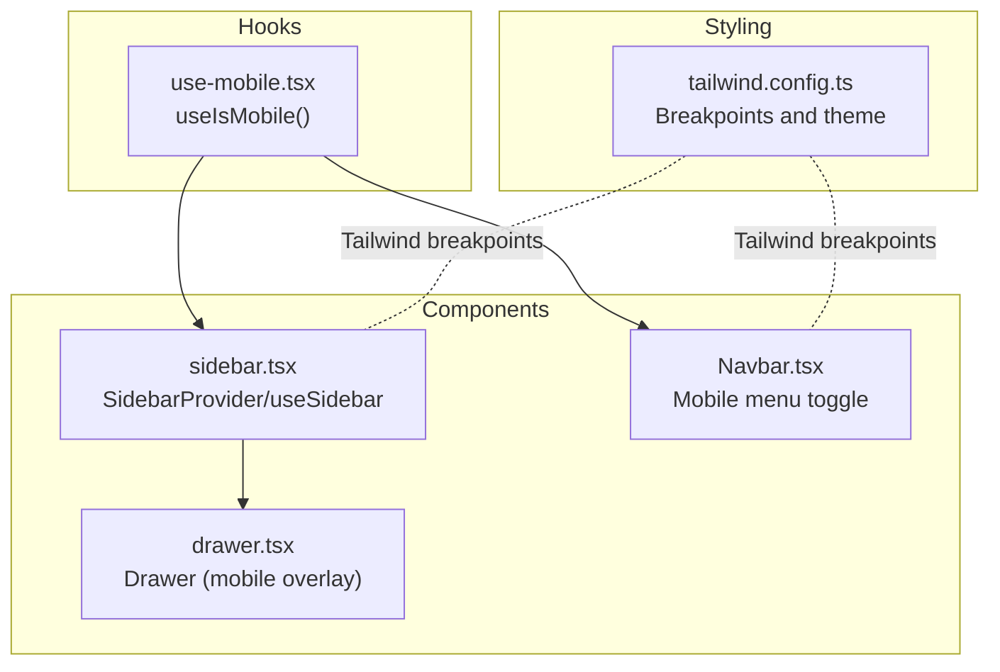
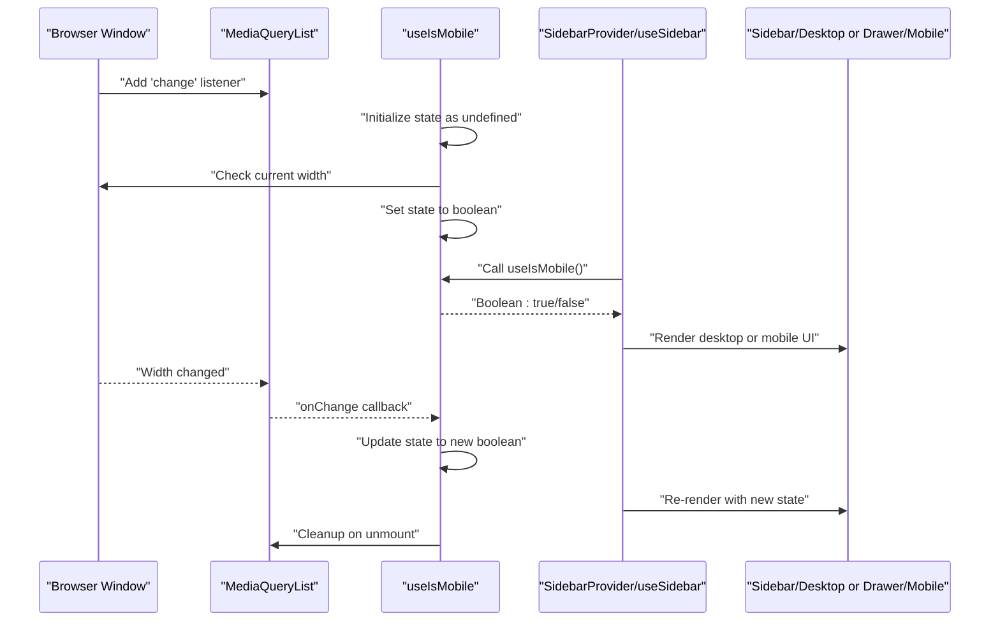
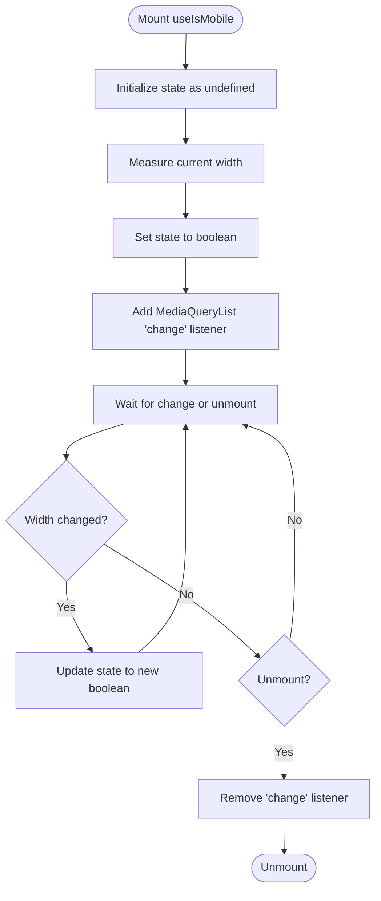
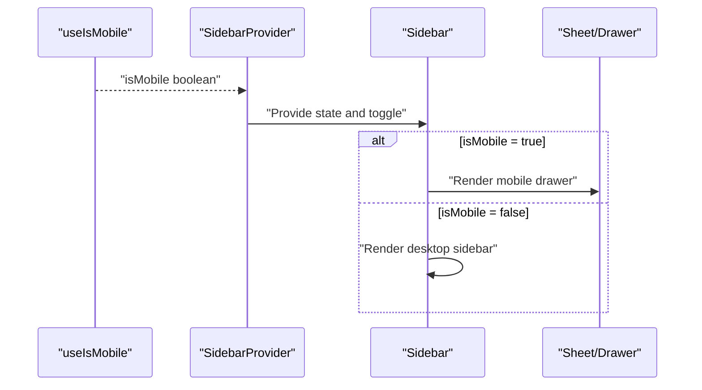
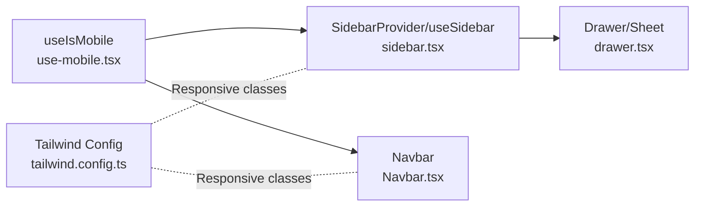

# useIsMobile Hook

<cite>
**Referenced Files in This Document**
- [use-mobile.tsx](file://src/hooks/use-mobile.tsx)
- [sidebar.tsx](file://src/components/ui/sidebar.tsx)
- [drawer.tsx](file://src/components/ui/drawer.tsx)
- [Navbar.tsx](file://src/components/Navbar.tsx)
- [tailwind.config.ts](file://tailwind.config.ts)
</cite>

## Table of Contents
1. [Introduction](#introduction)
2. [Project Structure](#project-structure)
3. [Core Components](#core-components)
4. [Architecture Overview](#architecture-overview)
5. [Detailed Component Analysis](#detailed-component-analysis)
6. [Dependency Analysis](#dependency-analysis)
7. [Performance Considerations](#performance-considerations)
8. [Troubleshooting Guide](#troubleshooting-guide)
9. [Testing Guidance](#testing-guidance)
10. [Conclusion](#conclusion)

## Introduction
This document explains the useIsMobile custom hook that detects whether the current device is considered “mobile” using a 768px breakpoint. It covers the hook’s implementation, state transitions, event listener lifecycle, and how it integrates with UI components like Sidebar and Navbar to drive responsive behavior. It also connects the hook to Tailwind’s breakpoint system and outlines performance and testing best practices.

## Project Structure
The useIsMobile hook lives in the hooks directory and is consumed by UI components that need to adapt their layout for mobile devices. The Sidebar component demonstrates conditional rendering between a desktop sidebar and a mobile drawer based on the hook’s return value.

**Diagram sources**
- [use-mobile.tsx](file://src/hooks/use-mobile.tsx#L1-L20)
- [sidebar.tsx](file://src/components/ui/sidebar.tsx#L1-L120)
- [drawer.tsx](file://src/components/ui/drawer.tsx#L1-L88)
- [Navbar.tsx](file://src/components/Navbar.tsx#L1-L123)
- [tailwind.config.ts](file://tailwind.config.ts#L1-L98)

**Section sources**
- [use-mobile.tsx](file://src/hooks/use-mobile.tsx#L1-L20)
- [sidebar.tsx](file://src/components/ui/sidebar.tsx#L1-L120)
- [drawer.tsx](file://src/components/ui/drawer.tsx#L1-L88)
- [Navbar.tsx](file://src/components/Navbar.tsx#L1-L123)
- [tailwind.config.ts](file://tailwind.config.ts#L1-L98)

## Core Components
- useIsMobile hook: Provides a boolean flag indicating mobile vs. non-mobile viewport width. It initializes with an undefined state and resolves to a boolean after mount. It manages a MediaQueryList change listener internally and cleans it up on unmount.
- Sidebar component: Uses useIsMobile to decide between a desktop collapsible sidebar and a mobile drawer overlay. On mobile, it renders a Sheet with Drawer content; on desktop, it renders a fixed sidebar.
- Drawer component: A mobile-first overlay used by Sidebar on small screens.
- Navbar component: Uses Tailwind responsive classes to hide/show mobile menu button and to render mobile navigation on smaller screens.

**Section sources**
- [use-mobile.tsx](file://src/hooks/use-mobile.tsx#L1-L20)
- [sidebar.tsx](file://src/components/ui/sidebar.tsx#L1-L220)
- [drawer.tsx](file://src/components/ui/drawer.tsx#L1-L88)
- [Navbar.tsx](file://src/components/Navbar.tsx#L1-L123)

## Architecture Overview
The hook integrates with the browser’s MediaQueryList API to listen for width changes at the 768px breakpoint. Components consuming the hook can reactively switch UI patterns (e.g., drawer vs. sidebar) without relying solely on CSS media queries.

**Diagram sources**
- [use-mobile.tsx](file://src/hooks/use-mobile.tsx#L1-L20)
- [sidebar.tsx](file://src/components/ui/sidebar.tsx#L1-L120)

**Section sources**
- [use-mobile.tsx](file://src/hooks/use-mobile.tsx#L1-L20)
- [sidebar.tsx](file://src/components/ui/sidebar.tsx#L1-L120)

## Detailed Component Analysis

### useIsMobile Hook
- Breakpoint: Uses a 768px breakpoint to determine mobile vs. non-mobile.
- State initialization: Starts with undefined to reflect initial unknown state until the first measurement.
- Mount behavior: Immediately checks current width and sets state accordingly.
- Event listener: Adds a change listener to the MediaQueryList for the breakpoint and removes it on cleanup.
- Return value: Coerces to boolean for convenient consumption.

**Diagram sources**
- [use-mobile.tsx](file://src/hooks/use-mobile.tsx#L1-L20)

**Section sources**
- [use-mobile.tsx](file://src/hooks/use-mobile.tsx#L1-L20)

### Sidebar Integration
- Mobile detection: Sidebar reads useIsMobile to decide layout.
- Desktop: Renders a fixed, collapsible sidebar with open/collapsed state.
- Mobile: Renders a Sheet overlay with Drawer content for a drawer-like experience.
- State coordination: SidebarProvider holds both desktop and mobile open states and exposes a toggle function.

**Diagram sources**
- [sidebar.tsx](file://src/components/ui/sidebar.tsx#L1-L220)
- [use-mobile.tsx](file://src/hooks/use-mobile.tsx#L1-L20)

**Section sources**
- [sidebar.tsx](file://src/components/ui/sidebar.tsx#L1-L220)

### Drawer Component
- Mobile overlay: Used by Sidebar on mobile to provide a slide-in navigation experience.
- Overlay and content: DrawerContent renders the overlay and content area with Tailwind classes.
- Portal pattern: Drawer portals its content to improve stacking and layout isolation.

**Section sources**
- [drawer.tsx](file://src/components/ui/drawer.tsx#L1-L88)

### Navbar Integration
- Responsive classes: Uses Tailwind responsive modifiers (e.g., md:hidden) to show/hide mobile menu button and mobile navigation.
- Mobile menu: Toggles a local state to show/hide the mobile navigation list.
- Scroll effect: Navbar adjusts styling based on scroll position.

**Section sources**
- [Navbar.tsx](file://src/components/Navbar.tsx#L1-L123)

## Dependency Analysis
- Hook dependency: Sidebar imports useIsMobile to branch UI rendering.
- UI dependency: Drawer is used inside Sidebar for mobile layout.
- Styling dependency: Tailwind’s responsive classes (e.g., md:*) complement the hook’s boolean to control visibility and layout.

**Diagram sources**
- [use-mobile.tsx](file://src/hooks/use-mobile.tsx#L1-L20)
- [sidebar.tsx](file://src/components/ui/sidebar.tsx#L1-L220)
- [drawer.tsx](file://src/components/ui/drawer.tsx#L1-L88)
- [Navbar.tsx](file://src/components/Navbar.tsx#L1-L123)
- [tailwind.config.ts](file://tailwind.config.ts#L1-L98)

**Section sources**
- [use-mobile.tsx](file://src/hooks/use-mobile.tsx#L1-L20)
- [sidebar.tsx](file://src/components/ui/sidebar.tsx#L1-L220)
- [drawer.tsx](file://src/components/ui/drawer.tsx#L1-L88)
- [Navbar.tsx](file://src/components/Navbar.tsx#L1-L123)
- [tailwind.config.ts](file://tailwind.config.ts#L1-L98)

## Performance Considerations
- Efficient event listener management: The hook adds and removes a single MediaQueryList change listener during mount/unmount, preventing memory leaks and unnecessary callbacks.
- Preventing unnecessary re-renders: Consumers should memoize derived values or use React.memo where appropriate. The hook itself returns a boolean primitive, minimizing re-render costs.
- Debouncing or throttling: If consumers perform expensive computations on resize, consider debouncing scroll/resize handlers elsewhere in the app.
- Conditional rendering: Prefer conditional rendering based on the hook’s boolean to avoid heavy DOM nodes on mobile.

[No sources needed since this section provides general guidance]

## Troubleshooting Guide
- Incorrect mobile detection on initial load:
  - Cause: Initial state starts as undefined; consumers should guard against undefined or rely on the boolean coercion.
  - Fix: Ensure consumers treat the hook’s return as a boolean and avoid depending on undefined.
  - Reference: [useIsMobile hook state initialization and return](file://src/hooks/use-mobile.tsx#L1-L20)

- Failure to update on window resize:
  - Cause: Listener not attached or removed prematurely.
  - Fix: Verify the hook runs on mount and that cleanup occurs on unmount; ensure no early returns prevent useEffect from firing.
  - Reference: [useEffect listener setup and cleanup](file://src/hooks/use-mobile.tsx#L1-L20)

- Hydration mismatches in SSR environments:
  - Cause: SSR renders differ from client due to undefined initial state.
  - Fix: Defer rendering of mobile-dependent UI until after mount, or use a hydration-safe pattern (e.g., dynamic imports or client-only rendering).
  - Reference: [useIsMobile hook state initialization](file://src/hooks/use-mobile.tsx#L1-L20)

- Sidebar not switching between desktop and mobile:
  - Cause: Consumer not reading the hook’s boolean or not re-rendering on state changes.
  - Fix: Confirm SidebarProvider/useSidebar reads useIsMobile and re-renders when the boolean flips.
  - Reference: [SidebarProvider and mobile/desktop branching](file://src/components/ui/sidebar.tsx#L1-L220)

- Mobile drawer not opening:
  - Cause: Drawer overlay not receiving the correct open state or portal issues.
  - Fix: Verify Sheet open prop mirrors the mobile open state and that DrawerContent is rendered within a portal.
  - Reference: [Drawer overlay and Sheet usage](file://src/components/ui/drawer.tsx#L1-L88)

**Section sources**
- [use-mobile.tsx](file://src/hooks/use-mobile.tsx#L1-L20)
- [sidebar.tsx](file://src/components/ui/sidebar.tsx#L1-L220)
- [drawer.tsx](file://src/components/ui/drawer.tsx#L1-L88)

## Testing Guidance
Recommended testing approach for useIsMobile with Jest and React Testing Library:
- Mock window.matchMedia and window.innerWidth:
  - Create a mock MediaQueryList and stub addEventListener/removeEventListener.
  - Set initial window.innerWidth to simulate mobile/non-mobile.
- Test mount behavior:
  - Assert initial state is undefined and becomes a boolean after mount.
- Test resize behavior:
  - Dispatch a 'change' event on the mock MediaQueryList and assert state updates.
- Test cleanup:
  - Unmount the component and verify removeEventListener was called.
- Example patterns:
  - Use act() to flush effects.
  - Render a component that consumes useIsMobile and assert conditional rendering behavior.

[No sources needed since this section provides general guidance]

## Conclusion
The useIsMobile hook provides a reliable, lightweight way to detect viewport width at the 768px breakpoint and react to changes. Combined with Tailwind’s responsive classes and UI components like Sidebar and Drawer, it enables clean, maintainable responsive behavior. Proper event listener management and SSR-aware rendering ensure robust performance and user experience.

[No sources needed since this section summarizes without analyzing specific files]