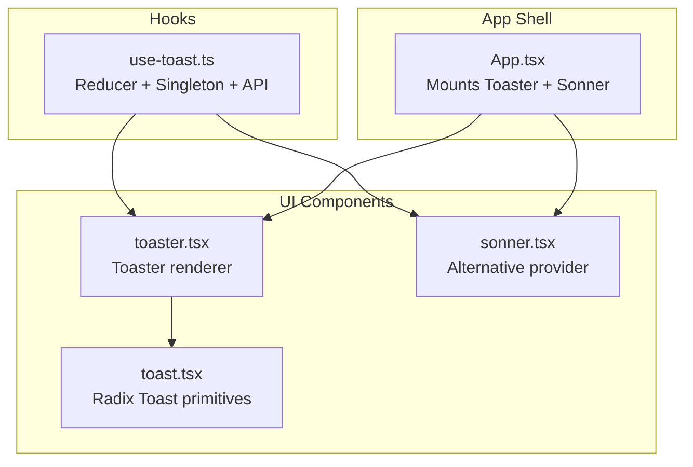
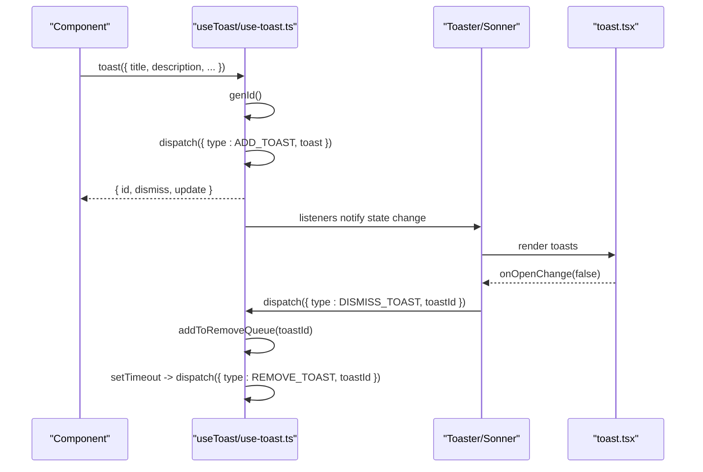
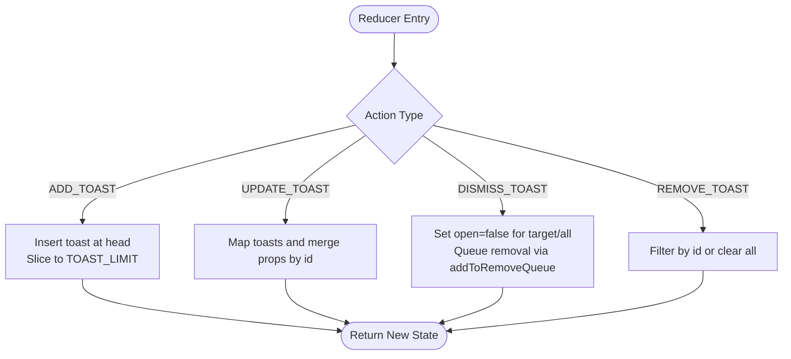
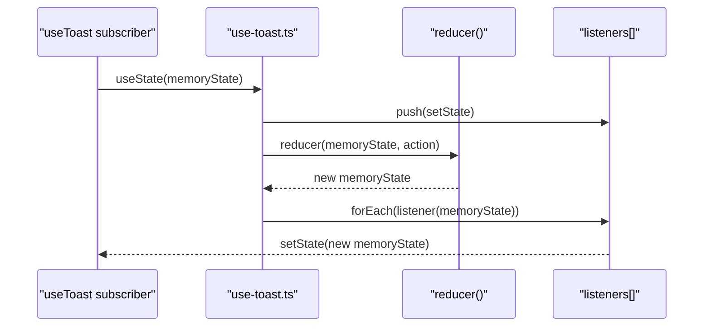
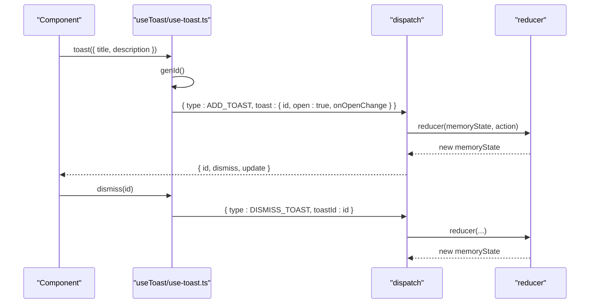
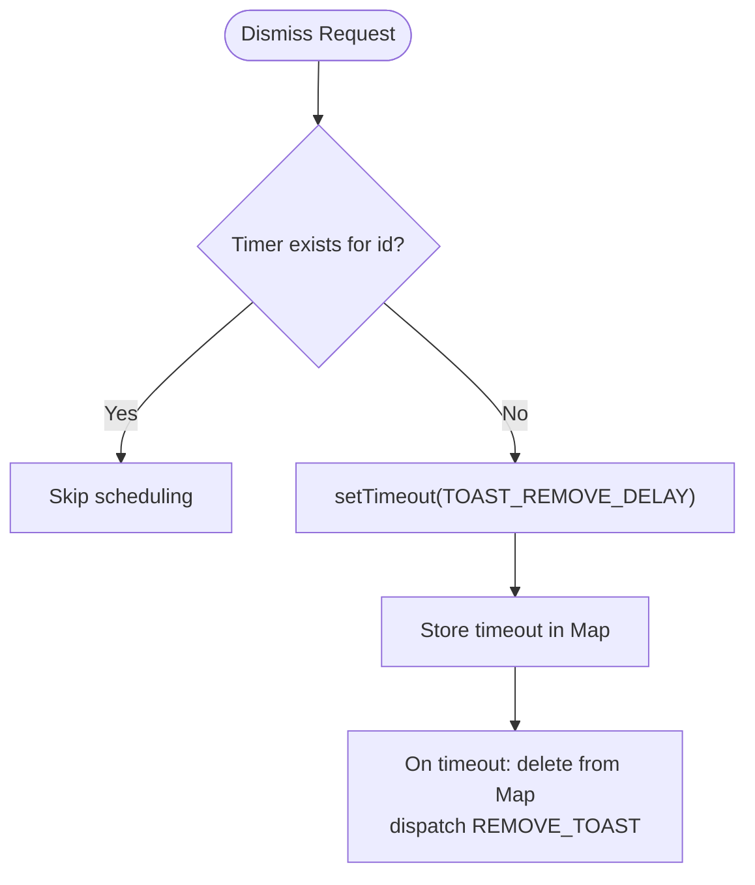
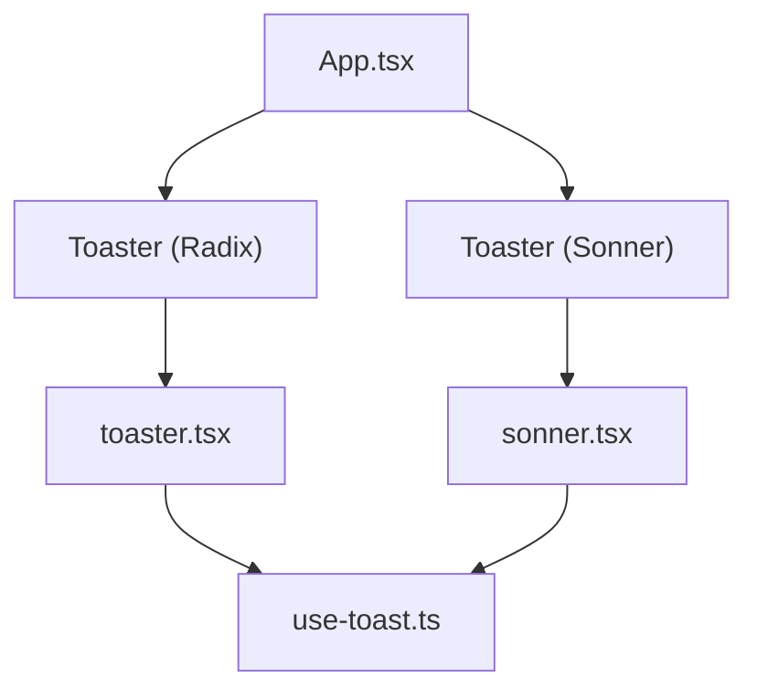
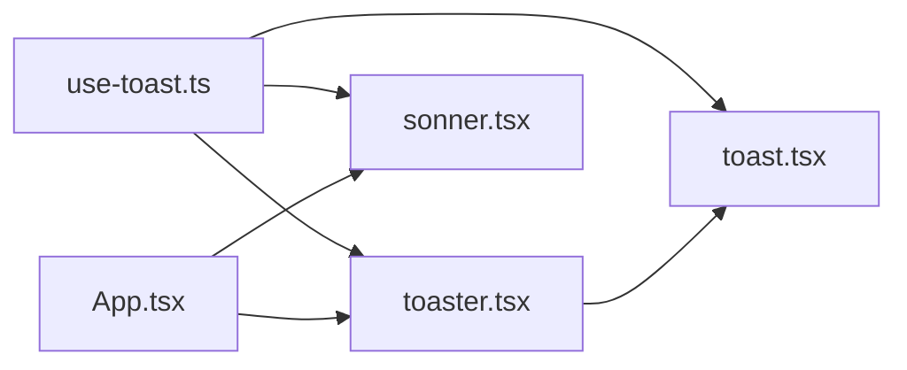

# useToast Hook

> **Referenced Files in This Document**
> - [use-toast.ts](src/hooks/use-toast.ts)
> - [toaster.tsx](src/components/ui/toaster.tsx)
> - [toast.tsx](src/components/ui/toast.tsx)
> - [sonner.tsx](src/components/ui/sonner.tsx)
> - [App.tsx](src/App.tsx)
> - [use-toast.ts (UI re-export)](src/components/ui/use-toast.ts)

## Table of Contents
1. [Introduction](#introduction)
2. [Project Structure](#project-structure)
3. [Core Components](#core-components)
4. [Architecture Overview](#architecture-overview)
5. [Detailed Component Analysis](#detailed-component-analysis)
6. [Dependency Analysis](#dependency-analysis)
7. [Performance Considerations](#performance-considerations)
8. [Troubleshooting Guide](#troubleshooting-guide)
9. [Testing Strategies](#testing-strategies)
10. [Conclusion](#conclusion)

## Introduction
This document explains the useToast custom hook and its reducer-based state management. It covers the state model, action types, singleton pattern, imperative toast API, timeout-based lifecycle, UI integration, usage patterns, performance, troubleshooting, and testing strategies.

## Project Structure
The useToast hook is implemented as a standalone reducer with a singleton state and a listener registry. It is consumed by UI components that render toasts and by the application shell to mount toast providers.

**Diagram sources**
- [use-toast.ts](src/hooks/use-toast.ts#L1-L186)
- [toast.tsx](src/components/ui/toast.tsx#L1-L112)
- [toaster.tsx](src/components/ui/toaster.tsx#L1-L25)
- [sonner.tsx](src/components/ui/sonner.tsx#L1-L28)
- [App.tsx](src/App.tsx#L1-L43)

**Section sources**
- [use-toast.ts](src/hooks/use-toast.ts#L1-L186)
- [toaster.tsx](src/components/ui/toaster.tsx#L1-L25)
- [toast.tsx](src/components/ui/toast.tsx#L1-L112)
- [sonner.tsx](src/components/ui/sonner.tsx#L1-L28)
- [App.tsx](src/App.tsx#L1-L43)

## Core Components
- Reducer and state model
  - State: an object containing a toasts array.
  - Action types: ADD_TOAST, UPDATE_TOAST, DISMISS_TOAST, REMOVE_TOAST.
  - Reducer enforces a TOAST_LIMIT and manages open state transitions.
- Singleton pattern
  - memoryState holds the current state.
  - listeners array notifies subscribers when state changes.
  - dispatch updates memoryState and invokes listeners.
- Imperative API
  - toast(props) generates a unique id, adds a toast, and returns { id, dismiss, update }.
  - useToast() returns the current state plus toast and dismiss helpers.
- Timeout-based lifecycle
  - addToRemoveQueue schedules removal after TOAST_REMOVE_DELAY.
  - toast.onOpenChange triggers dismissal when the toast closes.

**Section sources**
- [use-toast.ts](src/hooks/use-toast.ts#L1-L186)

## Architecture Overview
The hook uses a reducer with a singleton memoryState and a global listeners registry. Components subscribe via useToast() and receive updates through React state. Two providers are available: a Radix-based Toaster and a Sonner-based Toaster.

**Diagram sources**
- [use-toast.ts](src/hooks/use-toast.ts#L1-L186)
- [toaster.tsx](src/components/ui/toaster.tsx#L1-L25)
- [toast.tsx](src/components/ui/toast.tsx#L1-L112)
- [sonner.tsx](src/components/ui/sonner.tsx#L1-L28)

## Detailed Component Analysis

### Reducer and State Model
- State interface
  - toasts: array of ToasterToast items.
- ToasterToast fields
  - id: string
  - title?: React.ReactNode
  - description?: React.ReactNode
  - action?: ToastActionElement
  - open: managed by the UI; the reducer sets it to false during dismissal.
- Action types and roles
  - ADD_TOAST: inserts a new toast at the head and slices to TOAST_LIMIT.
  - UPDATE_TOAST: merges partial props into the matching toast by id.
  - DISMISS_TOAST: sets open=false for targeted or all toasts and queues removal.
  - REMOVE_TOAST: filters out the toast by id; undefined clears all.

**Diagram sources**
- [use-toast.ts](src/hooks/use-toast.ts#L49-L122)

**Section sources**
- [use-toast.ts](src/hooks/use-toast.ts#L49-L122)

### Singleton Pattern and Dispatch
- memoryState: holds the current state snapshot.
- listeners: array of subscriber callbacks.
- dispatch: updates memoryState and notifies all listeners.
- useToast: subscribes to state changes and returns the current state plus helpers.

**Diagram sources**
- [use-toast.ts](src/hooks/use-toast.ts#L124-L133)
- [use-toast.ts](src/hooks/use-toast.ts#L166-L184)

**Section sources**
- [use-toast.ts](src/hooks/use-toast.ts#L124-L133)
- [use-toast.ts](src/hooks/use-toast.ts#L166-L184)

### Imperative API: toast() and Helpers
- toast(props)
  - Generates id via genId().
  - Returns update and dismiss functions bound to that id.
  - Dispatches ADD_TOAST with open=true and onOpenChange to trigger dismissal.
- useToast()
  - Returns current state and helpers: toast, dismiss.
- dismiss(toastId?)
  - Dispatches DISMISS_TOAST for a specific id or all.

**Diagram sources**
- [use-toast.ts](src/hooks/use-toast.ts#L135-L164)
- [use-toast.ts](src/hooks/use-toast.ts#L166-L184)

**Section sources**
- [use-toast.ts](src/hooks/use-toast.ts#L135-L164)
- [use-toast.ts](src/hooks/use-toast.ts#L166-L184)

### Timeout Mechanism and Lifecycle
- addToRemoveQueue
  - Prevents duplicate timers for the same id.
  - Schedules a timeout to dispatch REMOVE_TOAST after TOAST_REMOVE_DELAY.
  - Removes the timer reference from the Map when triggered.
- TOAST_REMOVE_DELAY is set to a large value in this implementation.
- UI onOpenChange triggers dismissal when the toast closes.

**Diagram sources**
- [use-toast.ts](src/hooks/use-toast.ts#L53-L69)
- [use-toast.ts](src/hooks/use-toast.ts#L147-L157)

**Section sources**
- [use-toast.ts](src/hooks/use-toast.ts#L53-L69)
- [use-toast.ts](src/hooks/use-toast.ts#L147-L157)

### UI Integration: Toaster and Sonner
- Toaster component
  - Uses useToast() to render toasts.
  - Renders title, description, action, and close button.
- Sonner Toaster
  - Provides an alternative toast provider with theming and styling options.
- App mounts both providers to support different UI stacks.

**Diagram sources**
- [App.tsx](src/App.tsx#L1-L43)
- [toaster.tsx](src/components/ui/toaster.tsx#L1-L25)
- [sonner.tsx](src/components/ui/sonner.tsx#L1-L28)
- [use-toast.ts](src/hooks/use-toast.ts#L1-L186)

**Section sources**
- [App.tsx](src/App.tsx#L1-L43)
- [toaster.tsx](src/components/ui/toaster.tsx#L1-L25)
- [sonner.tsx](src/components/ui/sonner.tsx#L1-L28)

### Usage Examples
- Success toast in a form submission
  - Call toast({ title, description, variant: "default" }) after successful submission.
  - Optionally attach an action button for user follow-up.
- Error toast in a form submission
  - Call toast({ title, description, variant: "destructive" }) on failure.
  - Provide an action to retry or show details.
- Notes
  - The UI components accept variant and other props compatible with Radix Toast.
  - Sonner’s Toaster can be used for a different visual style.

[No sources needed since this section provides usage guidance without quoting specific files]

## Dependency Analysis
- Internal dependencies
  - use-toast.ts depends on toast.tsx types for ToasterToast and ToastActionElement.
  - toaster.tsx consumes useToast() and renders Radix Toast components.
  - sonner.tsx re-exports Sonner’s Toaster and toast for alternative rendering.
- External dependencies
  - @radix-ui/react-toast for native toast primitives.
  - lucide-react for icons.
  - next-themes for theme-aware Sonner styling.
- Coupling and cohesion
  - The hook is cohesive and decoupled from UI; UI components depend on the hook, not vice versa.
  - Providers (Toaster, Sonner) are independent and interchangeable.

**Diagram sources**
- [use-toast.ts](src/hooks/use-toast.ts#L1-L186)
- [toast.tsx](src/components/ui/toast.tsx#L1-L112)
- [toaster.tsx](src/components/ui/toaster.tsx#L1-L25)
- [sonner.tsx](src/components/ui/sonner.tsx#L1-L28)
- [App.tsx](src/App.tsx#L1-L43)

**Section sources**
- [use-toast.ts](src/hooks/use-toast.ts#L1-L186)
- [toast.tsx](src/components/ui/toast.tsx#L1-L112)
- [toaster.tsx](src/components/ui/toaster.tsx#L1-L25)
- [sonner.tsx](src/components/ui/sonner.tsx#L1-L28)
- [App.tsx](src/App.tsx#L1-L43)

## Performance Considerations
- Memory management
  - addToRemoveQueue stores timers in a Map keyed by toast id. On timeout, the entry is deleted before dispatching REMOVE_TOAST.
  - Ensure listeners are removed on component unmount to prevent stale subscriptions.
- Queue overflow prevention
  - TOAST_LIMIT is set to 1, enforcing a single toast at a time.
- Efficient state updates
  - reducer operations are O(n) over the toasts array; with TOAST_LIMIT=1, operations remain fast.
- Timeout duration
  - TOAST_REMOVE_DELAY is set to a large value in this implementation. Consider tuning for UX and memory pressure.

**Section sources**
- [use-toast.ts](src/hooks/use-toast.ts#L5-L7)
- [use-toast.ts](src/hooks/use-toast.ts#L71-L122)
- [use-toast.ts](src/hooks/use-toast.ts#L166-L184)

## Troubleshooting Guide
- Toasts not disappearing
  - Verify onOpenChange is wired so that closing triggers dismissal.
  - Confirm addToRemoveQueue is invoked and timers are not duplicated.
  - Check that listeners are active and dispatch is called.
- Duplicate toasts
  - Ensure each toast is created with a unique id generated by genId().
  - Respect TOAST_LIMIT to avoid stacking multiple toasts.
- Memory leaks from uncleaned timeouts
  - addToRemoveQueue deletes entries from the Map on timeout.
  - Ensure listeners are removed on unmount to avoid stale references.
- UI not rendering toasts
  - Confirm Toaster or Sonner is mounted in the app shell.
  - Ensure useToast() is called inside a component tree that receives state updates.

**Section sources**
- [use-toast.ts](src/hooks/use-toast.ts#L135-L164)
- [use-toast.ts](src/hooks/use-toast.ts#L166-L184)
- [toaster.tsx](src/components/ui/toaster.tsx#L1-L25)
- [App.tsx](src/App.tsx#L1-L43)

## Testing Strategies
- Jest timers
  - Use jest.useFakeTimers() and jest.advanceTimersByTime() to control TOAST_REMOVE_DELAY.
  - Advance time past TOAST_REMOVE_DELAY to verify REMOVE_TOAST dispatch.
- Mock dispatch verification
  - Spy on dispatch to assert ADD_TOAST, UPDATE_TOAST, DISMISS_TOAST, and REMOVE_TOAST calls.
  - Verify that addToRemoveQueue schedules a single timeout per toast id.
- Component-level tests
  - Render Toaster and trigger toast() via useToast().
  - Assert DOM updates for title, description, and action.
- Unmount cleanup
  - Test that listeners are removed on unmount to prevent memory leaks.

[No sources needed since this section provides general testing guidance]

## Conclusion
The useToast hook implements a robust, reducer-based, singleton-driven toast system with an imperative API and a clean separation of concerns. Its integration with both Radix and Sonner providers offers flexibility in UI presentation. By adhering to the patterns described—respecting TOAST_LIMIT, ensuring listener cleanup, and controlling timers—you can build reliable, performant toast experiences.