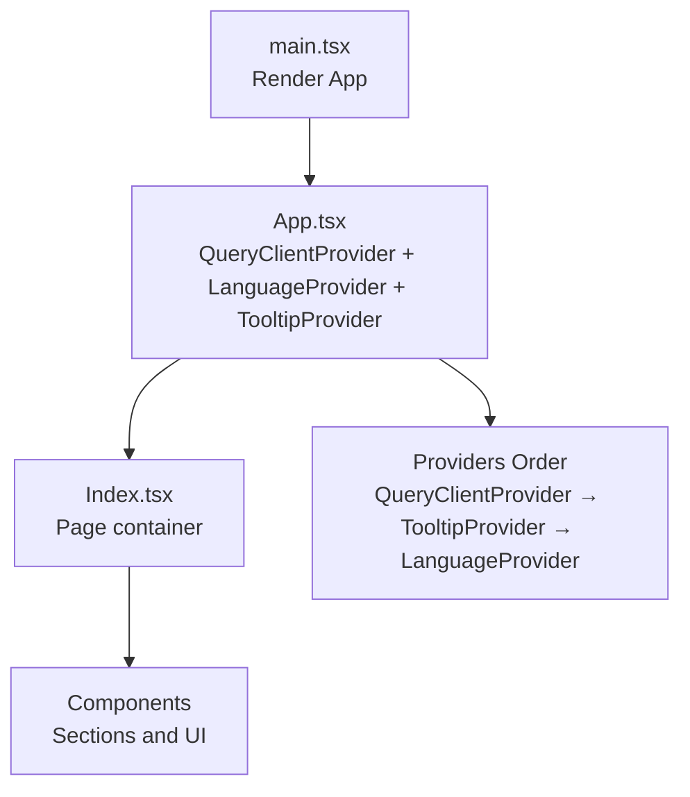
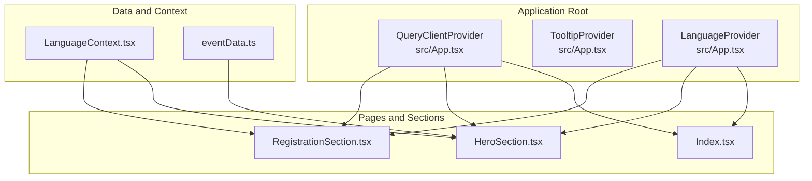
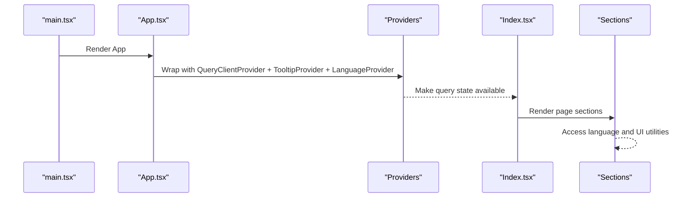
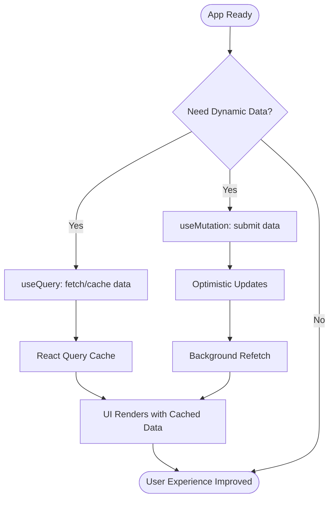
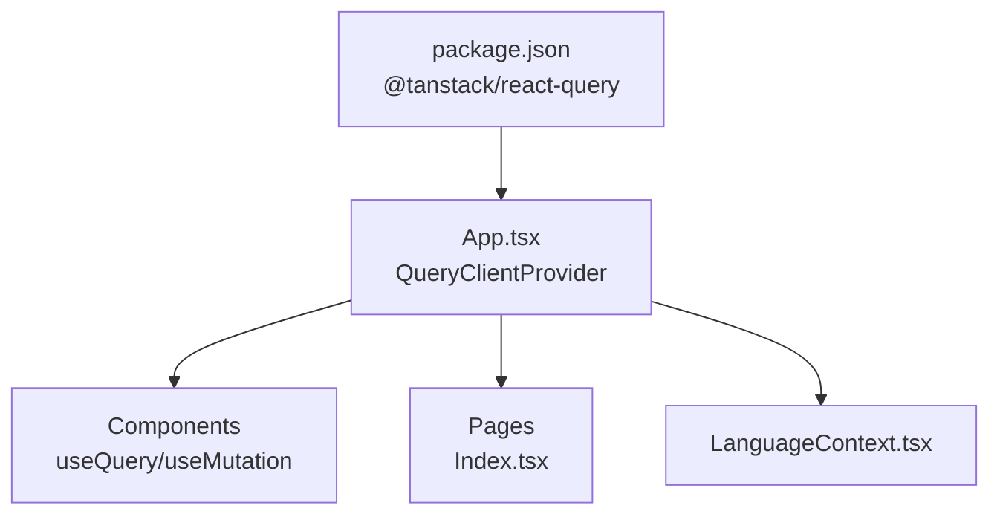

# React Query Integration

> **Referenced Files in This Document**
> - [App.tsx](src/App.tsx)
> - [main.tsx](src/main.tsx)
> - [LanguageContext.tsx](src/contexts/LanguageContext.tsx)
> - [RegistrationSection.tsx](src/components/RegistrationSection.tsx)
> - [Index.tsx](src/pages/Index.tsx)
> - [eventData.ts](src/data/eventData.ts)
> - [HeroSection.tsx](src/components/HeroSection.tsx)
> - [use-toast.ts](src/hooks/use-toast.ts)
> - [use-mobile.tsx](src/hooks/use-mobile.tsx)
> - [package.json](package.json)

## Table of Contents
1. [Introduction](#introduction)
2. [Project Structure](#project-structure)
3. [Core Components](#core-components)
4. [Architecture Overview](#architecture-overview)
5. [Detailed Component Analysis](#detailed-component-analysis)
6. [Dependency Analysis](#dependency-analysis)
7. [Performance Considerations](#performance-considerations)
8. [Troubleshooting Guide](#troubleshooting-guide)
9. [Conclusion](#conclusion)
10. [Appendices](#appendices)

## Introduction
This document explains how React Query is integrated into the application for client-side state management and data synchronization. It focuses on how the QueryClient is instantiated and provided at the root level via QueryClientProvider in App.tsx, and how this setup positions the app to handle server state, caching, and background data fetching. Even though explicit queries are not currently implemented, the integration prepares the application for future needs such as dynamic event data or registration workflows. The document also covers usage patterns for useQuery and useMutation hooks, configuration options (cache time, stale time, refetching strategies), debugging with React Query Devtools, performance optimization through query keys and prefetching, error handling, loading states, and how React Query complements the existing Context API for a cohesive state management strategy.

## Project Structure
React Query is configured at the application root so that all components can benefit from centralized caching and background synchronization. Providers wrap the app in a specific order to ensure global availability of query state, language context, and UI utilities.

**Diagram sources**
- [main.tsx](src/main.tsx#L1-L6)
- [App.tsx](src/App.tsx#L1-L43)
- [Index.tsx](src/pages/Index.tsx#L1-L32)

**Section sources**
- [main.tsx](src/main.tsx#L1-L6)
- [App.tsx](src/App.tsx#L1-L43)
- [Index.tsx](src/pages/Index.tsx#L1-L32)

## Core Components
- QueryClientProvider: Exposes the QueryClient to the entire component tree, enabling useQuery/useMutation hooks anywhere in the app.
- App.tsx: Instantiates the QueryClient and wraps the application with providers to ensure global availability.
- LanguageContext: Provides language and translation state; it coexists with React Query’s caching to manage UI-related state alongside server state.
- RegistrationSection: Demonstrates a real-world scenario where external links and QR codes are used for registration; this is a good candidate for integrating React Query in the future (e.g., fetching registration status or form metadata).

Key integration points:
- The QueryClient is created at the root and passed to QueryClientProvider.
- Providers are ordered to ensure that language and tooltips are available globally while query state is accessible everywhere.
- Components like RegistrationSection rely on external resources; React Query can later be used to fetch and cache such data.

**Section sources**
- [App.tsx](src/App.tsx#L1-L43)
- [LanguageContext.tsx](src/contexts/LanguageContext.tsx#L1-L292)
- [RegistrationSection.tsx](src/components/RegistrationSection.tsx#L1-L105)

## Architecture Overview
The application’s architecture centers around a root-level QueryClientProvider that enables React Query across the app. This setup allows components to leverage caching, background refetching, and optimistic updates without requiring explicit queries today. The Context API manages UI state (language and translations), while React Query manages server state and caching.

**Diagram sources**
- [App.tsx](src/App.tsx#L1-L43)
- [Index.tsx](src/pages/Index.tsx#L1-L32)
- [HeroSection.tsx](src/components/HeroSection.tsx#L1-L99)
- [RegistrationSection.tsx](src/components/RegistrationSection.tsx#L1-L105)
- [LanguageContext.tsx](src/contexts/LanguageContext.tsx#L1-L292)
- [eventData.ts](src/data/eventData.ts#L1-L109)

## Detailed Component Analysis

### QueryClient Initialization and Provider Setup
- The QueryClient is instantiated at the root and passed to QueryClientProvider.
- Providers are ordered to ensure that TooltipProvider and LanguageProvider are available inside the QueryClientProvider.
- This setup guarantees that all components can use React Query hooks and benefit from caching and background synchronization.

**Diagram sources**
- [main.tsx](src/main.tsx#L1-L6)
- [App.tsx](src/App.tsx#L1-L43)
- [Index.tsx](src/pages/Index.tsx#L1-L32)

**Section sources**
- [main.tsx](src/main.tsx#L1-L6)
- [App.tsx](src/App.tsx#L1-L43)

### How React Query Prepares the App for Future Data Fetching
- Even without explicit queries, the QueryClient is ready to cache server state and coordinate background refetching.
- The app is structured to support dynamic event data and registration workflows:
  - Dynamic event data: Use useQuery to fetch and cache event details, agenda, speakers, and venue information.
  - Registration forms: Use useQuery to fetch form metadata and useMutation to submit registrations, with optimistic updates and error handling.

[No sources needed since this diagram shows conceptual workflow, not actual code structure]

### Practical Usage Patterns with useQuery and useMutation
- useQuery pattern (conceptual):
  - Define a query key that uniquely identifies the resource (e.g., event details).
  - Configure cache time and stale time to balance freshness and performance.
  - Handle loading and error states in components.
  - Use enabled conditions to prevent unnecessary requests.
- useMutation pattern (conceptual):
  - Define mutation key aligned with the resource being updated.
  - Use optimistic updates to improve perceived performance.
  - Invalidate related queries after successful mutations to trigger refetch.
  - Handle errors and surface user feedback.

These patterns align with the existing structure where components like RegistrationSection and HeroSection can later integrate with external APIs through React Query.

**Section sources**
- [RegistrationSection.tsx](src/components/RegistrationSection.tsx#L1-L105)
- [HeroSection.tsx](src/components/HeroSection.tsx#L1-L99)

### Configuration Options: Cache Time, Stale Time, and Refetching Strategies
- Cache time: Controls how long cached data remains in memory before being garbage collected.
- Stale time: Determines when data is considered stale and eligible for background refetch.
- Refetching strategies: Configure automatic refetch on window focus, network reconnect, or periodic intervals.
- These settings help balance responsiveness with data freshness and reduce unnecessary network requests.

[No sources needed since this section provides general guidance]

### Debugging with React Query Devtools
- Install and mount React Query Devtools to inspect query keys, cache state, refetch reasons, and performance metrics.
- Use the devtools to verify that queries are being cached and refetched as expected.
- Monitor mutation lifecycles and invalidations to ensure data consistency.

[No sources needed since this section provides general guidance]

### Performance Optimization Through Query Keys and Prefetching
- Use precise, hierarchical query keys to group related data and enable targeted invalidations.
- Prefetch frequently accessed data during route transitions to reduce perceived latency.
- Combine query keys with stale time and cache time to minimize redundant requests.

[No sources needed since this section provides general guidance]

### Error Handling and Loading States
- useQuery exposes loading, error, and data states; components should render appropriate UI for each state.
- useMutation exposes variables, isLoading, isError, and isSuccess; combine with notifications and retry logic.
- Integrate with existing toast utilities to communicate outcomes to users.

**Section sources**
- [use-toast.ts](src/hooks/use-toast.ts#L1-L187)

### Integration with Context API for Cohesive State Management
- LanguageContext manages UI state (language, translations, RTL) and is provided alongside React Query.
- Components can consume both query state and language state concurrently.
- This dual-layer approach separates UI state (Context) from server state (React Query), keeping concerns distinct and maintainable.

**Section sources**
- [LanguageContext.tsx](src/contexts/LanguageContext.tsx#L1-L292)
- [App.tsx](src/App.tsx#L1-L43)

## Dependency Analysis
React Query is included as a dependency and is provided at the root. The app’s routing and component structure are compatible with React Query’s global availability.

**Diagram sources**
- [package.json](package.json#L1-L85)
- [App.tsx](src/App.tsx#L1-L43)
- [Index.tsx](src/pages/Index.tsx#L1-L32)
- [LanguageContext.tsx](src/contexts/LanguageContext.tsx#L1-L292)

**Section sources**
- [package.json](package.json#L1-L85)
- [App.tsx](src/App.tsx#L1-L43)

## Performance Considerations
- Choose appropriate cache and stale times to minimize network usage while keeping data fresh.
- Use query keys that reflect resource identity and scope to avoid cache bloat.
- Leverage background refetching and selective invalidation to keep data consistent without blocking UI.
- Combine React Query with Context API to avoid redundant re-renders by separating concerns.

[No sources needed since this section provides general guidance]

## Troubleshooting Guide
- If components do not receive query state, verify that QueryClientProvider is wrapping the app and that providers are ordered correctly.
- If queries appear to run repeatedly, review query keys and refetch strategies to avoid unnecessary refetches.
- If UI does not reflect recent changes after mutations, ensure that related queries are invalidated and refetched.
- Use React Query Devtools to inspect query lifecycle and cache state.

[No sources needed since this section provides general guidance]

## Conclusion
The application is configured with a root-level QueryClientProvider, positioning the app to adopt React Query for server state management and data synchronization. While explicit queries are not yet implemented, the architecture supports future enhancements such as dynamic event data and registration workflows. By leveraging useQuery/useMutation, thoughtful configuration of cache and stale times, and complementary Context API usage, the app can achieve robust, performant, and user-friendly data handling.

[No sources needed since this section summarizes without analyzing specific files]

## Appendices

### Appendix A: Example Scenarios for React Query Integration
- Dynamic event data:
  - Use useQuery to fetch event details, agenda, and speaker lists.
  - Configure cache and stale times to balance freshness and performance.
- Registration form:
  - Use useQuery to fetch form metadata and submission status.
  - Use useMutation to submit registrations with optimistic updates and error handling.
  - Invalidate related queries after successful submissions to refresh cached data.

[No sources needed since this section provides general guidance]