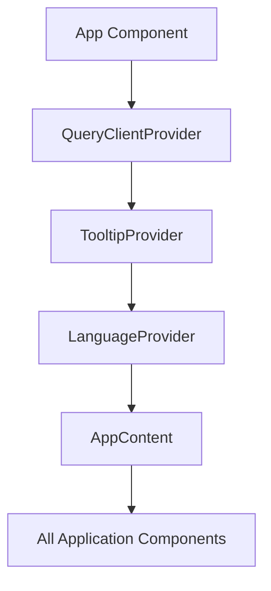
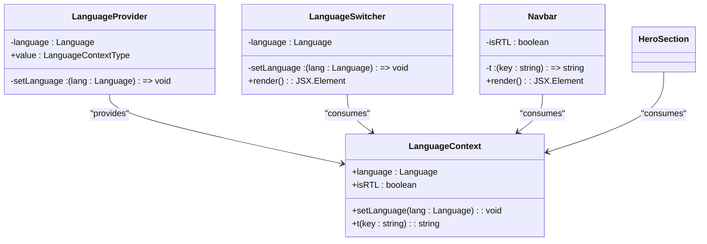
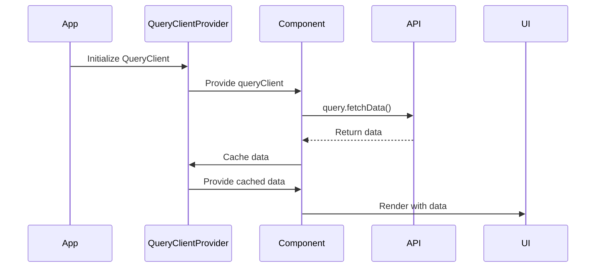
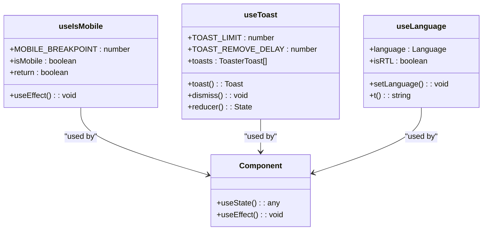

# State Management

<cite>
**Referenced Files in This Document**   
- [App.tsx](file://src/App.tsx)
- [LanguageContext.tsx](file://src/contexts/LanguageContext.tsx)
- [use-mobile.tsx](file://src/hooks/use-mobile.tsx)
- [use-toast.ts](file://src/hooks/use-toast.ts)
- [main.tsx](file://src/main.tsx)
- [LanguageSwitcher.tsx](file://src/components/LanguageSwitcher.tsx)
- [Navbar.tsx](file://src/components/Navbar.tsx)
- [HeroSection.tsx](file://src/components/HeroSection.tsx)
</cite>

## Table of Contents
1. [Introduction](#introduction)
2. [Global State Management with React Context](#global-state-management-with-react-context)
3. [Language Context Implementation](#language-context-implementation)
4. [Server State Management with React Query](#server-state-management-with-react-query)
5. [Custom Hooks for Reusable State Logic](#custom-hooks-for-reusable-state-logic)
6. [State Management Integration in Components](#state-management-integration-in-components)
7. [Performance Optimization and Best Practices](#performance-optimization-and-best-practices)
8. [Conclusion](#conclusion)

## Introduction
The application implements a comprehensive state management system that combines React Context API for global state, React Query for server state management, and custom hooks for reusable stateful logic. This documentation provides a detailed analysis of how these state management solutions work together to create a responsive, localized, and efficient user experience. The system enables language preference sharing across components, manages UI state for mobile detection and toast notifications, and provides a foundation for potential server data synchronization through React Query.

## Global State Management with React Context
The application uses React Context API to manage global state, primarily for language preferences and directionality. The LanguageProvider component wraps the entire application, making language state available to all components without prop drilling. This approach enables consistent language handling across the application and automatic UI adjustments based on the selected language. The context provides not only the current language but also a translation function and RTL (right-to-left) detection for Arabic language support.



**Diagram sources**
- [App.tsx](file://src/App.tsx#L33-L40)

**Section sources**
- [App.tsx](file://src/App.tsx#L33-L40)
- [LanguageContext.tsx](file://src/contexts/LanguageContext.tsx#L269-L282)

## Language Context Implementation
The LanguageContext provides a complete internationalization solution with support for Arabic, English, and Turkish languages. It maintains the current language state and provides a set of utilities including a translation function (t) and RTL detection. The context stores translations for all UI elements in a structured format, allowing components to access localized text through key-based lookups. When the language changes, all components that consume the context automatically re-render with the updated translations.



**Diagram sources**
- [LanguageContext.tsx](file://src/contexts/LanguageContext.tsx#L5-L292)
- [LanguageSwitcher.tsx](file://src/components/LanguageSwitcher.tsx#L1-L44)
- [Navbar.tsx](file://src/components/Navbar.tsx#L1-L123)

**Section sources**
- [LanguageContext.tsx](file://src/contexts/LanguageContext.tsx#L1-L292)
- [LanguageSwitcher.tsx](file://src/components/LanguageSwitcher.tsx#L1-L44)

## Server State Management with React Query
The application integrates React Query for server state management, providing a robust solution for data fetching, caching, and synchronization. The QueryClient is instantiated at the application root and provided through QueryClientProvider, making it available to all components. This setup enables efficient data fetching with built-in caching, automatic refetching, and loading state management. Although specific query implementations are not visible in the current codebase, the infrastructure is in place to support server state management for features like event registration data or speaker information.



**Diagram sources**
- [App.tsx](file://src/App.tsx#L4-L10)
- [package.json](file://package.json#L42)

## Custom Hooks for Reusable State Logic
The application implements several custom hooks to encapsulate reusable stateful logic. These hooks abstract complex state management patterns and provide clean APIs for components to consume. The useIsMobile hook detects screen size to enable responsive design, while the useToast hook manages toast notification state with an imperative API. These custom hooks follow React best practices by using useState, useEffect, and other built-in hooks to manage state and side effects.



**Diagram sources**
- [use-mobile.tsx](file://src/hooks/use-mobile.tsx#L1-L20)
- [use-toast.ts](file://src/hooks/use-toast.ts#L1-L187)
- [LanguageContext.tsx](file://src/contexts/LanguageContext.tsx#L285-L291)

**Section sources**
- [use-mobile.tsx](file://src/hooks/use-mobile.tsx#L1-L20)
- [use-toast.ts](file://src/hooks/use-toast.ts#L1-L187)

## State Management Integration in Components
The state management system is seamlessly integrated into various components throughout the application. The Navbar component uses the LanguageContext to display translated navigation items and handle RTL layout. The LanguageSwitcher component allows users to change the language preference, triggering re-renders across the application. The HeroSection component uses the translation function to display localized content. This integration demonstrates how global state, custom hooks, and component state work together to create a cohesive user experience.

```mermaid
flowchart TD
A[User Interaction] --> B{Component Type}
B --> C[LanguageSwitcher]
B --> D[Navbar]
B --> E[HeroSection]
B --> F[RegistrationSection]
C --> G[setLanguage]
G --> H[LanguageContext Update]
H --> I[All Context Consumers]
I --> J[Re-render with new language]
D --> K[useLanguage]
K --> L[Get t() and isRTL]
L --> M[Render Translated Nav]
E --> N[useLanguage]
N --> O[Get t()]
O --> P[Render Translated Hero]
F --> Q[useLanguage]
Q --> R[Get language]
R --> S[Render Language-specific Text]
```

**Diagram sources**
- [LanguageSwitcher.tsx](file://src/components/LanguageSwitcher.tsx#L1-L44)
- [Navbar.tsx](file://src/components/Navbar.tsx#L1-L123)
- [HeroSection.tsx](file://src/components/HeroSection.tsx#L1-L99)
- [RegistrationSection.tsx](file://src/components/RegistrationSection.tsx#L1-L105)

**Section sources**
- [Navbar.tsx](file://src/components/Navbar.tsx#L1-L123)
- [HeroSection.tsx](file://src/components/HeroSection.tsx#L1-L99)
- [RegistrationSection.tsx](file://src/components/RegistrationSection.tsx#L1-L105)

## Performance Optimization and Best Practices
The application follows several performance optimization strategies in its state management implementation. The LanguageContext minimizes re-renders by providing stable function references and using memoization patterns. The useIsMobile hook efficiently handles window resize events with proper cleanup to prevent memory leaks. The toast system implements a queue with automatic dismissal to prevent UI clutter. These optimizations ensure that state changes are handled efficiently and that the application remains responsive even with frequent state updates.

**Section sources**
- [use-mobile.tsx](file://src/hooks/use-mobile.tsx#L8-L16)
- [use-toast.ts](file://src/hooks/use-toast.ts#L53-L69)
- [LanguageContext.tsx](file://src/contexts/LanguageContext.tsx#L272-L274)

## Conclusion
The application's state management system effectively combines React Context API, React Query, and custom hooks to create a robust foundation for both client and server state management. The LanguageProvider enables seamless internationalization with support for multiple languages and RTL layout. Custom hooks like useIsMobile and useToast encapsulate reusable stateful logic, promoting code reuse and maintainability. The integration of React Query provides a scalable solution for server state management and data synchronization. Together, these state management solutions create a responsive, localized, and efficient user experience that can be easily extended with additional features and data sources.