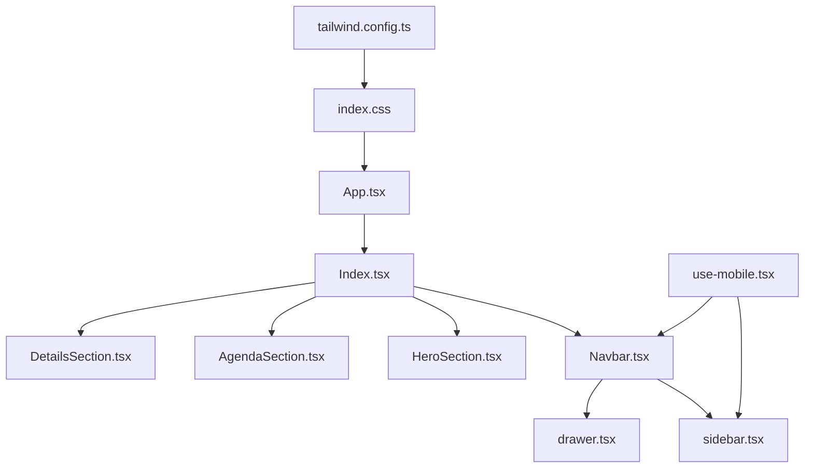
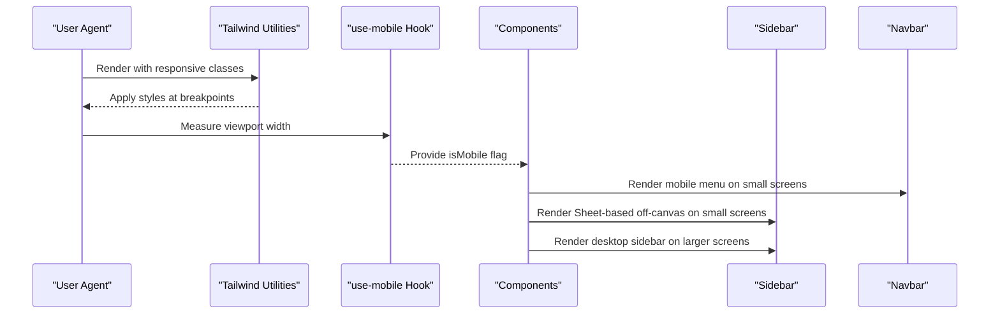
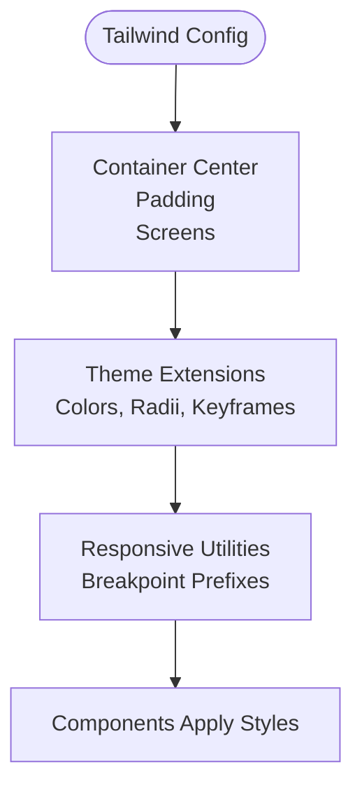
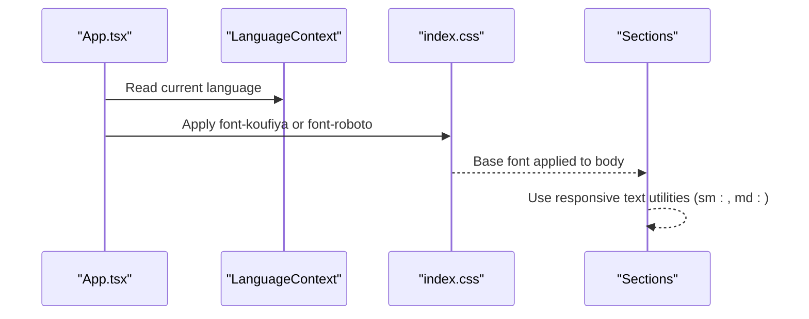
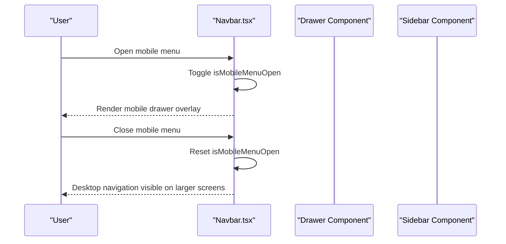
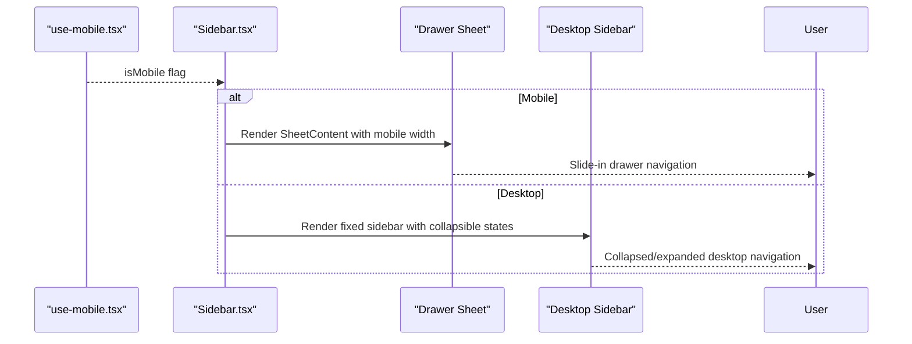
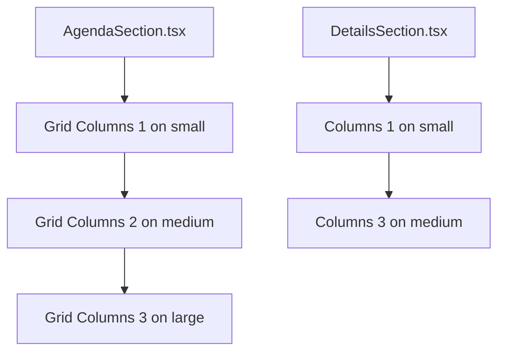
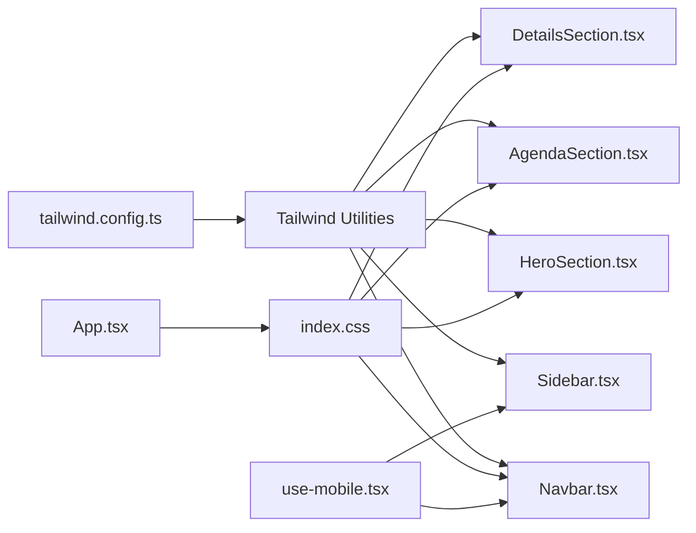

# Responsive Design

> **Referenced Files in This Document**
> - [tailwind.config.ts](tailwind.config.ts)
> - [index.css](src/index.css)
> - [App.tsx](src/App.tsx)
> - [use-mobile.tsx](src/hooks/use-mobile.tsx)
> - [Navbar.tsx](src/components/Navbar.tsx)
> - [sidebar.tsx](src/components/ui/sidebar.tsx)
> - [drawer.tsx](src/components/ui/drawer.tsx)
> - [Index.tsx](src/pages/Index.tsx)
> - [HeroSection.tsx](src/components/HeroSection.tsx)
> - [AgendaSection.tsx](src/components/AgendaSection.tsx)
> - [DetailsSection.tsx](src/components/DetailsSection.tsx)

## Table of Contents
1. [Introduction](#introduction)
2. [Project Structure](#project-structure)
3. [Core Components](#core-components)
4. [Architecture Overview](#architecture-overview)
5. [Detailed Component Analysis](#detailed-component-analysis)
6. [Dependency Analysis](#dependency-analysis)
7. [Performance Considerations](#performance-considerations)
8. [Troubleshooting Guide](#troubleshooting-guide)
9. [Conclusion](#conclusion)

## Introduction
This document explains how responsive design is implemented using Tailwind’s breakpoint system and complementary JavaScript detection. It covers:
- How the Tailwind configuration defines responsive containers and breakpoints
- How components adapt across mobile, tablet, and desktop views using Tailwind’s responsive prefixes
- How the use-mobile hook complements CSS-based responsiveness with JavaScript detection for conditional rendering
- Practical examples from the codebase, including mobile drawer navigation versus desktop sidebar and responsive typography scaling with font families

## Project Structure
The project organizes responsive concerns across configuration, global styles, and components:
- Tailwind configuration controls container widths and theme extensions
- Global CSS applies fonts and base styles
- Components use Tailwind utilities and the use-mobile hook to adapt behavior
- Pages assemble sections that demonstrate responsive grids and typography

**Diagram sources**
- [tailwind.config.ts](tailwind.config.ts#L1-L98)
- [index.css](src/index.css#L1-L249)
- [App.tsx](src/App.tsx#L1-L43)
- [Index.tsx](src/pages/Index.tsx#L1-L32)
- [Navbar.tsx](src/components/Navbar.tsx#L1-L123)
- [sidebar.tsx](src/components/ui/sidebar.tsx#L1-L638)
- [drawer.tsx](src/components/ui/drawer.tsx#L1-L88)
- [use-mobile.tsx](src/hooks/use-mobile.tsx#L1-L20)

**Section sources**
- [tailwind.config.ts](tailwind.config.ts#L1-L98)
- [index.css](src/index.css#L1-L249)
- [App.tsx](src/App.tsx#L1-L43)
- [Index.tsx](src/pages/Index.tsx#L1-L32)

## Core Components
- Tailwind configuration: Defines container widths and theme extensions used by responsive utilities
- Global CSS: Applies fonts and base styles, including a custom font family for typography scaling
- App wrapper: Chooses font families based on language for responsive typography
- use-mobile hook: Provides JavaScript-based device detection for conditional rendering
- Navbar: Uses Tailwind responsive utilities and a mobile drawer for small screens
- Sidebar: Uses the use-mobile hook to switch between a Sheet-based off-canvas on mobile and a desktop sidebar
- Sections: Demonstrate responsive grids and typography scaling

**Section sources**
- [tailwind.config.ts](tailwind.config.ts#L1-L98)
- [index.css](src/index.css#L1-L249)
- [App.tsx](src/App.tsx#L1-L43)
- [use-mobile.tsx](src/hooks/use-mobile.tsx#L1-L20)
- [Navbar.tsx](src/components/Navbar.tsx#L1-L123)
- [sidebar.tsx](src/components/ui/sidebar.tsx#L1-L638)
- [drawer.tsx](src/components/ui/drawer.tsx#L1-L88)
- [HeroSection.tsx](src/components/HeroSection.tsx#L1-L99)
- [AgendaSection.tsx](src/components/AgendaSection.tsx#L1-L64)
- [DetailsSection.tsx](src/components/DetailsSection.tsx#L1-L65)

## Architecture Overview
Responsive behavior is layered:
- CSS-based: Tailwind utilities apply breakpoint-specific styles
- Container-aware: Tailwind container configuration constrains content width at larger screens
- JavaScript-based: use-mobile hook detects device width to drive conditional rendering
- Typography-driven: Fonts are selected per language to improve readability across locales

**Diagram sources**
- [use-mobile.tsx](src/hooks/use-mobile.tsx#L1-L20)
- [Navbar.tsx](src/components/Navbar.tsx#L1-L123)
- [sidebar.tsx](src/components/ui/sidebar.tsx#L1-L638)

## Detailed Component Analysis

### Tailwind Breakpoints and Container Configuration
- Container configuration centers content and sets a maximum width for extra-large screens
- Theme extensions define color palettes and keyframe animations used across responsive components
- These settings enable consistent spacing and layout scaling across breakpoints

**Diagram sources**
- [tailwind.config.ts](tailwind.config.ts#L1-L98)

**Section sources**
- [tailwind.config.ts](tailwind.config.ts#L1-L98)

### Typography Scaling with Font Families
- Global CSS applies a custom font family for Arabic and a fallback for other languages
- App-level selection switches between font families depending on the active language
- Sections use responsive text sizing utilities to scale headings and content across breakpoints

**Diagram sources**
- [index.css](src/index.css#L1-L249)
- [App.tsx](src/App.tsx#L1-L43)
- [HeroSection.tsx](src/components/HeroSection.tsx#L1-L99)
- [AgendaSection.tsx](src/components/AgendaSection.tsx#L1-L64)
- [DetailsSection.tsx](src/components/DetailsSection.tsx#L1-L65)

**Section sources**
- [index.css](src/index.css#L1-L249)
- [App.tsx](src/App.tsx#L1-L43)
- [HeroSection.tsx](src/components/HeroSection.tsx#L1-L99)
- [AgendaSection.tsx](src/components/AgendaSection.tsx#L1-L64)
- [DetailsSection.tsx](src/components/DetailsSection.tsx#L1-L65)

### Navbar: Mobile Drawer vs Desktop Navigation
- Desktop navigation uses Tailwind responsive utilities to hide on smaller screens and show on medium-sized screens and above
- Mobile navigation toggles a drawer-like overlay controlled by state
- The component demonstrates breakpoint-specific visibility and layout adjustments

**Diagram sources**
- [Navbar.tsx](src/components/Navbar.tsx#L1-L123)
- [drawer.tsx](src/components/ui/drawer.tsx#L1-L88)

**Section sources**
- [Navbar.tsx](src/components/Navbar.tsx#L1-L123)
- [drawer.tsx](src/components/ui/drawer.tsx#L1-L88)

### Sidebar: Off-canvas on Mobile, Desktop Sidebar
- The Sidebar component uses the use-mobile hook to decide between:
  - A Sheet-based off-canvas on mobile devices
  - A desktop sidebar with collapsible behavior
- This hybrid approach ensures optimal UX across screen sizes

**Diagram sources**
- [use-mobile.tsx](src/hooks/use-mobile.tsx#L1-L20)
- [sidebar.tsx](src/components/ui/sidebar.tsx#L1-L638)
- [drawer.tsx](src/components/ui/drawer.tsx#L1-L88)

**Section sources**
- [sidebar.tsx](src/components/ui/sidebar.tsx#L1-L638)
- [use-mobile.tsx](src/hooks/use-mobile.tsx#L1-L20)

### Grid Layouts: Responsive Columns
- Sections use responsive grid utilities to adjust column counts across breakpoints
- This ensures content remains readable and well-spaced on all devices

**Diagram sources**
- [AgendaSection.tsx](src/components/AgendaSection.tsx#L1-L64)
- [DetailsSection.tsx](src/components/DetailsSection.tsx#L1-L65)

**Section sources**
- [AgendaSection.tsx](src/components/AgendaSection.tsx#L1-L64)
- [DetailsSection.tsx](src/components/DetailsSection.tsx#L1-L65)

## Dependency Analysis
Responsive design depends on coordinated layers:
- Tailwind configuration influences the availability and behavior of responsive utilities
- Global CSS establishes baseline fonts and styles
- App-level logic selects fonts per language
- Components rely on Tailwind utilities and the use-mobile hook for runtime decisions

**Diagram sources**
- [tailwind.config.ts](tailwind.config.ts#L1-L98)
- [index.css](src/index.css#L1-L249)
- [App.tsx](src/App.tsx#L1-L43)
- [Navbar.tsx](src/components/Navbar.tsx#L1-L123)
- [HeroSection.tsx](src/components/HeroSection.tsx#L1-L99)
- [AgendaSection.tsx](src/components/AgendaSection.tsx#L1-L64)
- [DetailsSection.tsx](src/components/DetailsSection.tsx#L1-L65)
- [sidebar.tsx](src/components/ui/sidebar.tsx#L1-L638)
- [use-mobile.tsx](src/hooks/use-mobile.tsx#L1-L20)

**Section sources**
- [tailwind.config.ts](tailwind.config.ts#L1-L98)
- [index.css](src/index.css#L1-L249)
- [App.tsx](src/App.tsx#L1-L43)
- [Navbar.tsx](src/components/Navbar.tsx#L1-L123)
- [HeroSection.tsx](src/components/HeroSection.tsx#L1-L99)
- [AgendaSection.tsx](src/components/AgendaSection.tsx#L1-L64)
- [DetailsSection.tsx](src/components/DetailsSection.tsx#L1-L65)
- [sidebar.tsx](src/components/ui/sidebar.tsx#L1-L638)
- [use-mobile.tsx](src/hooks/use-mobile.tsx#L1-L20)

## Performance Considerations
- Prefer CSS-based responsive utilities over runtime calculations for layout changes
- Minimize heavy computations in effect handlers; the use-mobile hook measures once and updates on media query changes
- Use container utilities to prevent excessive horizontal scrolling on small screens
- Keep font loading efficient; the project already uses font-display swap for custom fonts

[No sources needed since this section provides general guidance]

## Troubleshooting Guide
Common responsive design challenges and solutions:
- Viewport scaling on mobile devices
  - Ensure the viewport meta tag is configured in the HTML template (not shown in this repository snapshot)
  - Use Tailwind’s container utilities to constrain content width on large screens
  - Verify that the use-mobile hook returns the expected value on resize events
- Inconsistent layout behavior across screen sizes
  - Confirm Tailwind breakpoint prefixes match intended breakpoints
  - Validate that components conditionally render based on the use-mobile hook on small screens
  - Check that grid layouts use appropriate responsive column utilities

**Section sources**
- [use-mobile.tsx](src/hooks/use-mobile.tsx#L1-L20)
- [tailwind.config.ts](tailwind.config.ts#L1-L98)
- [AgendaSection.tsx](src/components/AgendaSection.tsx#L1-L64)
- [DetailsSection.tsx](src/components/DetailsSection.tsx#L1-L65)

## Conclusion
The project implements responsive design by combining Tailwind’s breakpoint system with JavaScript-based device detection:
- Tailwind configuration defines container widths and theme extensions
- Global CSS applies fonts and base styles
- App-level logic selects fonts per language
- Components use responsive utilities and the use-mobile hook to adapt navigation and layout across devices
- Sections demonstrate responsive grids and typography scaling

This layered approach ensures consistent, accessible experiences across mobile, tablet, and desktop views while maintaining clean, maintainable code.