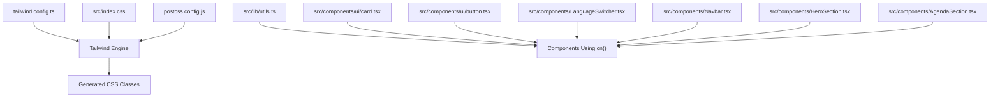
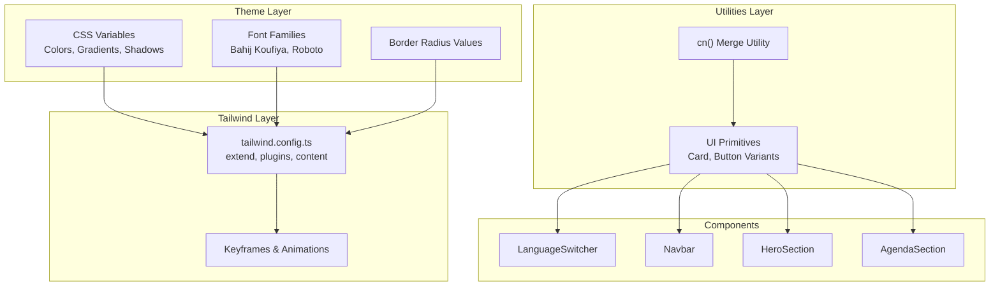
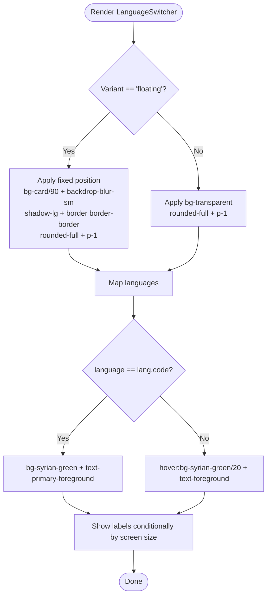
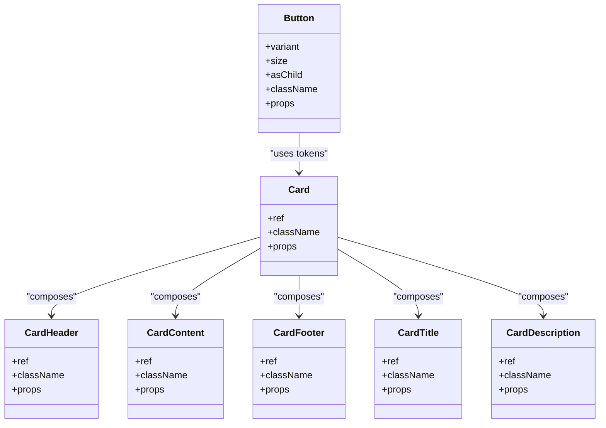
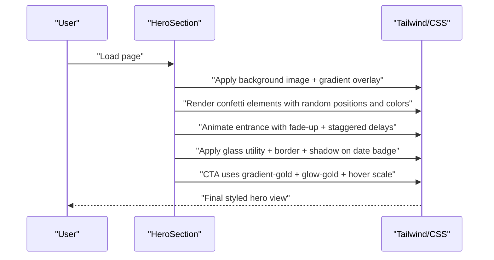
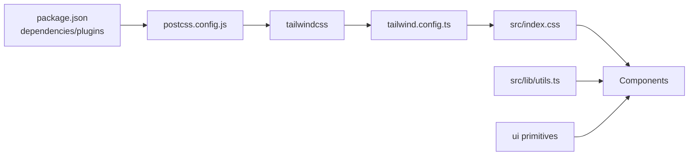

# Styling Strategy

<cite>
**Referenced Files in This Document**
- [tailwind.config.ts](file://tailwind.config.ts)
- [src/index.css](file://src/index.css)
- [postcss.config.js](file://postcss.config.js)
- [package.json](file://package.json)
- [src/lib/utils.ts](file://src/lib/utils.ts)
- [src/components/LanguageSwitcher.tsx](file://src/components/LanguageSwitcher.tsx)
- [src/components/Navbar.tsx](file://src/components/Navbar.tsx)
- [src/components/HeroSection.tsx](file://src/components/HeroSection.tsx)
- [src/components/ui/card.tsx](file://src/components/ui/card.tsx)
- [src/components/ui/button.tsx](file://src/components/ui/button.tsx)
- [src/components/AgendaSection.tsx](file://src/components/AgendaSection.tsx)
- [src/hooks/use-mobile.tsx](file://src/hooks/use-mobile.tsx)
</cite>

## Table of Contents
1. [Introduction](#introduction)
2. [Project Structure](#project-structure)
3. [Core Components](#core-components)
4. [Architecture Overview](#architecture-overview)
5. [Detailed Component Analysis](#detailed-component-analysis)
6. [Dependency Analysis](#dependency-analysis)
7. [Performance Considerations](#performance-considerations)
8. [Troubleshooting Guide](#troubleshooting-guide)
9. [Conclusion](#conclusion)

## Introduction
This document explains the styling strategy for the project, focusing on the Tailwind CSS implementation and the design system. It covers how the Tailwind configuration extends the default theme with custom colors, fonts, and animations, how the utility-first approach is applied across components, and how the cn() utility function enables safe conditional class composition. It also details responsive design using Tailwind’s breakpoint system, highlights complex styling patterns such as the floating language switcher’s backdrop blur effect and the card component’s shadow and border styling, and provides optimization tips for reducing CSS bundle size.

## Project Structure
The styling pipeline is organized around a small set of foundational files:
- Tailwind configuration defines theme extensions, plugins, and content scanning.
- Global CSS establishes base styles, CSS variables, gradients, and reusable utilities.
- PostCSS configuration integrates Tailwind and Autoprefixer.
- The cn() utility merges Tailwind classes safely, while shadcn/ui primitives provide component-level variants.
- Components apply utility-first styles and leverage responsive utilities and custom utilities.

**Diagram sources**
- [tailwind.config.ts](file://tailwind.config.ts#L1-L98)
- [src/index.css](file://src/index.css#L1-L249)
- [postcss.config.js](file://postcss.config.js#L1-L7)
- [src/lib/utils.ts](file://src/lib/utils.ts#L1-L7)
- [src/components/ui/card.tsx](file://src/components/ui/card.tsx#L1-L44)
- [src/components/ui/button.tsx](file://src/components/ui/button.tsx#L1-L48)
- [src/components/LanguageSwitcher.tsx](file://src/components/LanguageSwitcher.tsx#L1-L44)
- [src/components/Navbar.tsx](file://src/components/Navbar.tsx#L1-L123)
- [src/components/HeroSection.tsx](file://src/components/HeroSection.tsx#L1-L99)
- [src/components/AgendaSection.tsx](file://src/components/AgendaSection.tsx#L1-L64)

**Section sources**
- [tailwind.config.ts](file://tailwind.config.ts#L1-L98)
- [src/index.css](file://src/index.css#L1-L249)
- [postcss.config.js](file://postcss.config.js#L1-L7)

## Core Components
- Tailwind configuration:
  - Dark mode strategy uses a class-based approach.
  - Content scanning targets pages, components, app, and src directories.
  - Theme extension adds custom colors, typography families, border radius, and keyframe/animation definitions.
  - Plugin integration includes tailwindcss-animate.
- Global CSS:
  - Defines CSS variables for color palettes and gradients.
  - Establishes base layer styles and applies border defaults.
  - Provides utility classes for gradients, glass effects, and glow shadows.
  - Declares custom animations and staggered delays.
- Utilities:
  - cn() merges clsx and tailwind-merge to prevent class conflicts and deduplicate conflicting utilities.
- UI primitives:
  - Card and Button components demonstrate utility-first composition and variant systems.

**Section sources**
- [tailwind.config.ts](file://tailwind.config.ts#L1-L98)
- [src/index.css](file://src/index.css#L1-L249)
- [src/lib/utils.ts](file://src/lib/utils.ts#L1-L7)
- [src/components/ui/card.tsx](file://src/components/ui/card.tsx#L1-L44)
- [src/components/ui/button.tsx](file://src/components/ui/button.tsx#L1-L48)

## Architecture Overview
The styling architecture follows a layered approach:
- Variables and base styles live in global CSS.
- Tailwind compiles utilities and animations from the configuration.
- Components consume utilities and variants directly, enabling rapid iteration and consistency.

**Diagram sources**
- [tailwind.config.ts](file://tailwind.config.ts#L1-L98)
- [src/index.css](file://src/index.css#L1-L249)
- [src/lib/utils.ts](file://src/lib/utils.ts#L1-L7)
- [src/components/ui/card.tsx](file://src/components/ui/card.tsx#L1-L44)
- [src/components/ui/button.tsx](file://src/components/ui/button.tsx#L1-L48)
- [src/components/LanguageSwitcher.tsx](file://src/components/LanguageSwitcher.tsx#L1-L44)
- [src/components/Navbar.tsx](file://src/components/Navbar.tsx#L1-L123)
- [src/components/HeroSection.tsx](file://src/components/HeroSection.tsx#L1-L99)
- [src/components/AgendaSection.tsx](file://src/components/AgendaSection.tsx#L1-L64)

## Detailed Component Analysis

### Tailwind Configuration and Design Tokens
- Theme extensions:
  - Colors: semantic tokens mapped to CSS variables for light/dark modes, plus brand-specific tokens (Syrian red/green/black, gold, cream) and sidebar tokens.
  - Typography: two font families configured for Arabic and multilingual contexts.
  - Border radius: derived from a CSS variable for consistent rounding.
  - Animations: accordion animations included via plugin.
- Plugins:
  - tailwindcss-animate is enabled for declarative motion utilities.
- Content scanning:
  - Ensures only used utilities are generated, keeping the bundle lean.

**Section sources**
- [tailwind.config.ts](file://tailwind.config.ts#L1-L98)

### Global CSS and Base Styles
- CSS variables define:
  - Primary, secondary, muted, accent, destructive, and surface tokens for both light and dark themes.
  - Brand tokens for Syrian identity and gold gradients.
  - Shadow presets for consistent elevation.
- Base layer:
  - Applies border defaults globally and sets font family and anti-aliasing.
- Utilities:
  - Gradient helpers for hero, gold, and green.
  - Text gradient utility.
  - Glass effect utility using backdrop blur.
  - Glow utilities for primary and gold.
- Animations:
  - Floating, pulsing glow, shimmer, fade-up, scaling, and confetti fall.
  - Staggered delays for sequential animations.

**Section sources**
- [src/index.css](file://src/index.css#L1-L249)

### Utility Composition with cn()
- Purpose:
  - Safely merge conditional classes while avoiding duplicates.
- Implementation:
  - Uses clsx for conditional class arrays and tailwind-merge for deduplication.
- Usage patterns:
  - UI primitives pass className props through cn().
  - Components combine static and dynamic classes with confidence.

**Section sources**
- [src/lib/utils.ts](file://src/lib/utils.ts#L1-L7)
- [src/components/ui/card.tsx](file://src/components/ui/card.tsx#L1-L44)
- [src/components/ui/button.tsx](file://src/components/ui/button.tsx#L1-L48)

### Responsive Design and Breakpoints
- Breakpoint usage:
  - md: used to hide/show mobile menus, adjust typography, and change layout grids.
  - sm: used to show/hide labels and adjust sizes.
- Hook-based detection:
  - useIsMobile determines mobile state using a media query listener against a fixed breakpoint.
- Component examples:
  - Navbar toggles mobile menu visibility and adjusts backdrop blur and shadow on scroll.
  - HeroSection adapts typography and spacing across breakpoints.
  - AgendaSection stacks and tiles cards responsively.

**Section sources**
- [src/hooks/use-mobile.tsx](file://src/hooks/use-mobile.tsx#L1-L20)
- [src/components/Navbar.tsx](file://src/components/Navbar.tsx#L1-L123)
- [src/components/HeroSection.tsx](file://src/components/HeroSection.tsx#L1-L99)
- [src/components/AgendaSection.tsx](file://src/components/AgendaSection.tsx#L1-L64)

### Floating Language Switcher: Backdrop Blur Effect
- Pattern:
  - Fixed positioning with z-index and rounded container.
  - Background uses card/90 with backdrop blur for frosted glass effect.
  - Shadow and border provide depth and contrast against backgrounds.
  - Conditional classes switch between floating and navbar variants.
- Animation and typography:
  - Uses Roboto for non-Arabic labels and hides labels on small screens.

**Diagram sources**
- [src/components/LanguageSwitcher.tsx](file://src/components/LanguageSwitcher.tsx#L1-L44)
- [src/index.css](file://src/index.css#L143-L172)

**Section sources**
- [src/components/LanguageSwitcher.tsx](file://src/components/LanguageSwitcher.tsx#L1-L44)
- [src/index.css](file://src/index.css#L143-L172)

### Card Component: Shadow and Border Styling
- Pattern:
  - Rounded corners, border, and subtle shadow for depth.
  - Uses card and card-foreground tokens for consistent theming.
  - Header, Title, Description, Content, and Footer segments compose with shared spacing and typography.
- Variants:
  - Button primitive demonstrates variant and size classes for consistent interactive states.

**Diagram sources**
- [src/components/ui/card.tsx](file://src/components/ui/card.tsx#L1-L44)
- [src/components/ui/button.tsx](file://src/components/ui/button.tsx#L1-L48)

**Section sources**
- [src/components/ui/card.tsx](file://src/components/ui/card.tsx#L1-L44)
- [src/components/ui/button.tsx](file://src/components/ui/button.tsx#L1-L48)

### Hero Section: Complex Styling Patterns
- Background image with gradient overlay and confetti animation.
- Decorative elements use brand colors and shadows.
- Typography scales across breakpoints with animated entrance.
- Interactive CTA uses gradient backgrounds, glow, and hover transforms.
- Date badge uses the glass utility and border/shadow for depth.

**Diagram sources**
- [src/components/HeroSection.tsx](file://src/components/HeroSection.tsx#L1-L99)
- [src/index.css](file://src/index.css#L143-L172)

**Section sources**
- [src/components/HeroSection.tsx](file://src/components/HeroSection.tsx#L1-L99)
- [src/index.css](file://src/index.css#L143-L172)

### Agenda Section: Grid Responsiveness and Hover Effects
- Responsive grid adapts from single column to triple column based on viewport.
- Cards use card tokens, borders, and shadows with hover enhancements.
- Gradient accents animate on hover for visual feedback.

**Section sources**
- [src/components/AgendaSection.tsx](file://src/components/AgendaSection.tsx#L1-L64)

## Dependency Analysis
- Tailwind configuration depends on:
  - CSS variables for color tokens.
  - Global utilities for gradients and effects.
- Components depend on:
  - Tailwind utilities for layout and typography.
  - cn() for safe class merging.
  - UI primitives for consistent variants.
- Build pipeline:
  - PostCSS runs Tailwind and Autoprefixer.
  - Dependencies include Tailwind, tailwind-merge, and tailwindcss-animate.

**Diagram sources**
- [package.json](file://package.json#L1-L85)
- [postcss.config.js](file://postcss.config.js#L1-L7)
- [tailwind.config.ts](file://tailwind.config.ts#L1-L98)
- [src/index.css](file://src/index.css#L1-L249)
- [src/lib/utils.ts](file://src/lib/utils.ts#L1-L7)
- [src/components/ui/card.tsx](file://src/components/ui/card.tsx#L1-L44)
- [src/components/ui/button.tsx](file://src/components/ui/button.tsx#L1-L48)

**Section sources**
- [package.json](file://package.json#L1-L85)
- [postcss.config.js](file://postcss.config.js#L1-L7)
- [tailwind.config.ts](file://tailwind.config.ts#L1-L98)
- [src/index.css](file://src/index.css#L1-L249)
- [src/lib/utils.ts](file://src/lib/utils.ts#L1-L7)
- [src/components/ui/card.tsx](file://src/components/ui/card.tsx#L1-L44)
- [src/components/ui/button.tsx](file://src/components/ui/button.tsx#L1-L48)

## Performance Considerations
- Keep content scanning scoped:
  - The configuration scans pages, components, app, and src directories. Ensure only relevant paths are included to minimize generated utilities.
- Prefer CSS variables for theme tokens:
  - Using HSL variables ensures consistent theming across light/dark modes without duplicating utilities.
- Use utility-first composition:
  - Combine small, composable utilities rather than writing bespoke CSS to reduce duplication.
- Limit animation-heavy elements:
  - Animations like confetti and shimmer are visually appealing but can increase DOM complexity. Use sparingly and consider disabling on constrained devices.
- Optimize font loading:
  - The project loads custom fonts via @font-face. Ensure fonts are preloaded or cached appropriately to avoid layout shifts.
- Bundle size tips:
  - Remove unused utilities by scoping content globs tightly.
  - Avoid excessive nesting in custom utilities; prefer flat, composable utilities.
  - Consolidate repeated gradients and shadows into utility classes to reduce duplication.

[No sources needed since this section provides general guidance]

## Troubleshooting Guide
- Dark mode not applying:
  - Verify the darkMode strategy is set to class and that the class is toggled on the root element.
- Unexpected class collisions:
  - Ensure cn() is used to merge classes so tailwind-merge deduplicates conflicting utilities.
- Responsive breakpoints not triggering:
  - Confirm md/sm prefixes are used correctly and that useIsMobile hook aligns with Tailwind’s breakpoints.
- Backdrop blur not visible:
  - Ensure the browser supports backdrop-filter and that the element has sufficient background contrast or transparency.
- Animations not playing:
  - Check that animation utilities are defined and that the elements are not hidden or clipped by overflow.

**Section sources**
- [tailwind.config.ts](file://tailwind.config.ts#L1-L98)
- [src/lib/utils.ts](file://src/lib/utils.ts#L1-L7)
- [src/hooks/use-mobile.tsx](file://src/hooks/use-mobile.tsx#L1-L20)
- [src/index.css](file://src/index.css#L143-L172)

## Conclusion
The project’s styling strategy centers on a robust Tailwind configuration, a comprehensive set of CSS variables and utilities, and a utility-first component architecture. The cn() utility ensures predictable class composition, while responsive utilities and a dedicated mobile hook enable seamless adaptation across devices. Complex patterns like the floating language switcher’s glass effect and the hero section’s layered animations showcase the power of combining Tailwind utilities with custom CSS. Following the optimization tips and troubleshooting guidance will help maintain a fast, consistent, and scalable design system.