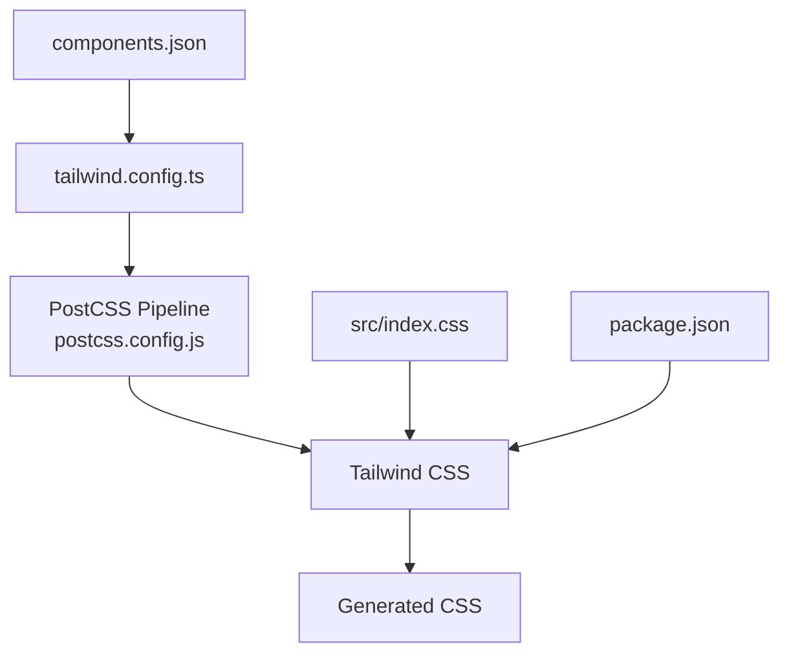
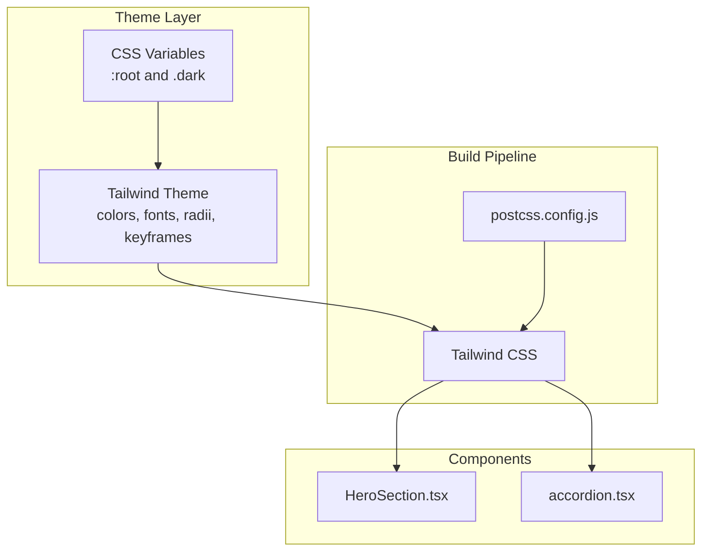
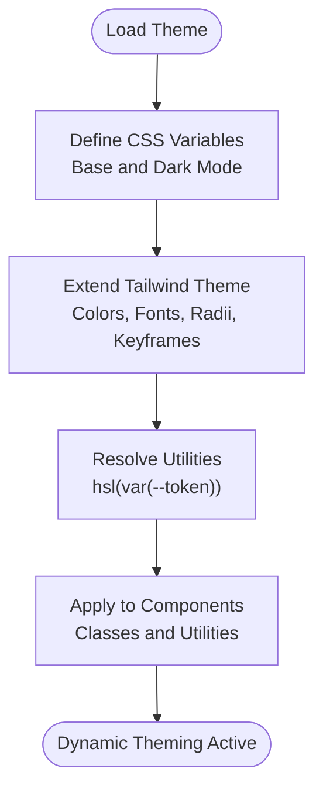
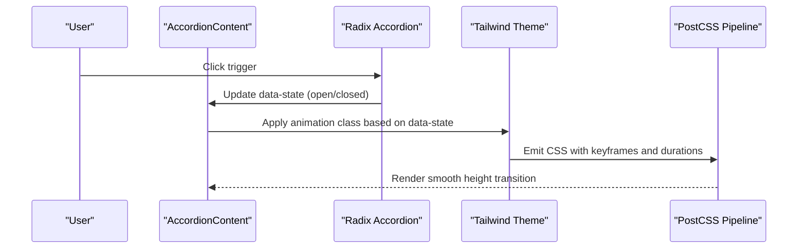
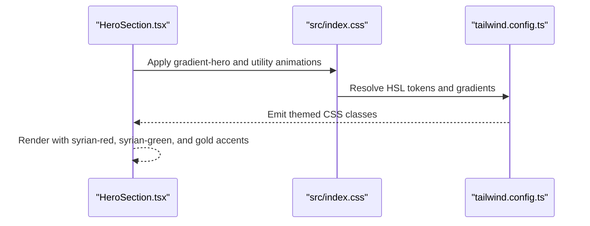
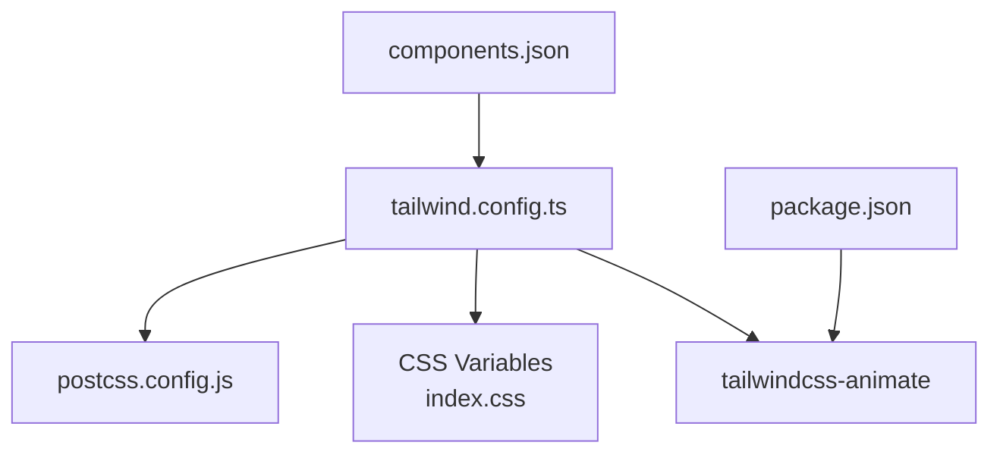

# Tailwind Configuration

<cite>
**Referenced Files in This Document**
- [tailwind.config.ts](file://tailwind.config.ts)
- [index.css](file://src/index.css)
- [HeroSection.tsx](file://src/components/HeroSection.tsx)
- [accordion.tsx](file://src/components/ui/accordion.tsx)
- [components.json](file://components.json)
- [package.json](file://package.json)
- [postcss.config.js](file://postcss.config.js)
</cite>

## Table of Contents
1. [Introduction](#introduction)
2. [Project Structure](#project-structure)
3. [Core Components](#core-components)
4. [Architecture Overview](#architecture-overview)
5. [Detailed Component Analysis](#detailed-component-analysis)
6. [Dependency Analysis](#dependency-analysis)
7. [Performance Considerations](#performance-considerations)
8. [Troubleshooting Guide](#troubleshooting-guide)
9. [Conclusion](#conclusion)

## Introduction
This document explains the Tailwind configuration focused on custom theme extensions and dynamic theming. It covers how the theme extends default colors with a Syrian community palette, integrates custom fonts, defines CSS variables for dynamic theming, and configures containers, border radius scaling, and keyframes for smooth UI animations. It also documents the integration of the tailwindcss-animate plugin and demonstrates practical usage in components such as the HeroSection and Radix Accordion.

## Project Structure
The Tailwind configuration is centralized in a single configuration file and backed by a global CSS layer that defines CSS variables for dynamic theming. The PostCSS pipeline applies Tailwind and Autoprefixer, while shadcn/ui components are configured to use the local Tailwind setup.

**Diagram sources**
- [tailwind.config.ts](file://tailwind.config.ts#L1-L98)
- [postcss.config.js](file://postcss.config.js#L1-L7)
- [components.json](file://components.json#L1-L21)
- [package.json](file://package.json#L1-L85)

**Section sources**
- [tailwind.config.ts](file://tailwind.config.ts#L1-L98)
- [postcss.config.js](file://postcss.config.js#L1-L7)
- [components.json](file://components.json#L1-L21)
- [package.json](file://package.json#L1-L85)

## Core Components
- Theme extension with custom colors and fonts:
  - Custom palette keys include syrian red, syrian green, syrian black, gold, and cream.
  - Custom font families include Bahij Koufiya and Roboto.
- Dynamic theming via CSS variables:
  - Base and dark mode variable sets define semantic tokens mapped to HSL values.
  - Tailwind resolves color utilities by interpolating CSS variables into HSL().
- Container sizing and responsive breakpoints:
  - Centered container with a default padding and a 2xl breakpoint at 1400px.
- Border radius scaling:
  - Radius scales adapt to a central --radius variable for consistent corner treatment across components.
- Keyframes and animations:
  - Accordion animations use named keyframes and durations.
  - Additional utility animations include floating, pulsing glow, shimmer, fade-up, scale-in, and confetti effects.
- Plugin integration:
  - tailwindcss-animate plugin enables utility classes for smooth transitions and animations.

**Section sources**
- [tailwind.config.ts](file://tailwind.config.ts#L1-L98)
- [index.css](file://src/index.css#L1-L249)

## Architecture Overview
The Tailwind pipeline transforms CSS variables into HSL-based color utilities and applies them across the app. The configuration extends default tokens and registers custom animations and typography. Components consume these utilities and animations directly.

**Diagram sources**
- [index.css](file://src/index.css#L1-L249)
- [tailwind.config.ts](file://tailwind.config.ts#L1-L98)
- [postcss.config.js](file://postcss.config.js#L1-L7)
- [HeroSection.tsx](file://src/components/HeroSection.tsx#L1-L99)
- [accordion.tsx](file://src/components/ui/accordion.tsx#L1-L53)

## Detailed Component Analysis

### Custom Theme Extension and Dynamic Theming
- CSS variables define semantic tokens and gradients:
  - Base tokens include background, foreground, primary, secondary, muted, accent, destructive, border, input, and ring.
  - Dark mode tokens mirror base tokens with adjusted HSL values.
  - Custom tokens include syrian red, syrian green, syrian black, gold, gold-light, and cream.
  - Predefined gradients use HSL values for hero, gold, and green themes.
- Tailwind theme mapping:
  - Colors resolve to HSL values derived from CSS variables.
  - Fonts include Bahij Koufiya and Roboto families.
  - Border radius scales derive from a central --radius variable.
  - Accordion keyframes and animations are registered for smooth expand/collapse transitions.

**Diagram sources**
- [index.css](file://src/index.css#L1-L249)
- [tailwind.config.ts](file://tailwind.config.ts#L1-L98)

**Section sources**
- [index.css](file://src/index.css#L1-L249)
- [tailwind.config.ts](file://tailwind.config.ts#L1-L98)

### Container Configuration and Responsive Behavior
- Container centering and padding:
  - The container is centered with a default padding and a 2xl breakpoint at 1400px.
- Impact:
  - Ensures consistent content width and spacing across screen sizes.

**Section sources**
- [tailwind.config.ts](file://tailwind.config.ts#L8-L14)

### Border Radius Scaling
- Centralized radius variable:
  - A single --radius controls lg, md, and sm radius variants with small adjustments.
- Benefits:
  - Consistent corner rounding across components and easy global tuning.

**Section sources**
- [tailwind.config.ts](file://tailwind.config.ts#L75-L79)
- [index.css](file://src/index.css#L59-L59)

### Keyframe Animations and Accordion Integration
- Accordion animations:
  - Named keyframes for accordion-down and accordion-up use a Radix-specific content height variable.
  - Duration and easing are defined for smooth transitions.
- Component usage:
  - The AccordionContent applies data-state-driven animations to animate open/close states.

**Diagram sources**
- [accordion.tsx](file://src/components/ui/accordion.tsx#L1-L53)
- [tailwind.config.ts](file://tailwind.config.ts#L80-L93)
- [postcss.config.js](file://postcss.config.js#L1-L7)

**Section sources**
- [tailwind.config.ts](file://tailwind.config.ts#L80-L93)
- [accordion.tsx](file://src/components/ui/accordion.tsx#L1-L53)

### Integration of tailwindcss-animate Plugin
- Purpose:
  - Provides utility classes for transitions and animations, enabling consistent motion across components.
- Configuration:
  - The plugin is enabled in the Tailwind configuration.
- Practical usage:
  - Components can apply animation utilities to achieve smooth state changes.

**Section sources**
- [tailwind.config.ts](file://tailwind.config.ts#L96-L96)
- [package.json](file://package.json#L61-L61)

### Custom Fonts and Typography
- Font families:
  - Bahij Koufiya and Roboto are registered as custom font families.
- Global application:
  - Body text defaults to the Bahij Koufiya font family via base layer utilities.

**Section sources**
- [tailwind.config.ts](file://tailwind.config.ts#L16-L19)
- [index.css](file://src/index.css#L130-L142)

### CSS Variables and HSL Color Functions
- Variable definitions:
  - Semantic tokens and custom colors are defined in :root and .dark.
  - Gradients and shadows use HSL values for consistent theming.
- Tailwind resolution:
  - Tailwind resolves color utilities by interpolating CSS variables into HSL(), enabling dynamic theming without rebuilding.

**Section sources**
- [index.css](file://src/index.css#L24-L127)
- [tailwind.config.ts](file://tailwind.config.ts#L21-L73)

### Practical Usage Examples from the Codebase
- HeroSection:
  - Uses gradient utilities and color tokens for visual impact.
  - Applies utility animations for decorative effects.
  - References custom tokens for confetti colors and gradient backgrounds.
- Accordion:
  - Leverages data-state attributes to drive animation classes for smooth expand/collapse.

**Diagram sources**
- [HeroSection.tsx](file://src/components/HeroSection.tsx#L1-L99)
- [index.css](file://src/index.css#L143-L172)
- [tailwind.config.ts](file://tailwind.config.ts#L54-L73)

**Section sources**
- [HeroSection.tsx](file://src/components/HeroSection.tsx#L1-L99)
- [accordion.tsx](file://src/components/ui/accordion.tsx#L1-L53)

## Dependency Analysis
- Tailwind configuration depends on:
  - CSS variables for dynamic theming.
  - PostCSS pipeline for processing Tailwind directives.
  - shadcn/ui configuration pointing to the local Tailwind config and CSS.
- Plugins:
  - tailwindcss-animate is installed and enabled in the Tailwind config.

**Diagram sources**
- [tailwind.config.ts](file://tailwind.config.ts#L1-L98)
- [index.css](file://src/index.css#L1-L249)
- [postcss.config.js](file://postcss.config.js#L1-L7)
- [components.json](file://components.json#L1-L21)
- [package.json](file://package.json#L61-L61)

**Section sources**
- [tailwind.config.ts](file://tailwind.config.ts#L1-L98)
- [components.json](file://components.json#L1-L21)
- [package.json](file://package.json#L61-L61)

## Performance Considerations
- Reduce unused CSS:
  - Ensure content paths in the Tailwind configuration match your project structure to avoid scanning unnecessary files.
  - Keep font assets minimal and only include weights/styles you use.
- Optimize animations:
  - Prefer transform and opacity for hardware-accelerated animations.
  - Limit heavy effects on low-end devices by adjusting durations and frequencies.
- CSS variable updates:
  - Centralize theme tokens to minimize cascade complexity and improve cacheability.

[No sources needed since this section provides general guidance]

## Troubleshooting Guide
- Fonts not loading:
  - Verify font-face declarations and file paths in the global CSS.
  - Confirm font-display strategy for improved perceived performance.
- Colors appear incorrect in dark mode:
  - Ensure .dark variables are defined and correctly mapped to HSL values.
  - Check that the darkMode strategy is set to class in the Tailwind config.
- Accordion animations not working:
  - Confirm data-state attributes are present on the AccordionContent element.
  - Ensure the tailwindcss-animate plugin is installed and enabled.
- Unused CSS bloat:
  - Adjust content globs in the Tailwind config to scan only relevant directories.
  - Remove unused color and utility classes from components.

**Section sources**
- [index.css](file://src/index.css#L1-L249)
- [tailwind.config.ts](file://tailwind.config.ts#L1-L98)
- [accordion.tsx](file://src/components/ui/accordion.tsx#L1-L53)
- [package.json](file://package.json#L61-L61)

## Conclusion
The Tailwind configuration establishes a cohesive, dynamic theming system by combining CSS variables with Tailwind’s HSL-based color resolution. It extends default tokens with a Syrian community palette, integrates custom fonts, and provides consistent container sizing, border radius scaling, and smooth animations. The tailwindcss-animate plugin enhances motion design, while the PostCSS pipeline ensures efficient CSS generation. Components like HeroSection and Radix Accordion demonstrate practical usage of these customizations.