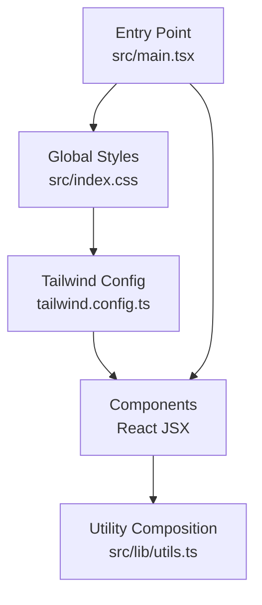
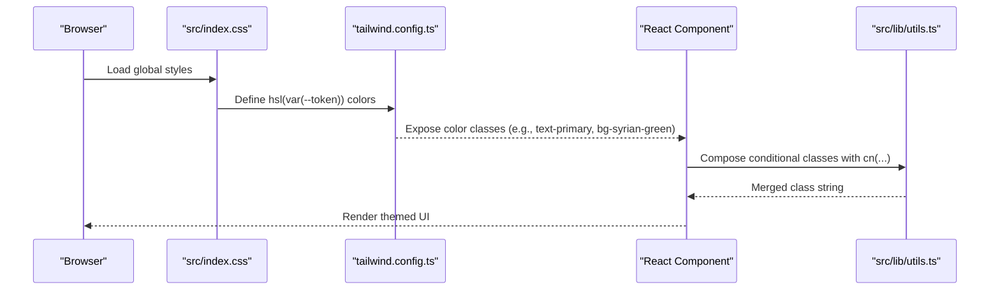
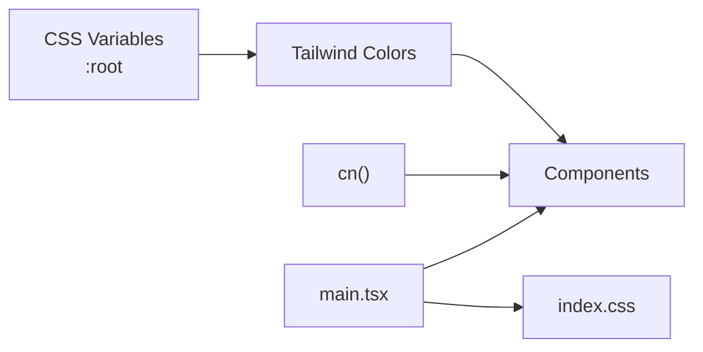

# Theme Customization

> **Referenced Files in This Document**
> - [index.css](src/index.css)
> - [tailwind.config.ts](tailwind.config.ts)
> - [utils.ts](src/lib/utils.ts)
> - [LanguageSwitcher.tsx](src/components/LanguageSwitcher.tsx)
> - [HeroSection.tsx](src/components/HeroSection.tsx)
> - [AgendaSection.tsx](src/components/AgendaSection.tsx)
> - [card.tsx](src/components/ui/card.tsx)
> - [App.tsx](src/App.tsx)
> - [main.tsx](src/main.tsx)

## Table of Contents
1. [Introduction](#introduction)
2. [Project Structure](#project-structure)
3. [Core Components](#core-components)
4. [Architecture Overview](#architecture-overview)
5. [Detailed Component Analysis](#detailed-component-analysis)
6. [Dependency Analysis](#dependency-analysis)
7. [Performance Considerations](#performance-considerations)
8. [Troubleshooting Guide](#troubleshooting-guide)
9. [Conclusion](#conclusion)
10. [Appendices](#appendices)

## Introduction
This document explains how the project’s theme system is built around CSS variables defined in the global stylesheet and consumed by Tailwind CSS. It covers:
- How :root CSS variables enable dynamic theming with light/dark mode support
- How Tailwind resolves these variables via hsl(var(--color)) syntax
- Custom utility classes that extend Tailwind’s capabilities (e.g., .glass, .gradient-hero)
- Animation utilities (.animate-float, .animate-pulse-glow) and staggered delays
- How the cn() utility composes conditional classes for theme-aware components
- Practical examples from components like LanguageSwitcher and HeroSection
- Guidance for adding new theme colors, modifying gradients, and creating custom animations while preserving design consistency

## Project Structure
The theme system spans three layers:
- Global CSS variables and utilities
- Tailwind configuration that maps CSS variables to Tailwind colors
- Component usage of Tailwind classes and cn() for conditional composition

**Diagram sources**
- [index.css](src/index.css#L20-L128)
- [tailwind.config.ts](tailwind.config.ts#L1-L98)
- [utils.ts](src/lib/utils.ts#L1-L7)
- [main.tsx](src/main.tsx#L1-L6)

**Section sources**
- [index.css](src/index.css#L20-L128)
- [tailwind.config.ts](tailwind.config.ts#L1-L98)
- [main.tsx](src/main.tsx#L1-L6)

## Core Components
- CSS Variables in :root define the color palette, gradients, shadows, and radius tokens. Dark mode toggles these variables under a .dark selector.
- Tailwind resolves these variables into Tailwind color utilities using hsl(var(--token)) declarations.
- Custom utilities in index.css provide reusable patterns for gradients, glass morphism, and glow effects.
- Animation utilities define keyframes and apply them to Tailwind-like classes for motion.
- cn() merges conditional class names safely, preventing conflicts and ensuring predictable overrides.

**Section sources**
- [index.css](src/index.css#L20-L128)
- [tailwind.config.ts](tailwind.config.ts#L1-L98)
- [utils.ts](src/lib/utils.ts#L1-L7)

## Architecture Overview
The theme pipeline connects CSS variables to Tailwind utilities and component rendering:

**Diagram sources**
- [index.css](src/index.css#L20-L128)
- [tailwind.config.ts](tailwind.config.ts#L1-L98)
- [utils.ts](src/lib/utils.ts#L1-L7)

## Detailed Component Analysis

### CSS Variables and Dark Mode
- The :root block defines a complete color palette using HSL values for background, foreground, primary, secondary, muted, accent, destructive, borders, inputs, and ring.
- Custom brand tokens (e.g., syrian-red, syrian-green, gold, cream) and gradients (e.g., hero, gold, green) are declared here.
- Radius and shadow tokens standardize corner rounding and elevation effects.
- The .dark block redefines all variables for dark mode, ensuring consistent contrast and readability.

Practical implications:
- Changing a single variable updates all derived utilities and components automatically.
- Dark mode is controlled by applying the .dark class to the root element (via Tailwind’s darkMode setting).

**Section sources**
- [index.css](src/index.css#L20-L128)
- [tailwind.config.ts](tailwind.config.ts#L1-L98)

### Tailwind Color Resolution via hsl(var(--token))
- Tailwind maps each semantic color to a CSS variable using hsl(var(--token)).
- Extended color groups (syrian, gold, cream, sidebar) are exposed for granular control.
- Border radius and keyframe-driven animations are configured to consume CSS variables.

Effects:
- Components can use Tailwind classes like text-primary, bg-syrian-green, and shadow-lg without hardcoding values.
- Accordion animations leverage a CSS variable for content height.

**Section sources**
- [tailwind.config.ts](tailwind.config.ts#L1-L98)

### Custom Utility Classes
- Gradient utilities: .gradient-hero, .gradient-gold, .gradient-green, and .text-gradient provide consistent hero and text treatments.
- Glass effect: .glass applies a translucent background with backdrop blur and border for frosted-glass UIs.
- Glow utilities: .glow-primary and .glow-gold add luminous halos around elements.
- These utilities resolve colors from CSS variables, keeping them in sync with the theme.

Usage examples:
- HeroSection uses .glass and .gradient-gold for the CTA and date badge.
- LanguageSwitcher uses .glass and backdrop blur for floating controls.

**Section sources**
- [index.css](src/index.css#L143-L172)
- [HeroSection.tsx](src/components/HeroSection.tsx#L74-L93)
- [LanguageSwitcher.tsx](src/components/LanguageSwitcher.tsx#L19-L41)

### Animation Utilities and Staggered Delays
- Keyframes define float, pulse-glow, shimmer, fade-up, scale-in, and confetti-fall.
- Tailwind-like classes (.animate-float, .animate-pulse-glow, .animate-shimmer, .animate-fade-up, .animate-scale-in, .animate-confetti) bind these animations.
- Staggered delays (.delay-100 through .delay-500) enable choreographed entrance sequences.

Usage examples:
- HeroSection animates the eagle emblem and tagline with .animate-float and .animate-fade-up.
- HeroSection decoratively animates confetti particles with .animate-confetti and random colors from CSS variables.

**Section sources**
- [index.css](src/index.css#L174-L249)
- [HeroSection.tsx](src/components/HeroSection.tsx#L20-L33)
- [HeroSection.tsx](src/components/HeroSection.tsx#L36-L68)

### Conditional Class Composition with cn()
- The cn() utility merges clsx inputs and deduplicates conflicting Tailwind classes using tailwind-merge.
- Components pass conditional class strings to cn(), ensuring only one variant is active at a time.

Usage examples:
- Card component composes rounded corners, borders, background, and text color with cn().
- LanguageSwitcher conditionally applies active/inactive states and hover effects.

**Section sources**
- [utils.ts](src/lib/utils.ts#L1-L7)
- [card.tsx](src/components/ui/card.tsx#L1-L10)
- [LanguageSwitcher.tsx](src/components/LanguageSwitcher.tsx#L20-L41)

### Example Components Using Theme Tokens
- LanguageSwitcher:
  - Uses .glass and backdrop blur for a floating control panel.
  - Applies text-syrian-green and hover states that respect theme variables.
- HeroSection:
  - Uses .glass and .gradient-gold for the CTA and date badge.
  - Applies .animate-float and .animate-fade-up for motion.
  - Randomly colors confetti using hsl(var(--syrian-red)), hsl(var(--syrian-green)), and hsl(var(--gold)).

**Section sources**
- [LanguageSwitcher.tsx](src/components/LanguageSwitcher.tsx#L19-L41)
- [HeroSection.tsx](src/components/HeroSection.tsx#L36-L93)

### Adding New Theme Colors
Steps:
1. Add a new CSS variable in :root (e.g., --brand-purple).
2. Optionally add a gradient or shadow token referencing the new variable.
3. Register the color in tailwind.config.ts under theme.extend.colors.
4. Use Tailwind classes (e.g., text-brand-purple, bg-brand-purple) in components.
5. Compose conditional classes with cn() to switch between themes.

Guidance:
- Keep HSL values consistent with the existing palette to preserve contrast and accessibility.
- Prefer semantic names (e.g., brand-* or status-*) to avoid confusion.
- Test both light and dark modes to ensure readability.

**Section sources**
- [index.css](src/index.css#L20-L128)
- [tailwind.config.ts](tailwind.config.ts#L1-L98)

### Modifying Gradients
Steps:
1. Update the gradient variable in :root (e.g., --gradient-hero).
2. Update the corresponding utility class in index.css if needed.
3. Reference the utility class in components (e.g., .gradient-hero).
4. Verify both light and dark mode gradients adapt to theme changes.

**Section sources**
- [index.css](src/index.css#L69-L73)
- [index.css](src/index.css#L144-L154)
- [HeroSection.tsx](src/components/HeroSection.tsx#L84-L93)

### Creating Custom Animation Patterns
Steps:
1. Define a new keyframe in index.css.
2. Create a Tailwind-like class that binds the keyframe and sets timing/easing.
3. Optionally add staggered delay utilities for choreography.
4. Apply the class to components and combine with other theme utilities.

Best practices:
- Keep durations and easing consistent with existing animations.
- Use staggered delays sparingly to avoid overwhelming users.
- Prefer subtle motion to maintain accessibility.

**Section sources**
- [index.css](src/index.css#L174-L249)
- [HeroSection.tsx](src/components/HeroSection.tsx#L36-L68)

## Dependency Analysis
The theme system depends on:
- index.css for CSS variables and utilities
- tailwind.config.ts for color resolution and extensions
- utils.ts for safe class composition
- Components that consume Tailwind classes and utilities

**Diagram sources**
- [index.css](src/index.css#L20-L128)
- [tailwind.config.ts](tailwind.config.ts#L1-L98)
- [utils.ts](src/lib/utils.ts#L1-L7)
- [main.tsx](src/main.tsx#L1-L6)

**Section sources**
- [index.css](src/index.css#L20-L128)
- [tailwind.config.ts](tailwind.config.ts#L1-L98)
- [utils.ts](src/lib/utils.ts#L1-L7)
- [main.tsx](src/main.tsx#L1-L6)

## Performance Considerations
- CSS variables reduce duplication and improve maintainability; Tailwind’s JIT compilation ensures only used utilities are generated.
- Avoid excessive use of backdrop blur and heavy shadows on low-end devices; prefer .glass and glow sparingly.
- Keep animation durations moderate to prevent jank on mobile devices.

## Troubleshooting Guide
Common issues and resolutions:
- Colors not updating in dark mode:
  - Ensure the .dark selector is present and variables are redefined.
  - Confirm dark mode is toggled at the root level.
- Gradient or glow not visible:
  - Verify the gradient variable and utility class are defined.
  - Check that the component applies the correct utility class.
- Conflicting classes:
  - Use cn() to merge conditional classes; it prevents duplicates and ensures precedence.
- Animation not playing:
  - Confirm the keyframe and class are defined.
  - Ensure the component applies the animation class and that the element is visible.

**Section sources**
- [index.css](src/index.css#L20-L128)
- [index.css](src/index.css#L143-L249)
- [utils.ts](src/lib/utils.ts#L1-L7)

## Conclusion
The theme system centers on a single source of truth: CSS variables in :root. Tailwind consumes these variables to expose semantic color classes, while custom utilities and animations provide cohesive design patterns. The cn() utility ensures predictable class composition. By following the steps outlined, you can extend the palette, adjust gradients, and introduce new animations while maintaining consistency across light and dark modes.

## Appendices

### Quick Reference: Theme Tokens and Utilities
- CSS Variables: background, foreground, primary, secondary, muted, accent, destructive, border, input, ring, radius, custom brand colors, gradients, shadows, sidebar tokens
- Tailwind Colors: border, input, ring, background, foreground, primary, secondary, destructive, muted, accent, popover, card, syrian.*, gold.*, cream, sidebar.*
- Utilities: .gradient-hero, .gradient-gold, .gradient-green, .text-gradient, .glass, .glow-primary, .glow-gold
- Animations: .animate-float, .animate-pulse-glow, .animate-shimmer, .animate-fade-up, .animate-scale-in, .animate-confetti
- Staggered Delays: .delay-100, .delay-200, .delay-300, .delay-400, .delay-500

**Section sources**
- [index.css](src/index.css#L20-L128)
- [index.css](src/index.css#L143-L249)
- [tailwind.config.ts](tailwind.config.ts#L1-L98)