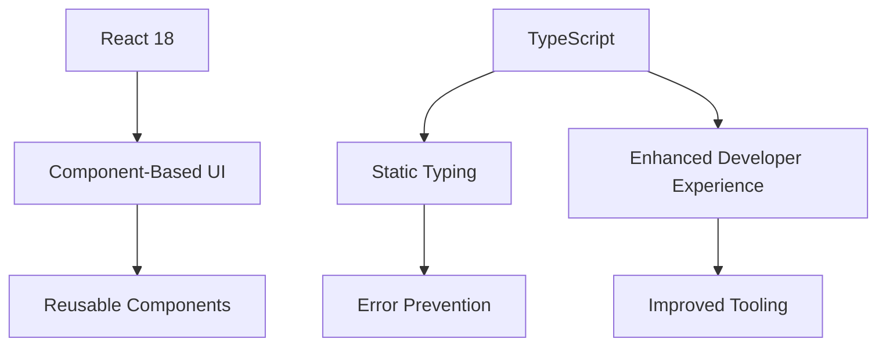
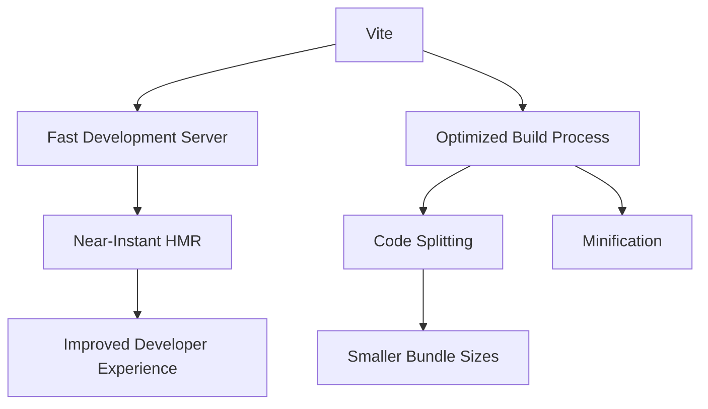
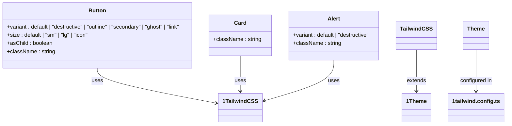
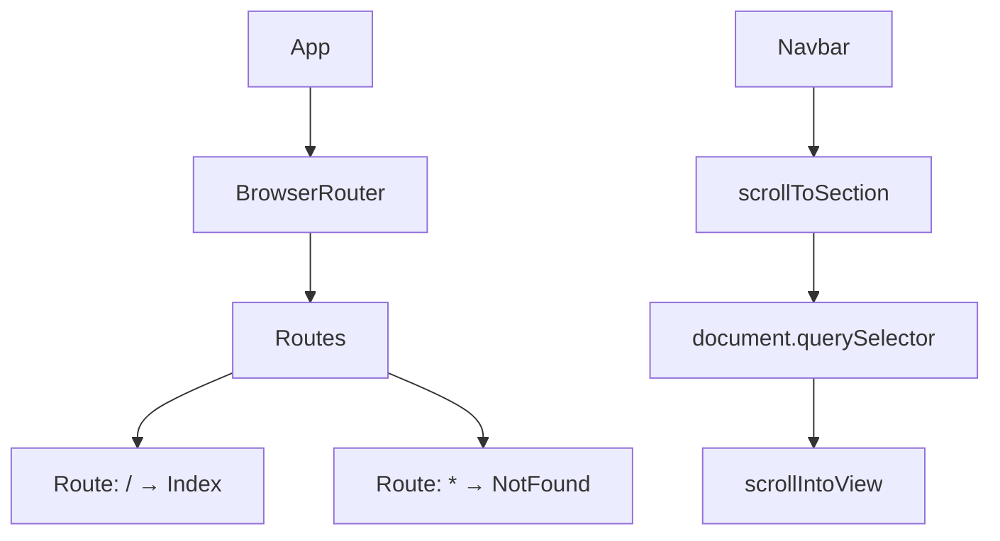
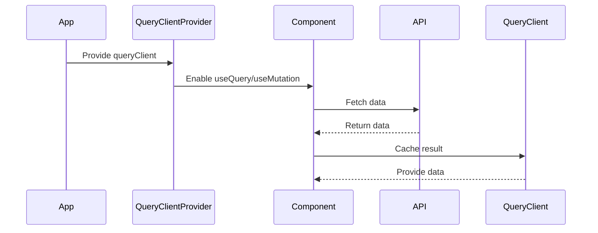
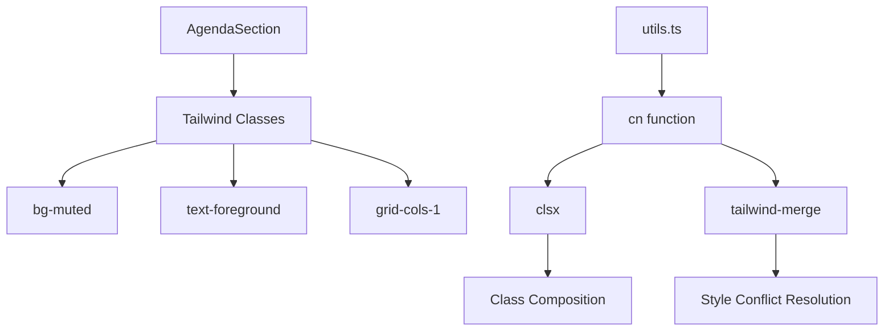

# Technology Stack & Dependencies

> **Referenced Files in This Document**   
> - [package.json](package.json)
> - [vite.config.ts](vite.config.ts)
> - [tailwind.config.ts](tailwind.config.ts)
> - [components.json](components.json)
> - [tsconfig.json](tsconfig.json)
> - [App.tsx](src/App.tsx)
> - [main.tsx](src/main.tsx)
> - [utils.ts](src/lib/utils.ts)
> - [AgendaSection.tsx](src/components/AgendaSection.tsx)
> - [CountdownTimer.tsx](src/components/CountdownTimer.tsx)
> - [Navbar.tsx](src/components/Navbar.tsx)
> - [Index.tsx](src/pages/Index.tsx)
> - [eventData.ts](src/data/eventData.ts)
> - [button.tsx](src/components/ui/button.tsx)
> - [use-toast.ts](src/hooks/use-toast.ts)

## Table of Contents
1. [Introduction](#introduction)
2. [Core Frameworks and Libraries](#core-frameworks-and-libraries)
3. [Development and Build Tools](#development-and-build-tools)
4. [Styling and UI Components](#styling-and-ui-components)
5. [Routing and Navigation](#routing-and-navigation)
6. [Data Management and State](#data-management-and-state)
7. [Date and Time Utilities](#date-and-time-utilities)
8. [Dependency Integration and Usage](#dependency-integration-and-usage)
9. [Common Issues and Optimization Tips](#common-issues-and-optimization-tips)
10. [Conclusion](#conclusion)

## Introduction
The sc-dof application is a modern React-based web application designed to commemorate Syria's Liberation Day. Built with a robust technology stack, it leverages contemporary frontend tools and libraries to deliver a responsive, accessible, and maintainable user experience. This document details the core technologies powering the application, including React 18 with TypeScript, Vite, Tailwind CSS, ShadCN UI, React Router DOM, React Query, and date-fns. It also explores how these technologies are integrated and configured to support the application's functionality and design goals.

**Section sources**
- [package.json](package.json)
- [App.tsx](src/App.tsx)

## Core Frameworks and Libraries
The foundation of the sc-dof application is built on React 18 and TypeScript, providing a type-safe and component-driven development environment. React enables the creation of reusable UI components, while TypeScript enhances code quality by introducing static typing, reducing runtime errors, and improving developer tooling.

TypeScript is configured through `tsconfig.json`, which sets up path aliases such as `@/` to resolve to the `src` directory, improving import readability and maintainability. The configuration also references separate app and node configurations, allowing for environment-specific compiler options.



**Diagram sources**
- [tsconfig.json](tsconfig.json)

**Section sources**
- [package.json](package.json#L52-L54)
- [tsconfig.json](tsconfig.json)

## Development and Build Tools
Vite serves as the development server and build tool for the sc-dof application, offering fast startup times and efficient hot module replacement (HMR). Configured in `vite.config.ts`, Vite integrates with the React SWC plugin for faster compilation and includes a custom component tagger for development mode, enhancing debugging capabilities.

The development server is configured to run on port 8080 and supports IPv6 binding. Vite's configuration also sets up path aliases, allowing imports like `@/components` to resolve correctly, aligning with the TypeScript configuration.



**Diagram sources**
- [vite.config.ts](vite.config.ts)

**Section sources**
- [vite.config.ts](vite.config.ts)
- [package.json](package.json#L7-L11)

## Styling and UI Components
Tailwind CSS provides utility-first styling, enabling developers to apply design tokens directly in JSX. The `tailwind.config.ts` file extends the default theme with custom colors, including Syrian national colors (`syrian-red`, `syrian-green`, `syrian-black`) and gold tones, as well as font families like Bahij Koufiya for Arabic text and Roboto for Latin scripts.

The application uses ShadCN UI components, which are built on Radix UI primitives to ensure accessibility and composability. These components are pre-styled with Tailwind classes and support dark mode via CSS variables. The `components.json` file configures the ShadCN CLI, specifying the use of TypeScript, Tailwind, and path aliases for consistent imports.



**Diagram sources**
- [tailwind.config.ts](tailwind.config.ts)
- [components.json](components.json)
- [button.tsx](src/components/ui/button.tsx)

**Section sources**
- [tailwind.config.ts](tailwind.config.ts)
- [components.json](components.json)
- [button.tsx](src/components/ui/button.tsx)

## Routing and Navigation
React Router DOM enables client-side routing, allowing navigation between views without full page reloads. In `App.tsx`, `BrowserRouter` wraps the application, and `Routes` define the route configuration. The application uses a catch-all route to handle 404 pages, ensuring a seamless user experience.

Navigation is implemented through anchor tags with `onClick` handlers that prevent default behavior and use `scrollIntoView` for smooth scrolling to section anchors. This approach combines SPA routing with in-page navigation, enhancing usability.



**Diagram sources**
- [App.tsx](src/App.tsx#L5-L28)
- [Navbar.tsx](src/components/Navbar.tsx#L30-L36)

**Section sources**
- [App.tsx](src/App.tsx#L5-L28)
- [Navbar.tsx](src/components/Navbar.tsx)

## Data Management and State
React Query is used for data fetching, caching, and synchronization, reducing the need for manual state management. In `App.tsx`, a `QueryClient` is instantiated and provided to the application via `QueryClientProvider`, making it available to all components.

While the current implementation does not show explicit data fetching, the setup enables components to use hooks like `useQuery` and `useMutation` for efficient API interactions. This pattern supports background refetching, error handling, and loading states with minimal boilerplate.



**Diagram sources**
- [App.tsx](src/App.tsx#L4-L10)

**Section sources**
- [App.tsx](src/App.tsx#L4-L10)
- [use-toast.ts](src/hooks/use-toast.ts)

## Date and Time Utilities
The `date-fns` library is included as a dependency for date manipulation, though it is not currently used in the codebase. Instead, native JavaScript `Date` objects are used in components like `CountdownTimer.tsx` to calculate time differences for the event countdown.

The `eventData.ts` file contains the event date as a string (`"2025-12-20"`), which could be enhanced with `date-fns` for formatting, localization, and duration calculations. Integrating `date-fns` would allow for more robust date handling, especially for internationalization.

```mermaid
flowchart TD
A[CountdownTimer] --> B[new Date()]
B --> C[Calculate Time Difference]
C --> D[Update State Every Second]
D --> E[Display Days, Hours, Minutes, Seconds]
F[date-fns] --> G[Format Date]
F --> H[Localize Date]
F --> I[Calculate Duration]
```

**Diagram sources**
- [CountdownTimer.tsx](src/components/CountdownTimer.tsx#L13-L27)
- [eventData.ts](src/data/eventData.ts#L7)

**Section sources**
- [CountdownTimer.tsx](src/components/CountdownTimer.tsx)
- [eventData.ts](src/data/eventData.ts)

## Dependency Integration and Usage
The integration of core libraries is evident in the component structure and configuration files. For example, `AgendaSection.tsx` uses Tailwind classes like `bg-muted`, `text-foreground`, and `grid-cols-1` to style its layout and elements. The `cn` utility from `utils.ts` combines `clsx` and `tailwind-merge` to safely merge Tailwind classes, preventing style conflicts.

ShadCN UI components like `Toaster` and `TooltipProvider` are used in `App.tsx` to provide global UI functionality. These components leverage Radix UI under the hood, ensuring accessibility features like keyboard navigation and screen reader support.



**Diagram sources**
- [AgendaSection.tsx](src/components/AgendaSection.tsx)
- [utils.ts](src/lib/utils.ts)

**Section sources**
- [AgendaSection.tsx](src/components/AgendaSection.tsx)
- [utils.ts](src/lib/utils.ts)
- [App.tsx](src/App.tsx#L1-L3)

## Common Issues and Optimization Tips
### Version Conflicts
The `package.json` shows up-to-date versions of core libraries, minimizing the risk of version conflicts. However, when updating dependencies, it's essential to ensure compatibility between React, React DOM, and React Query, as breaking changes can occur between major versions.

### Bundle Size Optimization
To reduce bundle size:
- Use dynamic imports for routes or heavy components
- Ensure only necessary Radix UI packages are installed
- Optimize images and assets
- Leverage Vite's built-in tree-shaking and code splitting

### Performance Recommendations
- Use React Query's caching to minimize network requests
- Implement memoization with `React.memo` or `useMemo` for expensive calculations
- Avoid inline functions in render props to prevent unnecessary re-renders
- Use `React.lazy` for code splitting in larger applications

**Section sources**
- [package.json](package.json)
- [vite.config.ts](vite.config.ts)

## Conclusion
The sc-dof application demonstrates a modern, well-structured frontend architecture using React 18, TypeScript, Vite, Tailwind CSS, and supporting libraries. The integration of ShadCN UI with Radix UI ensures accessible and consistent components, while React Router DOM and React Query provide robust navigation and data management. Although `date-fns` is not currently utilized, its inclusion suggests future plans for enhanced date handling. By following best practices in configuration and dependency management, the application is well-positioned for scalability and maintainability.